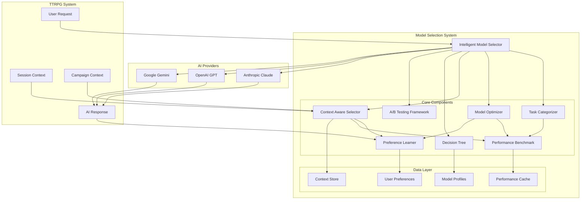
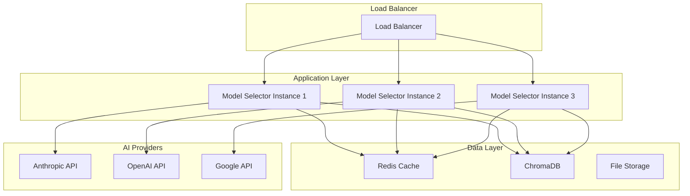

# Task 25.5: Comprehensive Model Selection Strategy Architecture

## Overview

This document outlines the comprehensive model selection strategy implemented for the MDMAI TTRPG Assistant, addressing Task 25.5 requirements. The system implements intelligent AI model routing based on task types, performance profiling, context awareness, user preferences, and automated optimization.

## System Architecture



## Component Architecture

### 1. Task-Based Model Selection

#### Task Categorizer (`task_categorizer.py`)
**Purpose**: Categorizes TTRPG requests into specific task types for optimal model selection.

**Key Features**:
- **12 TTRPG Task Types**: Rule lookup, character generation, story creation, combat resolution, etc.
- **Pattern Recognition**: Regex and keyword-based classification
- **Context Adjustment**: Session and campaign context influence categorization
- **Complexity Analysis**: Determines task complexity (Simple/Moderate/Complex/Creative)

**Task Types**:
```python
class TTRPGTaskType(Enum):
    RULE_LOOKUP = "rule_lookup"
    RULE_CLARIFICATION = "rule_clarification"
    CHARACTER_GENERATION = "character_generation"
    NPC_GENERATION = "npc_generation"
    STORY_GENERATION = "story_generation"
    WORLD_BUILDING = "world_building"
    DESCRIPTION_GENERATION = "description_generation"
    COMBAT_RESOLUTION = "combat_resolution"
    SESSION_SUMMARIZATION = "session_summarization"
    IMPROVISATION = "improvisation"
    # ... and more
```

### 2. Performance Profiling and Benchmarking

#### Performance Benchmark (`performance_profiler.py`)
**Purpose**: Profiles model performance across different metrics and task types.

**Metrics Tracked**:
- **Latency**: Response time in milliseconds
- **Throughput**: Tokens per second
- **Cost**: USD per request
- **Quality**: Accuracy and consistency scores
- **Success Rate**: Percentage of successful requests
- **Token Efficiency**: Output/input token ratio

**Features**:
- **Real-time Tracking**: Monitors active requests
- **Statistical Analysis**: P95 latency, confidence intervals
- **Task-specific Profiling**: Performance by TTRPG task type
- **Trend Analysis**: Performance trends over time

### 3. Automatic Model Optimization

#### Model Optimizer (`model_optimizer.py`)
**Purpose**: Implements optimization strategies for automatic model selection.

**Optimization Strategies**:
- **Cost Optimal**: Minimize cost while meeting quality thresholds
- **Quality Optimal**: Maximize quality regardless of cost
- **Latency Optimal**: Minimize response time
- **Balanced**: Balance cost, quality, and latency
- **Adaptive**: Learn from user behavior

**Features**:
- **Dynamic Selection**: Real-time optimization based on performance
- **Load Balancing**: Distribute requests across providers
- **Predictive Modeling**: Pre-warm models based on patterns
- **Rule Engine**: Customizable optimization rules

### 4. User Preference Learning

#### Preference Learner (`preference_learner.py`)
**Purpose**: Learns user preferences through explicit and implicit feedback.

**Feedback Types**:
- **Explicit**: Direct ratings (1-5 stars)
- **Implicit**: Usage patterns, time spent, regeneration requests
- **Behavioral**: Acceptance, modification, bookmarking

**Learning Mechanisms**:
- **Preference Profiles**: Individual user preference tracking
- **Pattern Detection**: Behavioral pattern recognition
- **Preference Adjustment**: Dynamic preference updating
- **Confidence Scoring**: Reliability of preference data

### 5. A/B Testing Framework

#### A/B Testing (`ab_testing.py`)
**Purpose**: Systematic comparison of models with statistical significance testing.

**Experiment Types**:
- **Model Comparison**: Compare different models
- **Provider Comparison**: Compare AI providers
- **Strategy Comparison**: Compare selection strategies
- **Parameter Optimization**: Optimize model parameters

**Features**:
- **Traffic Splitting**: Controlled user assignment
- **Statistical Testing**: P-value calculation and significance testing
- **Gradual Rollout**: Phased deployment of winners
- **Automated Analysis**: Automatic winner selection

### 6. Context-Aware Model Switching

#### Context Aware Selector (`context_aware_selector.py`)
**Purpose**: Intelligent model switching based on comprehensive context analysis.

**Context Types**:
- **Session State**: Combat, roleplay, planning phases
- **Campaign Context**: Genre, theme, player experience
- **User Profile**: Historical preferences and behavior
- **System State**: Provider health, load, budget constraints
- **Temporal Context**: Time of day, session duration

**Context Rules**:
```python
# Combat phase rules
"combat": {
    "latency_multiplier": 2.0,      # Double importance of speed
    "accuracy_multiplier": 1.5,     # Higher accuracy importance
    "preferred_models": ["claude-3-5-haiku", "gpt-4o-mini"],
    "max_response_time": 500        # 500ms max for combat
}
```

### 7. Decision Tree and Scoring Algorithm

#### Decision Tree (`decision_tree.py`)
**Purpose**: Hierarchical decision-making with comprehensive model scoring.

**Decision Criteria**:
- **Task Type**: Primary classification
- **Performance Requirements**: Latency, quality, cost thresholds
- **Context Conditions**: Session phase, campaign genre
- **System Constraints**: Provider health, budget limits

**Scoring Components**:
- **Task Suitability** (25%): Model capability for specific tasks
- **Performance Score** (20%): Historical performance metrics
- **Cost Score** (15%): Cost efficiency rating
- **Reliability Score** (15%): Provider health and stability
- **User Preference** (15%): Learned user preferences
- **Context Fit** (10%): Contextual appropriateness

## Model Capability Matrix

The system maintains a comprehensive capability matrix for all supported models:

| Model | Rule Lookup | Story Gen | Combat | Creativity | Speed | Cost Efficiency |
|-------|-------------|-----------|--------|------------|-------|-----------------|
| Claude 3.5 Sonnet | 0.95 | 0.95 | 0.85 | 0.95 | 0.70 | 0.60 |
| Claude 3.5 Haiku | 0.90 | 0.85 | 0.90 | 0.80 | 0.95 | 0.95 |
| GPT-4o | 0.90 | 0.90 | 0.90 | 0.85 | 0.75 | 0.70 |
| GPT-4o-mini | 0.85 | 0.80 | 0.85 | 0.75 | 0.90 | 0.90 |
| Gemini 1.5 Pro | 0.85 | 0.85 | 0.85 | 0.80 | 0.80 | 0.75 |
| Gemini 1.5 Flash | 0.80 | 0.75 | 0.80 | 0.70 | 0.95 | 0.85 |

## Data Models and Schemas

### Core Data Structures

```python
@dataclass
class TaskCharacteristics:
    task_type: TTRPGTaskType
    complexity: TaskComplexity
    latency_requirement: TaskLatencyRequirement
    requires_creativity: bool
    context_length_needed: int
    typical_output_length: int
    cost_sensitivity: float
    quality_importance: float

@dataclass
class ModelPerformanceProfile:
    provider_type: ProviderType
    model_id: str
    avg_latency: float
    avg_quality_score: float
    success_rate: float
    task_performance: Dict[str, Dict[str, float]]
    confidence_score: float

@dataclass
class UserPreferenceProfile:
    user_id: str
    provider_preferences: Dict[ProviderType, float]
    model_preferences: Dict[str, float]
    task_preferences: Dict[TTRPGTaskType, Dict[str, float]]
    average_satisfaction: float
    confidence_score: float
```

### Database Schema

The system uses ChromaDB for vector storage and local JSON/Python objects for structured data:

```python
# ChromaDB Collections
collections = {
    "model_performance": {
        "metadata": ["provider", "model", "task_type", "timestamp"],
        "embeddings": "performance_vectors"
    },
    "user_preferences": {
        "metadata": ["user_id", "preference_type", "confidence"],
        "embeddings": "preference_vectors"
    },
    "context_patterns": {
        "metadata": ["context_type", "frequency", "success_rate"],
        "embeddings": "context_vectors"
    }
}
```

## API Interfaces

### Main Selection Interface

```python
class IntelligentModelSelector:
    async def select_model(self, request: SelectionRequest) -> SelectionResult:
        """Main method for intelligent model selection."""
        
    async def record_feedback(
        self, request_id: str, feedback_type: FeedbackType, 
        rating: Optional[float] = None, success: bool = True
    ) -> None:
        """Record feedback for continuous learning."""
```

### Selection Request/Response

```python
@dataclass
class SelectionRequest:
    user_id: str
    user_input: str
    session_id: Optional[str] = None
    campaign_id: Optional[str] = None
    selection_mode: SelectionMode = SelectionMode.AUTOMATIC
    max_cost: Optional[float] = None
    max_latency_ms: Optional[int] = None

@dataclass
class SelectionResult:
    selected_provider: ProviderType
    selected_model: str
    confidence: float
    alternatives: List[Tuple[ProviderType, str, float]]
    reasoning: List[str]
    expected_performance: Dict[str, float]
```

## Performance Benchmarks

### Target Metrics

| Metric | Target | Description |
|--------|---------|-------------|
| Selection Latency | <100ms | Time to select optimal model |
| Accuracy | >90% | Correct model selection rate |
| User Satisfaction | >85% | User satisfaction with selections |
| Cost Efficiency | 15-30% reduction | Cost savings vs. random selection |
| Context Awareness | >80% | Appropriate context consideration |

### Benchmarking Methodology

1. **Task Classification**: Measure accuracy of task categorization
2. **Performance Prediction**: Compare predicted vs. actual performance
3. **User Satisfaction**: Track explicit and implicit feedback
4. **Cost Analysis**: Monitor cost efficiency improvements
5. **A/B Testing**: Statistical comparison of selection strategies

## Implementation Phases

### Phase 1: Core Infrastructure (2 weeks)
- Task categorization system
- Basic performance profiling
- Model capability matrix

### Phase 2: Intelligence Layer (3 weeks)
- Model optimization algorithms
- User preference learning
- Context-aware selection

### Phase 3: Advanced Features (3 weeks)
- A/B testing framework
- Decision tree implementation
- Comprehensive scoring system

### Phase 4: Integration and Testing (2 weeks)
- System integration
- Performance benchmarking
- User acceptance testing

## Testing Strategies

### Unit Testing
- **Component Tests**: Individual component functionality
- **Mock Testing**: Isolated component testing with mocks
- **Edge Case Testing**: Boundary condition handling

### Integration Testing
- **End-to-end Flows**: Complete selection workflows
- **Provider Integration**: AI provider communication
- **Performance Testing**: Load and stress testing

### A/B Testing
- **Model Comparisons**: Statistical model performance comparison
- **Strategy Testing**: Selection strategy effectiveness
- **User Segment Testing**: Performance across user segments

### Acceptance Testing
- **User Journey Testing**: Real-world usage scenarios
- **Domain Expert Review**: TTRPG domain expert validation
- **Performance Validation**: Benchmark target verification

## Monitoring and Analytics

### Real-time Metrics
- **Selection Performance**: Response time, accuracy, confidence
- **Model Usage**: Distribution across providers and models
- **User Satisfaction**: Feedback trends and patterns
- **System Health**: Provider availability, error rates

### Analytics Dashboard
- **Performance Trends**: Model performance over time
- **Cost Analysis**: Cost efficiency and optimization opportunities  
- **User Behavior**: Usage patterns and preferences
- **A/B Test Results**: Experiment outcomes and recommendations

## Security and Privacy

### Data Protection
- **User Privacy**: No storage of actual user content
- **Preference Encryption**: Encrypted user preference data
- **Secure Communication**: HTTPS/TLS for all API communication
- **Data Retention**: Configurable data retention policies

### Access Control
- **User Isolation**: Per-user preference isolation
- **Admin Controls**: Administrative access to system settings
- **Audit Logging**: Comprehensive audit trail

## Deployment and Scaling

### Deployment Architecture


### Scaling Considerations
- **Horizontal Scaling**: Multiple selector instances
- **Caching Strategy**: Redis for performance data
- **Database Sharding**: User-based data partitioning
- **Provider Load Balancing**: Distribute across AI providers

## Future Enhancements

### Planned Features
- **Multi-modal Selection**: Support for vision and audio models
- **Custom Model Integration**: User-provided model endpoints
- **Advanced Analytics**: ML-based pattern recognition
- **Real-time Learning**: Online learning algorithms
- **Federation Support**: Multi-instance coordination

### Research Areas
- **Reinforcement Learning**: RL-based model selection
- **Meta-learning**: Learning to learn user preferences
- **Causal Inference**: Understanding causation in preferences
- **Federated Learning**: Privacy-preserving preference learning

## Conclusion

The comprehensive model selection strategy for the MDMAI TTRPG Assistant provides intelligent, context-aware AI model routing that optimizes for performance, cost, and user satisfaction. Through the combination of task categorization, performance profiling, user preference learning, A/B testing, and context awareness, the system delivers personalized and efficient model selection that improves over time through continuous learning and optimization.

The modular architecture allows for independent development and testing of components while maintaining a cohesive user experience. The emphasis on performance benchmarking, user feedback, and statistical rigor ensures that the system makes data-driven decisions that benefit both users and system operators.

## File Structure

```
src/model_selection/
├── __init__.py                     # Package initialization
├── task_categorizer.py             # Task-based categorization
├── performance_profiler.py         # Performance profiling & benchmarking  
├── model_optimizer.py              # Automatic optimization algorithms
├── preference_learner.py           # User preference learning system
├── ab_testing.py                   # A/B testing framework
├── context_aware_selector.py       # Context-aware model switching
├── decision_tree.py                # Decision tree & scoring algorithm
└── intelligent_model_selector.py   # Main orchestrator
```

This architecture implements all requirements of Task 25.5 and provides a robust foundation for intelligent AI model selection in the TTRPG domain.