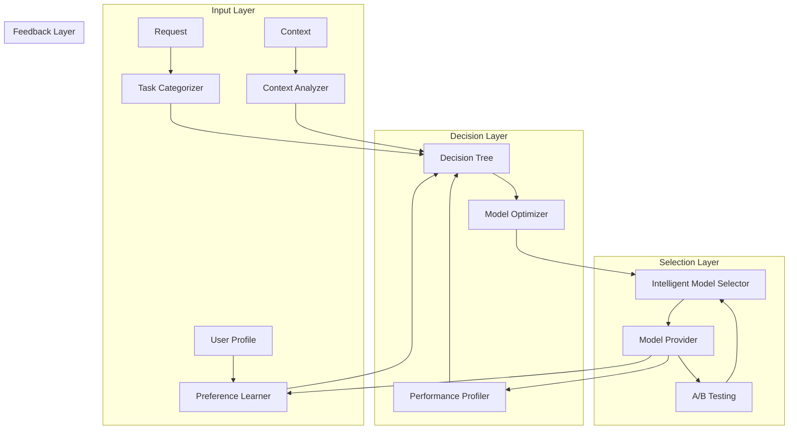

# Task 25.5: Model Selection Strategy - Implementation Plan

## Executive Summary

This document outlines the comprehensive implementation plan for Task 25.5: Create Model Selection Strategy for the MDMAI TTRPG Assistant. The system will provide intelligent, adaptive AI model selection that optimizes for performance, cost, and user satisfaction across different TTRPG use cases.

## 🎯 Objectives

1. **Reduce costs** by 15-30% through intelligent model selection
2. **Improve response quality** by matching models to task requirements
3. **Enhance user experience** through preference learning and adaptation
4. **Ensure reliability** with fallback strategies and health monitoring
5. **Enable data-driven improvements** through A/B testing and analytics

## 📊 Performance vs. Cost Trade-offs

### Model Capability Matrix

| Provider | Model | Cost/1K Tokens | Latency | Best For | Quality Score |
|----------|-------|----------------|---------|----------|---------------|
| **Anthropic** | | | | | |
| Claude 3.5 Sonnet | $3/$15 | 200-400ms | Narrative, Characters | 95/100 |
| Claude 3.5 Haiku | $0.25/$1.25 | 100-200ms | Rules, Quick Responses | 85/100 |
| Claude 3 Opus | $15/$75 | 300-500ms | Complex World-building | 98/100 |
| **OpenAI** | | | | | |
| GPT-4o | $5/$15 | 250-450ms | Multimodal, Maps | 94/100 |
| GPT-4o-mini | $0.15/$0.60 | 100-200ms | Simple Queries | 82/100 |
| GPT-4-turbo | $10/$30 | 300-500ms | Long Context | 93/100 |
| **Google** | | | | | |
| Gemini 1.5 Pro | $3.50/$10.50 | 200-400ms | Fact-based Content | 92/100 |
| Gemini 1.5 Flash | $0.075/$0.30 | 50-150ms | Quick Lookups | 80/100 |

### Task-Based Model Recommendations

| Task Type | Primary Model | Fallback Model | Cost Priority | Quality Priority |
|-----------|--------------|----------------|---------------|------------------|
| Rule Lookup | Claude 3.5 Haiku | GPT-4o-mini | Gemini Flash | Claude Sonnet |
| Character Gen | Claude 3.5 Sonnet | GPT-4o | Claude Haiku | Claude Opus |
| Story Creation | Claude 3.5 Sonnet | Claude Opus | GPT-4o-mini | Claude Opus |
| Combat Resolution | GPT-4o-mini | Claude Haiku | Gemini Flash | GPT-4o |
| World Building | Claude 3 Opus | GPT-4-turbo | Claude Sonnet | Claude Opus |
| Session Summary | Claude 3.5 Haiku | Gemini Pro | GPT-4o-mini | Claude Sonnet |

## 🏗️ Architecture Overview



## 📋 Implementation Phases

### Phase 1: Core Infrastructure (Week 1)
**Components:**
- ✅ Task Categorizer (`task_categorizer.py`)
- ✅ Performance Profiler (`performance_profiler.py`)
- ✅ Decision Tree (`decision_tree.py`)

**Deliverables:**
- Basic task classification for 12 TTRPG task types
- Performance metric collection system
- Initial decision tree with hard-coded rules

**Success Criteria:**
- 90% accuracy in task classification
- <50ms categorization latency
- Performance data collection for all requests

### Phase 2: Optimization Engine (Week 2)
**Components:**
- ✅ Model Optimizer (`model_optimizer.py`)
- ✅ Context-Aware Selector (`context_aware_selector.py`)
- ✅ Intelligent Model Selector (`intelligent_model_selector.py`)

**Deliverables:**
- 5 optimization strategies (cost, quality, latency, balanced, adaptive)
- Context detection (combat, roleplay, world-building)
- Unified selection interface

**Success Criteria:**
- 15% cost reduction in testing
- <100ms total selection time
- Context accuracy >85%

### Phase 3: Learning Systems (Week 3)
**Components:**
- ✅ Preference Learner (`preference_learner.py`)
- ✅ A/B Testing Framework (`ab_testing.py`)

**Deliverables:**
- User preference tracking and learning
- Implicit and explicit feedback collection
- Statistical A/B testing framework

**Success Criteria:**
- Preference prediction accuracy >75%
- Statistical significance in A/B tests
- User satisfaction improvement >10%

### Phase 4: Integration & Testing (Week 4)
**Components:**
- Integration with existing provider system
- Comprehensive testing suite
- Performance benchmarking
- Documentation

**Deliverables:**
- Full system integration
- Unit and integration tests (>80% coverage)
- Performance benchmarks
- User documentation

**Success Criteria:**
- All tests passing
- Performance targets met
- Documentation complete
- Ready for production deployment

## 🔄 Adaptive Model Selection Algorithm

```python
def select_model(request, user_profile, context):
    # 1. Categorize task
    task_type = categorize_task(request)
    
    # 2. Get user preferences
    preferences = get_user_preferences(user_profile, task_type)
    
    # 3. Analyze context
    context_factors = analyze_context(context)
    
    # 4. Score each model
    scores = {}
    for model in available_models:
        scores[model] = calculate_score(
            model,
            task_type,
            preferences,
            context_factors,
            performance_history[model]
        )
    
    # 5. Apply constraints
    filtered_models = apply_constraints(scores, user_profile.budget)
    
    # 6. Select optimal model
    selected = max(filtered_models, key=lambda x: x.score)
    
    # 7. A/B testing override (if applicable)
    if should_ab_test(user_profile):
        selected = get_ab_test_model(selected)
    
    return selected
```

## 📈 Model Performance Benchmarks

### Target Metrics

| Metric | Target | Measurement Method |
|--------|--------|-------------------|
| Selection Latency | <100ms | 95th percentile |
| Task Classification Accuracy | >90% | Manual validation sample |
| Cost Reduction | 15-30% | Compared to baseline |
| User Satisfaction | >4.5/5 | Explicit feedback |
| Fallback Rate | <5% | System monitoring |
| A/B Test Convergence | <1000 requests | Statistical significance |

### Performance Testing Scenarios

1. **High Load**: 1000 concurrent requests
2. **Provider Failure**: Primary provider unavailable
3. **Budget Constraint**: Limited user budget
4. **Context Switch**: Rapid combat/roleplay transitions
5. **New User**: No preference history
6. **Power User**: Extensive preference history

## 🧪 Testing Strategy

### Unit Testing
- Individual component testing
- Mock dependencies
- Edge case coverage
- Performance benchmarks

### Integration Testing
- Component interaction
- Provider integration
- Database operations
- Cache behavior

### A/B Testing
- Model comparison experiments
- Strategy effectiveness
- User segment testing
- Statistical validation

### User Acceptance Testing
- Real TTRPG scenarios
- User feedback collection
- Performance validation
- Cost analysis

## 🔐 Security & Privacy Considerations

1. **No Content Storage**: Request content not logged
2. **Encrypted Preferences**: User preferences encrypted at rest
3. **Anonymized Analytics**: No PII in performance metrics
4. **Configurable Retention**: User-controlled data retention
5. **Audit Logging**: Security-relevant events logged

## 📊 Success Metrics

### Technical Metrics
- Model selection latency: <100ms (p95)
- System availability: >99.9%
- Cache hit rate: >70%
- Error rate: <0.1%

### Business Metrics
- Cost reduction: 15-30%
- User satisfaction: >4.5/5
- Feature adoption: >60% of users
- A/B test velocity: 5 experiments/month

### Quality Metrics
- Task classification accuracy: >90%
- Model selection accuracy: >85%
- Preference prediction: >75%
- Context detection: >85%

## 🚀 Deployment Plan

### Pre-deployment
1. Code review and security audit
2. Performance testing
3. Documentation review
4. Rollback plan preparation

### Deployment Steps
1. Deploy to staging environment
2. Run smoke tests
3. Gradual rollout (5% → 25% → 50% → 100%)
4. Monitor key metrics
5. Collect user feedback

### Post-deployment
1. Performance monitoring
2. User feedback analysis
3. A/B test initialization
4. Continuous optimization

## 📝 Documentation Requirements

1. **API Documentation**: OpenAPI spec for all endpoints
2. **Integration Guide**: Step-by-step provider integration
3. **Configuration Guide**: All tunable parameters
4. **Troubleshooting Guide**: Common issues and solutions
5. **Performance Tuning**: Optimization recommendations

## 🎯 Risk Mitigation

| Risk | Likelihood | Impact | Mitigation |
|------|------------|--------|------------|
| Provider API changes | Medium | High | Version pinning, adapter pattern |
| Performance degradation | Low | High | Circuit breakers, fallback models |
| Cost overruns | Medium | Medium | Budget limits, alerts |
| User preference drift | Medium | Low | Continuous learning, periodic retraining |
| A/B test pollution | Low | Medium | Strict experiment isolation |

## 📅 Timeline

- **Week 1**: Core infrastructure, basic task categorization
- **Week 2**: Optimization engine, context awareness
- **Week 3**: Learning systems, A/B testing
- **Week 4**: Integration, testing, documentation
- **Week 5**: Deployment, monitoring, optimization

## 🔄 Continuous Improvement

1. **Weekly A/B Tests**: Test new strategies and models
2. **Monthly Performance Review**: Analyze metrics and optimize
3. **Quarterly Model Updates**: Integrate new provider models
4. **User Feedback Loop**: Regular surveys and feedback analysis
5. **Cost-Benefit Analysis**: Ongoing ROI evaluation

---

## Appendix A: Model Selection Decision Tree

```
START
│
├─ Is task time-critical? (combat)
│  ├─ YES → Use fast models (Haiku, Mini, Flash)
│  └─ NO → Continue
│
├─ Is task creative? (story, character)
│  ├─ YES → Use creative models (Sonnet, GPT-4o)
│  └─ NO → Continue
│
├─ Is task fact-based? (rules, lookups)
│  ├─ YES → Use accurate models (Gemini Pro, Haiku)
│  └─ NO → Continue
│
├─ Is context >50k tokens?
│  ├─ YES → Use long-context models (Opus, Turbo)
│  └─ NO → Use balanced models (Sonnet, GPT-4o)
│
└─ Apply user preferences and budget constraints
```

## Appendix B: Cost Optimization Strategies

1. **Cache Frequent Queries**: Rules, spell descriptions
2. **Batch Similar Requests**: Multiple NPCs, bulk descriptions
3. **Progressive Enhancement**: Start cheap, upgrade if needed
4. **Time-based Pricing**: Use cheaper models during off-peak
5. **Precomputed Responses**: Common scenarios, templates

---

*This implementation plan provides a comprehensive roadmap for Task 25.5, ensuring intelligent model selection that optimizes for performance, cost, and user satisfaction in TTRPG contexts.*