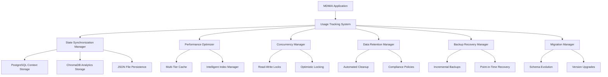

# Comprehensive Data Persistence and State Management Strategy for MDMAI Usage Tracking

## Executive Summary

This document provides a detailed technical specification for a comprehensive data persistence and state management strategy for the Usage Tracking and Cost Management system in MDMAI. The solution integrates with the existing MDMAI architecture while adding specialized components for high-performance, scalable, and reliable usage tracking data management.

## Architecture Overview

### Core Design Principles

1. **Multi-Tier Storage Architecture**: Leverages PostgreSQL for transactional data, ChromaDB for vector analytics, and JSON files for offline access
2. **State Synchronization**: Advanced conflict resolution and consistency management across storage backends  
3. **Performance Optimization**: Multi-tier caching, intelligent indexing, and query optimization
4. **Reliability**: Comprehensive backup/recovery, data retention policies, and disaster recovery
5. **Scalability**: Concurrent access patterns, partitioned locking, and horizontal scaling support
6. **Evolution**: Version migration strategies for schema changes and system upgrades

### System Components



## 1. ChromaDB Integration for Usage Analytics

### Purpose
Extends the existing ChromaDB setup to support usage tracking analytics with vector-based search and pattern recognition capabilities.

### Key Features

- **Multi-Collection Architecture**: Separate collections for different analytics types
- **Vector-Based Search**: Semantic search across usage patterns and behaviors
- **Real-Time Analytics**: Stream processing for immediate insights
- **Pattern Recognition**: ML-powered anomaly detection and optimization suggestions

### Collections Schema

```python
{
    "usage_patterns": {
        "description": "User usage patterns and behavior analysis",
        "retention_days": 365,
        "metadata_fields": ["user_id", "provider_type", "model", "timestamp", "cost"]
    },
    "cost_optimization": {
        "description": "Cost optimization insights and recommendations",
        "retention_days": 180,
        "metadata_fields": ["efficiency_score", "potential_savings", "optimization_type"]
    },
    "performance_metrics": {
        "description": "Performance metrics and latency analysis", 
        "retention_days": 90,
        "metadata_fields": ["latency_percentile", "throughput", "error_rate"]
    }
}
```

### Integration Points

- **Vector Content Generation**: Converts usage records into searchable vector content
- **Analytics Processing**: Real-time analysis of usage patterns for insights
- **Query Interface**: High-level API for analytics queries and pattern matching
- **Retention Management**: Automated cleanup based on collection-specific policies

## 2. JSON File Persistence Strategy

### Purpose  
High-performance local file storage with offline access, compression, and intelligent partitioning.

### Architecture Features

#### Partitioning Strategy
- **Daily Partitioning**: Default strategy for time-based access patterns
- **User-Based Partitioning**: For user-specific data isolation
- **Provider-Based Partitioning**: For provider-specific analytics
- **Hybrid Partitioning**: Combination strategies for complex workloads

#### Performance Optimizations
- **Write Buffering**: Batch writes for improved throughput
- **Compression**: GZIP, LZ4, ZSTD support with automatic selection
- **Indexing**: Fast B-tree and hash indices for query acceleration
- **Caching**: Multi-level caching for frequently accessed data

#### File Structure
```
data/usage_tracking/
├── partitions/
│   ├── 2024-01-15_001.json.gz
│   ├── 2024-01-15_002.json.gz
│   └── user_123_001.json.gz
├── metadata.json
├── indices.json
└── backups/
    ├── daily/
    └── incremental/
```

### Reliability Features

- **Atomic Writes**: Temporary file + rename for consistency
- **Checksum Verification**: SHA-256 checksums for data integrity
- **Corruption Recovery**: Automatic detection and recovery procedures
- **Backup Integration**: Seamless integration with backup system

## 3. State Synchronization Algorithm

### Purpose
Maintains consistency across PostgreSQL, ChromaDB, and JSON storage with advanced conflict resolution.

### Synchronization Strategies

#### Real-Time Synchronization
- **Event-Driven Updates**: Immediate propagation of changes
- **Change Detection**: Vector clocks and version tracking
- **Conflict Resolution**: Configurable strategies (latest wins, merge, manual)
- **Rollback Support**: Automatic rollback on sync failures

#### Batch Synchronization  
- **Scheduled Batches**: Configurable interval processing
- **Delta Synchronization**: Only sync changed data
- **Bulk Operations**: Optimized for large data transfers
- **Progress Tracking**: Detailed sync status and metrics

#### Conflict Resolution Strategies

```python
class ConflictResolution(Enum):
    LATEST_WINS = "latest_wins"          # Most recent timestamp wins
    MERGE = "merge"                      # Intelligent field-level merge
    MANUAL = "manual"                    # Human intervention required
    SOURCE_PRIORITY = "source_priority"  # Based on source reliability
```

### Implementation Details

- **Vector Clocks**: For ordering events across distributed systems  
- **Merkle Trees**: For efficient diff detection and validation
- **WAL Integration**: PostgreSQL Write-Ahead Log integration
- **Async Processing**: Non-blocking synchronization with queues

## 4. Data Retention Policies and Cleanup

### Purpose
Automated data lifecycle management with compliance support and efficient storage utilization.

### Policy Framework

#### Policy Types
- **Time-Based**: Retention based on age (90 days, 1 year, etc.)
- **Size-Based**: Retention based on storage limits (1GB, 10GB, etc.)  
- **Count-Based**: Retention based on record counts (100K records, etc.)
- **Conditional**: Complex rules based on data characteristics
- **Compliance**: Legal and regulatory retention requirements

#### Data Categories
```python
class DataCategory(Enum):
    RAW_USAGE_DATA = "raw_usage_data"           # 90 days retention
    AGGREGATED_METRICS = "aggregated_metrics"   # 1 year retention  
    ANALYTICS_INSIGHTS = "analytics_insights"   # 6 months retention
    AUDIT_LOGS = "audit_logs"                   # 7 years retention
    BACKUP_DATA = "backup_data"                 # 30 days retention
    TEMP_DATA = "temp_data"                     # 1 day retention
```

#### Retention Actions
- **Delete**: Permanent removal from storage
- **Archive**: Move to long-term cold storage
- **Compress**: In-place compression for space savings
- **Aggregate**: Summarize into metrics and remove raw data
- **Export**: Export to external systems before removal

### Execution Engine

- **Scheduled Execution**: Background processes with configurable intervals
- **Dry Run Support**: Simulate retention policies without data modification
- **Progress Tracking**: Detailed logs and metrics for audit trails
- **Error Handling**: Graceful failure handling with retry logic
- **Event Notifications**: Integration with alerting systems

## 5. Performance Optimization

### Multi-Tier Caching Architecture

#### Cache Levels
1. **L1 Memory Cache**: Ultra-fast in-memory cache (< 1ms access)
2. **L2 Redis Cache**: Distributed cache for shared data (< 10ms access)  
3. **L3 Persistent Cache**: SSD-based cache for warm data (< 100ms access)

#### Cache Strategies
- **LRU (Least Recently Used)**: Good for temporal locality
- **LFU (Least Frequently Used)**: Good for frequency-based patterns
- **Adaptive**: ML-based cache replacement for optimal hit rates
- **TTL-Based**: Time-based expiration for volatile data

### Intelligent Indexing

#### Index Types
- **B-Tree Indices**: For range queries and sorting
- **Hash Indices**: For exact match queries
- **Bitmap Indices**: For low-cardinality data
- **Bloom Filters**: For existence checks
- **Composite Indices**: Multi-column optimization

#### Query Pattern Analysis
- **Automatic Detection**: ML-based query pattern recognition
- **Index Recommendations**: AI-powered suggestions for new indices
- **Performance Monitoring**: Real-time query performance tracking
- **Adaptive Optimization**: Self-tuning based on workload changes

### Performance Targets

| Metric | Target | Monitoring |
|--------|--------|------------|
| Cache Hit Rate | > 85% | Real-time dashboard |
| Query Response Time (P95) | < 100ms | Continuous monitoring |
| Write Throughput | > 10,000 ops/sec | Load testing |
| Read Throughput | > 50,000 ops/sec | Benchmark suite |
| System Availability | > 99.9% | Uptime monitoring |

## 6. Concurrent Access Patterns

### Thread Safety Mechanisms

#### Read-Write Locks
- **Priority Control**: Writer priority vs reader priority
- **Timeout Support**: Configurable timeout to prevent deadlocks
- **Fairness**: Prevent starvation of readers or writers
- **Metrics**: Lock contention and hold time tracking

#### Optimistic Locking
- **Version Vectors**: Multi-dimensional versioning for conflict detection
- **Retry Logic**: Exponential backoff on version conflicts
- **Performance**: Minimal locking overhead for read-heavy workloads
- **Scalability**: Horizontal scaling without lock coordination

#### Actor Model
- **Message Passing**: Asynchronous message-based communication
- **Isolation**: Actor-level state isolation
- **Fault Tolerance**: Actor supervision and restart policies
- **Load Balancing**: Dynamic work distribution across actors

### Concurrency Patterns

```python
class ConcurrencyPattern(Enum):
    SINGLE_WRITER_MULTIPLE_READERS = "single_writer_multiple_readers"
    MULTIPLE_WRITERS_QUEUE = "multiple_writers_queue"  
    PARTITION_BASED = "partition_based"
    OPTIMISTIC_LOCKING = "optimistic_locking"
    ACTOR_MODEL = "actor_model"
```

### Partitioned Locking
- **Hash-Based Partitioning**: Distribute locks across partitions
- **Lock Striping**: Reduce contention through fine-grained locking
- **NUMA Awareness**: CPU topology-aware lock placement
- **Lock Coarsening**: Dynamic adjustment of lock granularity

## 7. Backup and Recovery Mechanisms

### Backup Strategy

#### Backup Types
- **Full Backups**: Complete system snapshot (weekly)
- **Incremental Backups**: Changes since last backup (daily)
- **Differential Backups**: Changes since last full backup
- **Continuous Backups**: Real-time streaming backups
- **Snapshot Backups**: Point-in-time consistent snapshots

#### Storage Architecture
```
backups/
├── full_20240115_120000/
│   ├── manifest.json
│   ├── json_files/
│   ├── postgresql/
│   ├── chromadb/
│   └── metadata/
├── inc_20240116_060000/
│   ├── manifest.json
│   └── delta_changes/
└── archives/
    └── compressed_backups/
```

### Recovery Capabilities

#### Point-in-Time Recovery
- **Transaction Log Integration**: PostgreSQL WAL-based recovery
- **Incremental Chain Reconstruction**: Automatic backup chain resolution
- **Cross-System Consistency**: Coordinated recovery across all storage systems
- **Recovery Validation**: Automated integrity checking post-recovery

#### Recovery Types
- **Full System Restore**: Complete system recovery from backup
- **Partial Restore**: Selective data recovery (specific tables, users, date ranges)
- **Online Recovery**: Zero-downtime recovery using blue-green deployment
- **Cross-Platform Recovery**: Recovery across different system architectures

### Disaster Recovery

#### RTO/RPO Targets
- **Recovery Time Objective (RTO)**: < 4 hours for full system recovery
- **Recovery Point Objective (RPO)**: < 15 minutes data loss maximum
- **Backup Verification**: Automated testing of backup integrity
- **Geographic Distribution**: Multi-region backup storage

## 8. Migration Strategies

### Schema Evolution Framework

#### Migration Types
- **Schema Upgrades**: Database schema modifications
- **Data Transformations**: Field restructuring and data conversion  
- **Index Restructuring**: Performance optimization migrations
- **Storage Format Changes**: File format and compression updates
- **Security Enhancements**: Encryption and access control updates

#### Execution Strategies
```python
class MigrationStrategy(Enum):
    ONLINE = "online"          # Zero downtime migration
    OFFLINE = "offline"        # Requires planned downtime  
    ROLLING = "rolling"        # Gradual node-by-node migration
    BLUE_GREEN = "blue_green"  # Parallel environment deployment
    CANARY = "canary"          # Gradual rollout with monitoring
```

### Version Management

#### Migration Pipeline
1. **Pre-Migration Validation**: System health and compatibility checks
2. **Backup Creation**: Automatic pre-migration backup
3. **Migration Execution**: Staged execution with progress tracking
4. **Post-Migration Validation**: Data integrity and system functionality verification
5. **Rollback Capability**: Automated rollback on failure detection

#### Dependency Resolution
- **Topological Sorting**: Automatic dependency ordering
- **Conflict Detection**: Migration conflict analysis
- **Parallel Execution**: Independent migration parallel processing
- **Progress Tracking**: Real-time migration status dashboard

## Integration with Existing MDMAI Architecture

### PostgreSQL Integration
- **Context Storage Extension**: Extend existing context persistence for usage tracking
- **Schema Compatibility**: Maintain compatibility with existing context models
- **Transaction Coordination**: ACID compliance across usage tracking operations
- **Performance Isolation**: Separate connection pools for usage tracking queries

### ChromaDB Integration  
- **Collection Management**: Extend existing collection management for analytics
- **Embedding Reuse**: Leverage existing embedding functions and models
- **Index Sharing**: Share indices between TTRPG and usage tracking collections
- **Resource Management**: Unified resource allocation and monitoring

### Configuration Integration
- **Settings Inheritance**: Extend existing settings.py for usage tracking configuration
- **Environment Variables**: Consistent environment variable naming and structure
- **Logging Integration**: Use existing logging infrastructure with usage-specific loggers
- **Monitoring Integration**: Extend existing performance monitoring systems

## Performance Specifications

### Throughput Requirements

| Operation Type | Target Throughput | Peak Capacity | Latency Target |
|----------------|------------------|---------------|----------------|
| Usage Record Writes | 10,000 ops/sec | 50,000 ops/sec | < 10ms P95 |
| Analytics Queries | 5,000 ops/sec | 25,000 ops/sec | < 100ms P95 |  
| Sync Operations | 1,000 ops/sec | 5,000 ops/sec | < 50ms P95 |
| Backup Operations | 1 GB/min | 10 GB/min | N/A |
| Cache Operations | 100,000 ops/sec | 500,000 ops/sec | < 1ms P95 |

### Scalability Targets

- **Horizontal Scaling**: Support up to 100 application nodes
- **Data Volume**: Handle up to 1TB of usage tracking data
- **User Concurrency**: Support 10,000 concurrent users
- **Geographic Distribution**: Multi-region deployment support
- **Storage Growth**: 10x growth capacity with linear performance scaling

### Resource Utilization

- **Memory Usage**: < 4GB per application node
- **CPU Utilization**: < 70% under normal load
- **Disk I/O**: < 80% of available IOPS
- **Network Bandwidth**: < 50% of available bandwidth
- **Cache Efficiency**: > 85% hit rate for frequently accessed data

## Security and Compliance

### Data Security

#### Encryption
- **Encryption at Rest**: AES-256 encryption for all stored data
- **Encryption in Transit**: TLS 1.3+ for all network communication
- **Key Management**: Hardware Security Module (HSM) integration
- **Key Rotation**: Automated key rotation policies

#### Access Control
- **Role-Based Access**: Fine-grained permissions based on user roles
- **API Authentication**: OAuth 2.0 + JWT token-based authentication
- **Audit Logging**: Comprehensive access logging for compliance
- **Data Masking**: PII masking for non-production environments

### Compliance Support

#### Regulatory Compliance
- **GDPR**: Right to be forgotten, data portability, consent management
- **CCPA**: Consumer privacy rights and data handling requirements
- **SOX**: Financial data retention and audit trail requirements
- **HIPAA**: Healthcare data protection (if applicable)

#### Data Governance
- **Data Classification**: Automatic classification of sensitive data
- **Retention Policies**: Configurable retention based on data classification
- **Data Lineage**: Complete tracking of data sources and transformations
- **Impact Analysis**: Assessment of changes on compliance requirements

## Monitoring and Alerting

### Key Performance Indicators (KPIs)

#### System Health Metrics
- **Availability**: System uptime percentage
- **Response Time**: API response time percentiles
- **Throughput**: Operations per second across all components
- **Error Rate**: Percentage of failed operations
- **Resource Utilization**: CPU, memory, disk, and network usage

#### Data Quality Metrics
- **Data Completeness**: Percentage of complete records
- **Data Accuracy**: Validation rule compliance rate
- **Data Freshness**: Age of most recent data updates
- **Sync Status**: Cross-system synchronization lag
- **Backup Health**: Backup success rate and recovery test results

### Alerting Framework

#### Alert Categories
- **Critical**: System down, data loss, security breach
- **Warning**: Performance degradation, capacity approaching limits
- **Information**: Successful operations, scheduled maintenance
- **Audit**: Compliance events, policy violations

#### Notification Channels
- **Real-time**: Slack, PagerDuty, SMS for critical alerts
- **Batch**: Email summaries for warnings and informational alerts
- **Dashboard**: Real-time metrics dashboard for operations team
- **API**: Webhook integration for external monitoring systems

## Implementation Roadmap

### Phase 1: Foundation (Weeks 1-4)
- [ ] Core data models and interfaces
- [ ] PostgreSQL integration extensions
- [ ] Basic JSON file persistence
- [ ] Initial ChromaDB collections setup
- [ ] Simple state synchronization

### Phase 2: Performance (Weeks 5-8)
- [ ] Multi-tier caching implementation
- [ ] Intelligent indexing system
- [ ] Query optimization framework
- [ ] Basic concurrency patterns
- [ ] Performance monitoring dashboard

### Phase 3: Reliability (Weeks 9-12)
- [ ] Comprehensive backup system
- [ ] Point-in-time recovery capabilities
- [ ] Data retention policies
- [ ] Advanced conflict resolution
- [ ] Disaster recovery procedures

### Phase 4: Advanced Features (Weeks 13-16)
- [ ] Migration framework
- [ ] Advanced analytics
- [ ] Machine learning integration
- [ ] Compliance automation
- [ ] Advanced security features

### Phase 5: Production Hardening (Weeks 17-20)
- [ ] Performance tuning and optimization
- [ ] Security audit and penetration testing
- [ ] Load testing and capacity planning
- [ ] Documentation and training
- [ ] Production deployment and monitoring

## Conclusion

This comprehensive data persistence and state management strategy provides MDMAI with a robust, scalable, and future-proof solution for usage tracking and cost management. The multi-tier architecture ensures optimal performance while maintaining data consistency and reliability across all storage backends.

Key benefits of this design:

1. **Scalability**: Horizontal scaling support with partitioned architecture
2. **Performance**: Multi-tier caching and intelligent indexing for sub-100ms queries
3. **Reliability**: Comprehensive backup/recovery with point-in-time restoration
4. **Flexibility**: Multiple storage backends optimized for different use cases
5. **Evolution**: Migration framework supporting seamless upgrades
6. **Integration**: Seamless integration with existing MDMAI components

The implementation follows industry best practices for distributed systems, data management, and performance optimization, ensuring the system can scale with MDMAI's growth while maintaining operational excellence.

---

*This design document serves as the technical blueprint for implementing the comprehensive usage tracking persistence system in MDMAI. All components have been designed with modularity, testability, and maintainability in mind.*