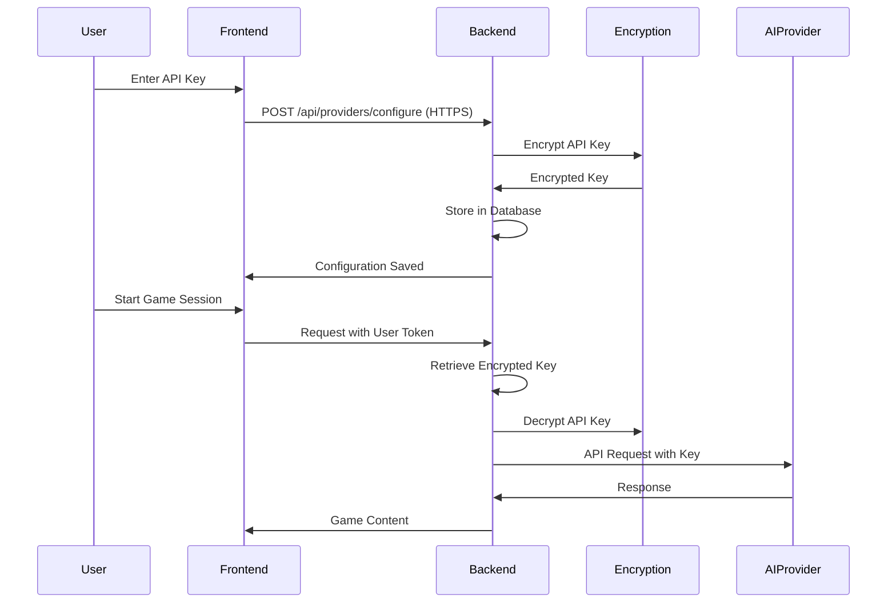

# TTRPG Assistant MCP Server - Design Document

## System Architecture

### Overview
The TTRPG Assistant is built as a Model Context Protocol (MCP) server that operates locally via stdin/stdout communication. It provides a comprehensive assistant for Dungeon Masters and Game Runners with fast access to rules, campaign data, and AI-powered content generation.

### Implementation Phases
The project follows a phased approach to ensure incremental delivery and testing:

1. **Phase 1**: Core Infrastructure - Database setup, basic MCP server
2. **Phase 2**: PDF Processing - Content extraction, chunking, indexing
3. **Phase 3**: Search System - Hybrid search, query processing, caching
4. **Phase 4**: Personality System - Style extraction and application
5. **Phase 5**: Campaign Management - CRUD operations, versioning, linking
6. **Phase 6**: Session Management - Game session tracking, initiative
7. **Phase 7**: Character Generation - PC/NPC generation with personalities
8. **Phase 8**: Testing & Optimization - Performance tuning, test coverage
9. **Phase 9-13**: Advanced Features - Tools, monitoring, security, deployment
10. **Phase 14**: Bridge Service - MCP to web integration
11. **Phase 15**: AI Provider Integration - Multi-provider support
12. **Phase 16**: Security & Authentication - OAuth2, JWT, sandboxing
13. **Phase 17**: Context Management - Distributed state management
14. **Phase 18**: Frontend Development - SvelteKit responsive web application
15. **Phase 19**: Integration Testing - End-to-end testing
16. **Phase 20**: Performance Optimization - Final optimizations
17. **Phase 21**: Mobile Support - Integrated into Phase 18 (responsive web)
18. **Phase 22**: Testing & Documentation - Comprehensive test suite and docs
19. **Phase 23**: Desktop Application - Native desktop app using Tauri

Each phase builds on the previous ones, with clear interfaces between components.

### Core Components

#### 1. MCP Server Layer
- **Framework**: FastMCP for Python
- **Communication**: stdin/stdout (local operations)
- **Protocol**: Model Context Protocol standard
- **Tools**: Exposed as decorated async functions

```python
from mcp.server.fastmcp import FastMCP
mcp = FastMCP("TTRPG")
```

**IMPORTANT: MCP Server Singleton Pattern**
- There must be ONLY ONE FastMCP instance in the entire application
- Initialize it in main.py and pass it to modules that need to register tools
- DO NOT create separate FastMCP instances in module files
- Use a registration pattern for module tools:

```python
# In module files (e.g., campaign/mcp_tools.py)
def register_campaign_tools(mcp_server):
    """Register tools with the main MCP server."""
    mcp_server.tool()(create_campaign)
    mcp_server.tool()(get_campaign_data)
    # ... register other tools

# In main.py
from src.campaign import register_campaign_tools
mcp = FastMCP("TTRPG")
register_campaign_tools(mcp)
```

#### 2. Database Layer
- **Primary Database**: ChromaDB (embedded vector database)
- **Storage Strategy**: 
  - Vector embeddings for semantic search
  - Metadata storage for structured queries
  - Document chunking with overlap for context preservation
- **Collections**:
  - `rulebooks`: Game system rules and mechanics
  - `flavor_sources`: Novels, lore, and narrative content
  - `campaigns`: Active campaign data
  - `sessions`: Game session tracking
  - `personalities`: System-specific personality profiles

#### 3. PDF Processing Pipeline
- **Extraction**: pypdf or pdfplumber for text extraction (modern, maintained packages)
- **Structure Preservation**:
  - Table detection and formatting
  - Section hierarchy maintenance
  - Index/glossary parsing for metadata
- **Adaptive Learning**:
  - Pattern recognition for content types
  - Template caching for similar documents
  - Progressive improvement through usage

#### 4. Search Engine
- **Hybrid Search Architecture**:
  - Vector similarity search (semantic)
  - BM25 keyword search (exact matching)
  - Weighted combination of results
- **Query Processing**:
  - Query expansion and suggestions
  - Spell correction
  - Context-aware filtering

#### 5. Personality Engine
- **Profile Extraction**:
  - NLP analysis of source material
  - Tone and style classification
  - Vocabulary extraction
- **Profile Application**:
  - Response templating
  - Vocabulary injection
  - Style consistency enforcement

## Data Models

### Source Document
```python
class SourceDocument:
    id: str
    title: str
    system: str  # e.g., "D&D 5e", "Call of Cthulhu"
    source_type: str  # "rulebook" or "flavor"
    content_chunks: List[ContentChunk]
    metadata: Dict
    personality_profile: PersonalityProfile
```

### Content Chunk
```python
class ContentChunk:
    id: str
    source_id: str
    content: str
    page_number: int
    section: str
    chunk_type: str  # "rule", "table", "narrative", etc.
    embedding: List[float]
    metadata: Dict
```

### Campaign Data
```python
class Campaign:
    id: str
    name: str
    system: str
    characters: List[Character]
    npcs: List[NPC]
    locations: List[Location]
    plot_points: List[PlotPoint]
    sessions: List[Session]
    created_at: datetime
    updated_at: datetime
```

### Session Data
```python
class Session:
    id: str
    campaign_id: str
    date: datetime
    notes: List[str]
    initiative_order: List[InitiativeEntry]
    monsters: List[Monster]
    status: str  # "planned", "active", "completed"
```

### Personality Profile
```python
class PersonalityProfile:
    system: str
    tone: str  # "authoritative", "mysterious", "scholarly"
    perspective: str  # "omniscient", "first-person", "instructional"
    style_descriptors: List[str]
    common_phrases: List[str]
    vocabulary: Dict[str, float]  # term -> frequency
```

## MCP Tool Interfaces

### Search Tool
```python
@mcp.tool()
async def search(
    query: str, 
    rulebook: str = None, 
    source_type: str = None,  # "rulebook" or "flavor"
    content_type: str = None,  # "rule", "spell", "monster", etc.
    max_results: int = 5,
    use_hybrid: bool = True
) -> Dict[str, Any]:
    """
    Search across TTRPG content with semantic and keyword matching
    """
```

### Source Management
```python
@mcp.tool()
async def add_source(
    pdf_path: str,
    rulebook_name: str,
    system: str,
    source_type: str = "rulebook"
) -> Dict[str, str]:
    """
    Add a new PDF source to the knowledge base
    """

@mcp.tool()
async def list_sources(
    system: str = None,
    source_type: str = None
) -> List[Dict[str, Any]]:
    """
    List available sources in the system
    """
```

### Campaign Management
```python
@mcp.tool()
async def create_campaign(
    name: str,
    system: str,
    description: str = None
) -> Dict[str, str]:
    """
    Create a new campaign
    """

@mcp.tool()
async def get_campaign_data(
    campaign_id: str,
    data_type: str = None  # "characters", "npcs", "locations", etc.
) -> Dict[str, Any]:
    """
    Retrieve campaign-specific data
    """

@mcp.tool()
async def update_campaign_data(
    campaign_id: str,
    data_type: str,
    data: Dict[str, Any]
) -> Dict[str, str]:
    """
    Update campaign information
    """
```

### Session Management
```python
@mcp.tool()
async def start_session(
    campaign_id: str,
    session_name: str = None
) -> Dict[str, str]:
    """
    Start a new game session
    """

@mcp.tool()
async def add_session_note(
    session_id: str,
    note: str
) -> Dict[str, str]:
    """
    Add a note to the current session
    """

@mcp.tool()
async def set_initiative(
    session_id: str,
    initiative_order: List[Dict[str, Any]]
) -> Dict[str, str]:
    """
    Set the initiative order for combat
    """

@mcp.tool()
async def update_monster_hp(
    session_id: str,
    monster_id: str,
    new_hp: int
) -> Dict[str, str]:
    """
    Update a monster's hit points
    """
```

### Character Generation
```python
@mcp.tool()
async def generate_character(
    system: str,
    level: int = 1,
    class_type: str = None,
    backstory_hints: str = None
) -> Dict[str, Any]:
    """
    Generate a player character with stats and backstory
    """

@mcp.tool()
async def generate_npc(
    system: str,
    role: str,  # "merchant", "guard", "noble", etc.
    level: int = None,
    personality_traits: List[str] = None
) -> Dict[str, Any]:
    """
    Generate an NPC with appropriate stats and personality
    """
```

### Personality Management
```python
@mcp.tool()
async def get_system_personality(
    system: str
) -> Dict[str, Any]:
    """
    Get the personality profile for a game system
    """

@mcp.tool()
async def set_active_personality(
    system: str
) -> Dict[str, str]:
    """
    Set the active personality for responses
    """
```

## Processing Pipelines

### PDF Import Pipeline
1. **Document Loading**: Load PDF and extract raw text
2. **Structure Analysis**: Identify sections, tables, indices
3. **Content Chunking**: Split into semantic chunks with overlap
4. **Metadata Extraction**: Extract page numbers, sections, content types
5. **Personality Analysis**: Analyze tone, style, vocabulary
6. **Embedding Generation**: Create vector embeddings for chunks
7. **Storage**: Store in ChromaDB with metadata
8. **Pattern Learning**: Update adaptive learning cache

### TTRPG Content Expansion Pipeline

#### Overview
Extract and categorize game elements from 271+ TTRPG rulebooks to expand character generation beyond generic D&D fantasy. This pipeline identifies races, classes, roles, equipment, and setting-specific elements across diverse genres (sci-fi, cosmic horror, cyberpunk, etc.).

#### Content Extraction Strategy

##### 1. Genre Classification
```python
class TTRPGGenre(Enum):
    FANTASY = "fantasy"           # D&D, Pathfinder, etc.
    SCI_FI = "sci_fi"             # Traveller, Star Wars RPG
    CYBERPUNK = "cyberpunk"       # 2040, Shadowrun
    COSMIC_HORROR = "cosmic_horror"  # Call of Cthulhu, Delta Green
    POST_APOCALYPTIC = "post_apoc"   # Fallout, Mutant Year Zero
    STEAMPUNK = "steampunk"       # Iron Kingdoms, Castle Falkenstein
    SUPERHERO = "superhero"       # Mutants & Masterminds
    HISTORICAL = "historical"     # Pendragon, Ars Magica
    URBAN_FANTASY = "urban_fantasy"  # World of Darkness
```

##### 2. Content Pattern Recognition
The pipeline uses pattern matching and NLP to identify:
- **Character Types**: races/species, classes/professions, backgrounds
- **Abilities**: skills, feats, powers, spells, cyberware
- **Equipment**: weapons, armor, gear, vehicles
- **NPCs**: roles, archetypes, stat blocks
- **Setting Elements**: factions, locations, terminology

##### 3. Extraction Patterns
```python
# Pattern examples for different content types
RACE_PATTERNS = [
    r"(?:Race|Species|Origin|Heritage):\s*([A-Z][a-z]+)",
    r"Playing a(?:n)?\s+([A-Z][a-z]+)",
    r"([A-Z][a-z]+)\s+Racial\s+Traits",
]

CLASS_PATTERNS = [
    r"(?:Class|Profession|Career|Role):\s*([A-Z][a-z]+)",
    r"The\s+([A-Z][a-z]+)\s+class",
    r"([A-Z][a-z]+)\s+Starting\s+Equipment",
]

NPC_ROLE_PATTERNS = [
    r"([A-Z][a-z]+)\s+(?:Stat Block|Statistics)",
    r"(?:Typical|Average)\s+([A-Z][a-z]+)",
]
```

##### 4. Multi-Stage Processing
1. **Initial Scan**: Quick pattern matching for common structures
2. **Context Analysis**: Use surrounding text to validate matches
3. **Cross-Reference**: Check against game system terminology
4. **Deduplication**: Merge similar concepts across systems
5. **Categorization**: Assign to appropriate genre and type

#### Data Model Extensions

##### Extended Character Models
```python
@dataclass
class ExtendedCharacterRace:
    name: str
    genre: TTRPGGenre
    system: str  # "D&D 5e", "Cyberpunk 2020", etc.
    description: str
    stat_modifiers: Dict[str, int]
    abilities: List[str]
    restrictions: List[str]
    source_book: str
    page_reference: int
    
@dataclass
class ExtendedCharacterClass:
    name: str
    genre: TTRPGGenre
    system: str
    description: str
    primary_attributes: List[str]
    skills: List[str]
    equipment: List[str]
    progression: Dict[int, List[str]]  # level -> abilities
    source_book: str
    page_reference: int

@dataclass
class ExtendedNPCRole:
    name: str
    genre: TTRPGGenre
    system: str
    description: str
    typical_stats: Dict[str, Any]
    behaviors: List[str]
    motivations: List[str]
    source_book: str
    page_reference: int
```

##### Content Repository Structure
```python
class TTRPGContentRepository:
    def __init__(self):
        self.races: Dict[TTRPGGenre, List[ExtendedCharacterRace]] = {}
        self.classes: Dict[TTRPGGenre, List[ExtendedCharacterClass]] = {}
        self.npc_roles: Dict[TTRPGGenre, List[ExtendedNPCRole]] = {}
        self.equipment: Dict[TTRPGGenre, List[Equipment]] = {}
        self.name_generators: Dict[TTRPGGenre, NameGenerator] = {}
        self.backstory_templates: Dict[TTRPGGenre, List[str]] = {}
```

#### Processing Implementation

##### Phase 1: PDF Analysis Script
```python
async def analyze_ttrpg_pdfs(pdf_directory: str) -> TTRPGContentRepository:
    """One-time script to extract content from all PDFs."""
    repository = TTRPGContentRepository()
    
    for pdf_path in Path(pdf_directory).glob("*.pdf"):
        # Extract text and metadata
        content = await extract_pdf_content(pdf_path)
        genre = classify_genre(content, pdf_path.name)
        
        # Extract game elements
        races = extract_races(content, genre)
        classes = extract_classes(content, genre)
        npcs = extract_npc_roles(content, genre)
        
        # Store in repository
        repository.add_content(genre, races, classes, npcs)
    
    return repository
```

##### Phase 2: Content Validation
- Manual review of extracted content
- Verification against known game systems
- Correction of misclassified elements
- Addition of missing metadata

##### Phase 3: Integration with Generators
```python
class EnhancedCharacterGenerator:
    def __init__(self, repository: TTRPGContentRepository):
        self.repository = repository
    
    async def generate_character(
        self,
        genre: TTRPGGenre = None,
        system: str = None,
        level: int = 1
    ) -> Character:
        # Select appropriate content based on genre/system
        if genre:
            available_races = self.repository.races.get(genre, [])
            available_classes = self.repository.classes.get(genre, [])
        
        # Generate using expanded content
        race = random.choice(available_races)
        char_class = random.choice(available_classes)
        
        return self.build_character(race, char_class, level)
```

#### Storage Schema Updates

##### ChromaDB Collections
- **expanded_races**: All races across genres with embeddings
- **expanded_classes**: All classes/professions with embeddings
- **expanded_npcs**: NPC roles and archetypes
- **genre_personalities**: Genre-specific narrative styles
- **system_mechanics**: Game-specific rules and mechanics

##### Metadata Structure
```python
metadata = {
    "genre": "cyberpunk",
    "system": "Cyberpunk 2020",
    "content_type": "race",
    "name": "Netrunner",
    "source_book": "Cyberpunk 2020 Core",
    "page": 42,
    "extraction_confidence": 0.95,
    "validated": True
}
```

### Search Pipeline
1. **Query Processing**: Clean and expand query
2. **Hybrid Search**:
   - Vector similarity search
   - Keyword search with BM25
   - Result merging with weights
3. **Reranking**: Apply relevance scoring
4. **Context Enhancement**: Add surrounding context
5. **Personality Application**: Apply system personality to response
6. **Result Formatting**: Structure results with citations

### Campaign Update Pipeline
1. **Validation**: Verify campaign exists and data is valid
2. **Version Creation**: Create snapshot of current state
3. **Update Application**: Apply changes to data
4. **Cross-Reference**: Update links to rulebook content
5. **Index Update**: Update search indices
6. **Confirmation**: Return success with version info

## Implementation Guidelines

### Project Structure
```
src/
├── main.py                 # Single MCP server instance, tool registration
├── core/
│   ├── __init__.py
│   └── database.py         # ChromaDB manager singleton
├── campaign/
│   ├── __init__.py        # Module exports
│   ├── models.py          # Data models (Campaign, Character, etc.)
│   ├── campaign_manager.py # Business logic
│   ├── rulebook_linker.py # Cross-referencing logic
│   └── mcp_tools.py       # Tool definitions (NO MCP instance)
├── search/
│   ├── __init__.py
│   ├── search_service.py  # Main search logic
│   ├── hybrid_search.py   # Search implementation
│   ├── query_processor.py # Query handling
│   ├── cache_manager.py   # Caching logic
│   └── error_handler.py   # Error handling utilities
├── personality/
│   ├── __init__.py
│   ├── personality_manager.py
│   ├── personality_extractor.py
│   └── response_generator.py
├── pdf_processing/
│   ├── __init__.py
│   ├── pipeline.py        # Processing pipeline
│   ├── pdf_parser.py      # PDF extraction
│   ├── content_chunker.py # Chunking logic
│   └── adaptive_learning.py
└── session/              # Future: Session management
    └── __init__.py
```

### Module Structure Best Practices

#### 1. Separation of Concerns
- **Models** (`models.py`): Data structures and validation
- **Managers** (`*_manager.py`): Business logic and operations
- **MCP Tools** (`mcp_tools.py`): Tool definitions and registration
- **Utilities** (`*_linker.py`, `*_helper.py`): Supporting functionality

#### 2. Dependency Injection
- Initialize dependencies in main.py
- Pass dependencies to modules via initialization functions
- Avoid global imports of stateful objects

```python
# Good: Dependency injection
def initialize_campaign_tools(db, campaign_manager, linker):
    global _db, _campaign_manager, _linker
    _db = db
    _campaign_manager = campaign_manager
    _linker = linker

# Bad: Direct import
from src.core.database import db  # Creates coupling
```

#### 3. Async/Await Consistency
- All MCP tools MUST be async functions
- Use `@handle_search_errors()` decorator for error handling
- Maintain async chain through the call stack

#### 4. Error Handling Pattern
```python
from src.search.error_handler import handle_search_errors, DatabaseError

@handle_search_errors()
async def campaign_operation():
    try:
        # Operation logic
        return {"success": True, "data": result}
    except SpecificError as e:
        logger.error(f"Operation failed: {str(e)}")
        raise DatabaseError(f"Operation failed: {str(e)}")
```

#### 5. Standardized Return Patterns
All MCP tools should follow consistent return patterns:

**Success Response:**
```python
{
    "success": True,
    "message": "Operation completed successfully",
    "data": {...},  # Optional: returned data
    "id": "...",    # Optional: created/modified entity ID
}
```

**Error Response:**
```python
{
    "success": False,
    "error": "Descriptive error message",
    "details": {...},  # Optional: additional error context
}
```

**Search Response:**
```python
{
    "success": True,
    "query": "original query",
    "results": [...],
    "total_results": 42,
    "metadata": {...},  # Optional: search metadata
}
```

#### 6. Data Model Patterns
- Use `@dataclass` for models with `to_dict()` and `from_dict()` methods
- Handle datetime serialization consistently
- Provide default values using `field(default_factory=...)`

```python
@dataclass
class Model:
    id: str = field(default_factory=lambda: str(uuid.uuid4()))
    created_at: datetime = field(default_factory=datetime.utcnow)
    
    def to_dict(self) -> Dict[str, Any]:
        data = asdict(self)
        data['created_at'] = self.created_at.isoformat()
        return data
    
    @classmethod
    def from_dict(cls, data: Dict[str, Any]) -> 'Model':
        if isinstance(data.get('created_at'), str):
            data['created_at'] = datetime.fromisoformat(data['created_at'])
        return cls(**data)
```

## Technical Implementation Details

### Database Schema (ChromaDB Collections)

#### Rulebooks Collection
- **Documents**: Content chunks from rulebooks
- **Metadata**: 
  - `source_id`: Unique identifier for source
  - `page`: Page number
  - `section`: Section name
  - `content_type`: Type of content
  - `system`: Game system
- **Embeddings**: Vector representations of content

#### Campaigns Collection
- **Documents**: Campaign data serialized as JSON
- **Metadata**:
  - `campaign_id`: Unique identifier
  - `data_type`: Type of data stored
  - `version`: Version number
  - `created_at`: Timestamp
  - `updated_at`: Timestamp

### Adaptive Learning System
- **Pattern Cache**: Store learned patterns for content types
- **Classification Models**: Simple ML models for content classification
- **Performance Metrics**: Track accuracy and improve over time
- **Template Library**: Reusable parsing templates

### Error Handling
- **Graceful Degradation**: Fallback to simpler search if advanced fails
- **User Feedback**: Clear error messages with suggestions
- **Retry Logic**: Automatic retry for transient failures
- **Logging**: Comprehensive logging for debugging

### Performance Optimizations
- **Caching**: LRU cache for frequent queries
- **Batch Processing**: Process multiple chunks in parallel
- **Index Optimization**: Periodic index optimization
- **Connection Pooling**: Reuse database connections

## Security Considerations
- **Input Validation**: Sanitize all user inputs
- **File Access**: Restrict PDF access to allowed directories
- **Data Isolation**: Separate campaign data by user/campaign
- **Rate Limiting**: Prevent abuse of resource-intensive operations

## Testing Guidelines

### Unit Testing
- Test each module independently with mocked dependencies
- Use `pytest` and `pytest-asyncio` for async tests
- Maintain test coverage above 80%

### Integration Testing
- Test MCP tool registration and execution
- Verify database operations with test fixtures
- Test error handling and edge cases

### Example Test Structure
```python
import pytest
from unittest.mock import Mock, AsyncMock

@pytest.fixture
def mock_db():
    db = Mock(spec=ChromaDBManager)
    db.add_document = AsyncMock()
    return db

@pytest.mark.asyncio
async def test_create_campaign(mock_db):
    manager = CampaignManager(mock_db)
    result = await manager.create_campaign("Test", "D&D 5e")
    assert result["success"] == True
    mock_db.add_document.assert_called_once()
```

## Common Pitfalls to Avoid

1. **Multiple MCP Instances**: Always use a single FastMCP instance
2. **Synchronous MCP Tools**: All tools must be async
3. **Missing Error Handling**: Use decorators consistently
4. **Direct Database Access**: Always go through managers
5. **Hardcoded Paths**: Use configuration settings
6. **Circular Imports**: Use dependency injection
7. **Unhandled Datetime Serialization**: Always convert to ISO format
8. **Missing Type Hints**: Use type hints for all functions
9. **Inconsistent Return Formats**: Standardize on success/error patterns
10. **Memory Leaks**: Implement proper cache eviction

## Development Workflow

### Adding New Features
1. Update requirements.md if needed
2. Design data models first
3. Implement business logic in managers
4. Create MCP tool wrappers
5. Register tools in main.py
6. Write tests
7. Update documentation

### Code Review Checklist
- [ ] Single MCP instance pattern followed
- [ ] All MCP tools are async
- [ ] Error handling decorators used
- [ ] Type hints present
- [ ] Tests included
- [ ] Documentation updated
- [ ] No hardcoded values
- [ ] Dependency injection used

## Future Enhancements
- **Multi-language Support**: Support for non-English rulebooks
- **Image Processing**: Extract and index images from PDFs
- **Voice Integration**: Voice commands for hands-free operation
- **Web Interface**: Optional web UI for visual management (See Web UI Integration Architecture below)
- **Cloud Sync**: Optional cloud backup and sync
- **Plugin System**: Extensible architecture for custom tools
- **Real-time Collaboration**: Multiple DMs sharing a campaign (See Collaborative Features below)
- **AI-powered Content Generation**: Generate NPCs, quests, and encounters
- **Progressive Web App**: Installable web app with offline capabilities

## Web UI Integration Architecture

### Overview
The Web UI Integration enables users to connect their own AI provider accounts (Anthropic, OpenAI, Google Gemini) to access the TTRPG Assistant's MCP tools through a web interface, eliminating the need for custom clients like Claude Desktop while maintaining the robustness of local stdio operations.

### High-Level Architecture

```
┌─────────────────┐    ┌──────────────────┐    ┌─────────────────┐
│    Web UI       │────│  Bridge Service  │────│ MCP Server      │
│  (SvelteKit)    │ WS │   (FastAPI)      │stdio│  (FastMCP)      │
└─────────────────┘    └──────────────────┘    └─────────────────┘
         │                       │                       │
         │              ┌────────┴────────┐              │
         │              │                 │              │
    ┌────▼────┐    ┌────▼────┐      ┌─────▼─────┐       │
    │  SSR    │    │ AI      │      │ Session   │       │
    │ Routes  │    │Providers│      │ Manager   │       │
    └─────────┘    └─────────┘      └───────────┘       │
                        │                               │
               ┌────────┼────────┐                      │
               │        │        │                      │
          ┌────▼─┐ ┌────▼─┐ ┌────▼─┐                   │
          │Claude│ │OpenAI│ │Gemini│                   │
          └──────┘ └──────┘ └──────┘                   │
```

### Core Components

#### 1. MCP Bridge Service
A new component that bridges WebSocket requests to the stdio MCP server, managing session state and request routing.

```python
        self.mcp_processes = {}  # Dict of session_id -> process
        self.sessions = {}  # Track user sessions
        self.request_queue = asyncio.Queue()
        
    async def start_mcp_server(self, session_id: str):
        )
        self.sessions[session_id] = process
        return process
```

#### 2. Transport Configuration
Maintains stdio as primary transport while adding bridge capability:

```python
class TransportConfig:
    STDIO_ONLY = "stdio"          # Current mode
    HTTP_BRIDGE = "http_bridge"   # New bridge mode
    HYBRID = "hybrid"              # Both modes simultaneously
```

#### 3. Unified AI Provider Interface
Abstraction layer for different AI providers:

```python
from abc import ABC, abstractmethod

class AIProvider(ABC):
    @abstractmethod
    async def chat_completion(
        self, 
        messages: List[AIMessage], 
        tools: List[Dict],
        stream: bool = False
    ) -> AsyncIterator[StreamChunk]:
        pass
    
    @abstractmethod
    async def validate_credentials(self, api_key: str) -> bool:
        pass

class UnifiedAIClient:
    def __init__(self):
        self.providers = {
            ProviderType.ANTHROPIC: AnthropicProvider(),
            ProviderType.OPENAI: OpenAIProvider(), 
            ProviderType.GEMINI: GeminiProvider()
        }
```

### Request/Response Flow

1. **User Query**: Web UI sends query with context to orchestrator
2. **Tool Discovery**: Orchestrator gets available tools from MCP server
3. **AI Processing**: Query forwarded to selected AI provider with tools
4. **Tool Execution**: AI requests tool execution, routed through MCP bridge
5. **Response Streaming**: Results streamed back to UI via WebSocket

### Security Architecture

#### Authentication & Authorization
- **Multi-provider Authentication**: Support for API keys, OAuth, JWT
- **Session Isolation**: Each user gets isolated MCP process
- **Tool Permissions**: Granular control over tool access per user
- **Rate Limiting**: Per-user and per-tool rate limits
- **Result Pattern**: Error-as-values for secure error handling
- **SSR Security**: Server-side validation and sanitization

```python
class AuthenticationManager:
    def __init__(self):
        self.providers = {
            "api_key": APIKeyAuthProvider(),
            "oauth": OAuthProvider(),
            "jwt": JWTProvider()
        }
        
    async def authenticate_request(self, request: Request) -> User:
        auth_header = request.headers.get("Authorization")
        provider = self.get_provider(auth_header)
        user = await provider.validate(auth_header)
        
        if not self.check_mcp_permissions(user):
            raise PermissionError("Insufficient MCP permissions")
            
        return user
```

### Context Management Architecture

#### Conversation Context Handling
Manages context across distributed components with consistency and performance:

```python
@dataclass
class ConversationContext:
    session_id: str
    campaign_id: str
    current_scene: Optional[str] = None
    active_characters: List[str] = field(default_factory=list)
    recent_actions: List[Dict] = field(default_factory=list)
    tool_results_cache: Dict[str, Any] = field(default_factory=dict)
    conversation_history: List[AIMessage] = field(default_factory=list)
```

#### State Synchronization Strategy
- **Event-driven Updates**: Use event bus for component communication
- **Optimistic Locking**: Prevent conflicting updates with version tracking
- **Cache Coherence**: Multi-layer caching with automatic invalidation
- **Conflict Resolution**: Hybrid approach based on data type:
  - **Operational Transformation (OT)**: For text-based content (notes, descriptions)
  - **CRDTs (Conflict-free Replicated Data Types)**: For collaborative canvas and shared maps
  - **Last-write-wins with audit trail**: For simple property updates (HP, status flags)
  - **Three-way merge**: For complex campaign data with user-prompted resolution

### Collaborative Features

#### Real-time Multi-user Sessions with CRDT Support
```python
class SessionRoom:
    def __init__(self, session_id: str):
        self.session_id = session_id
        self.connections: Set[WebSocket] = set()
        self.participants: Dict[str, Dict] = {}
        # CRDT state for collaborative features
        self.crdt_state = {
            'canvas': YjsDocument(),  # For collaborative canvas
            'notes': ShareableString(),  # For shared notes
            'map_positions': LWWMap()  # Last-write-wins map for positions
        }
        
    async def broadcast(self, message: Dict, exclude: WebSocket = None):
        for connection in self.connections:
            if connection != exclude:
                await connection.send_text(json.dumps(message))
    
    def apply_operation(self, op_type: str, operation: Any):
        """Apply CRDT operation based on type"""
        if op_type == 'canvas':
            self.crdt_state['canvas'].apply_update(operation)
        elif op_type == 'text':
            self.crdt_state['notes'].apply_op(operation)
```

### Performance Optimization

#### Intelligent Caching System
- **Response Caching**: Cache AI responses with context hashing
- **Tool Result Caching**: Reuse tool results within TTL window
- **Predictive Prefetching**: Preload likely next data based on patterns
- **Compression**: Context compression for storage efficiency

#### Load Balancing
- **MCP Server Pool**: Multiple MCP processes for horizontal scaling
- **Cost-optimized Routing**: Route to cheapest appropriate AI provider
- **Circuit Breakers**: Automatic failover for provider failures

### Frontend Architecture

#### Technology Stack
- **Framework**: SvelteKit 2.x with TypeScript
- **State Management**: Built-in Svelte stores for reactive state
- **UI Components**: Tailwind CSS + DaisyUI/Skeleton UI
- **Real-time**: WebSocket API (native) + Server-Sent Events (SSE)
- **Build Tool**: Vite (integrated with SvelteKit)

#### Key UI Components
- **Campaign Dashboard**: SSR-optimized overview of active campaigns
- **Tool Result Visualizer**: Progressive enhancement for tool outputs
- **Collaborative Canvas**: Real-time shared workspace with CRDT support
- **AI Provider Selector**: Server-side provider routing with client fallback
- **Responsive Design**: Mobile-first approach (no separate mobile app)

### Implementation Phases

#### Phase 1: Bridge Foundation (Weeks 1-2)
- Create FastAPI bridge service
- Implement stdio subprocess management
- Add WebSocket transport for bidirectional real-time communication
- Basic request/response routing

#### Phase 2: AI Provider Integration (Weeks 2-3)
- Implement provider abstraction layer
- Add support for Anthropic, OpenAI, Google
- Tool format conversion utilities
- Response streaming handlers

#### Phase 3: Security & Auth (Weeks 3-4)
- Authentication mechanisms
- Session isolation implementation
- Permission system setup
- Rate limiting and quotas

#### Phase 4: Context Management (Weeks 4-5)
- Context persistence layer
- State synchronization system
- Cache implementation
- Conflict resolution

#### Phase 5: UI Development (Weeks 5-7)
- SvelteKit application setup with TypeScript
- SSR/CSR hybrid components for optimal performance
- WebSocket/SSE integration for real-time updates
- Progressive enhancement with form actions
- Responsive design system (mobile-first, no separate app)

#### Phase 6: Testing & Optimization (Weeks 7-8)
- Load testing
- Performance optimization
- Security auditing
- Documentation

### Configuration

```yaml
# config/bridge.yaml
bridge:
  enabled: true
  host: "0.0.0.0"
  port: 8080
  
  transport:
    type: "websocket"  # Standardized on WebSocket for bidirectional communication
    heartbeat_interval: 30
    reconnect_timeout: 5000  # Auto-reconnect after 5 seconds
    
  security:
    auth_required: true
    providers:
      - api_key
      - oauth
    rate_limits:
      per_minute: 60
      per_hour: 1000
      
  ai_providers:
    anthropic:
      enabled: true
      api_key: ${ANTHROPIC_API_KEY}
    openai:
      enabled: true
      api_key: ${OPENAI_API_KEY}
    gemini:
      enabled: true
      api_key: ${GEMINI_API_KEY}
      
  mcp:
    session_ttl:
      # Default TTL for sessions (in seconds). Adjust per session type as needed.
      default: 21600  # 6 hours
      one_shot: 14400  # 4 hours
      campaign: 28800  # 8 hours
    resource_limits:
      memory_mb: 512
      cpu_percent: 50
```

### Monitoring & Observability

#### Key Metrics
- **Context Retrieval**: < 50ms for 95th percentile
- **Cache Hit Rate**: > 90% for frequently accessed data
- **Synchronization Latency**: < 100ms cross-component updates
- **Memory Efficiency**: < 2GB context storage per 1000 sessions
- **Error Recovery Time**: < 5 seconds for component failures

#### Monitoring Stack
- **Metrics**: Prometheus + Grafana
- **Tracing**: OpenTelemetry
- **Logging**: Structured logging with correlation IDs
- **Alerting**: PagerDuty integration for critical issues

## LLM Provider Authentication Architecture

### Overview
The LLM Provider Authentication system enables users to bring their own API keys for various AI providers (Anthropic, OpenAI, Google Gemini, etc.) to use as the primary DM/Game Runner. This architecture prioritizes security, flexibility, and cost optimization while maintaining a seamless user experience.

### Core Design Principles
1. **Security First**: API keys are never exposed client-side
2. **Provider Agnostic**: Easy to add new providers without major refactoring
3. **User Control**: Users manage their own API keys and costs
4. **Graceful Degradation**: Fallback options when primary provider fails
5. **Cost Transparency**: Real-time usage tracking and cost estimation

### Architecture Components

#### 1. Provider Abstraction Layer (Python Backend)
```python
# src/ai_providers/base_provider.py
from abc import ABC, abstractmethod
from typing import Any, AsyncIterator, Dict, List, Optional, Union
from dataclasses import dataclass
from datetime import datetime
from enum import Enum

class ProviderType(Enum):
    ANTHROPIC = "anthropic"
    OPENAI = "openai"
    GOOGLE = "google"
    AZURE = "azure"
    COHERE = "cohere"
    LOCAL = "local"  # For Ollama/local models

@dataclass
class CompletionResponse:
    """Structured response from get_completion method."""
    content: str  # The actual completion text
    provider: ProviderType  # The provider that generated the response
    is_fallback: bool = False  # Whether this was from a fallback provider
    stream: Optional[AsyncIterator[str]] = None  # Stream iterator if streaming is enabled

# Custom exceptions for better error handling
class ProviderError(Exception):
    """Base exception for provider-related errors."""
    def __init__(self, message: str, provider: Optional[str] = None, retry_after: Optional[int] = None):
        super().__init__(message)
        self.provider = provider
        self.retry_after = retry_after

class ProviderAuthenticationError(ProviderError):
    """Raised when provider authentication fails."""
    def __init__(self, message: str, provider: Optional[str] = None):
        super().__init__(message, provider)
        self.error_code = "AUTH_FAILED"

class ProviderRateLimitError(ProviderError):
    """Raised when a provider hits rate limits."""
    def __init__(self, message: str, provider: Optional[str] = None, retry_after: Optional[int] = None):
        super().__init__(message, provider, retry_after)
        self.error_code = "RATE_LIMITED"

class ProviderTimeoutError(ProviderError):
    """Raised when a provider request times out."""
    def __init__(self, message: str, provider: Optional[str] = None, timeout_seconds: Optional[float] = None):
        super().__init__(message, provider)
        self.timeout_seconds = timeout_seconds
        self.error_code = "TIMEOUT"

class ProviderQuotaExceededError(ProviderError):
    """Raised when provider quota is exceeded."""
    def __init__(self, message: str, provider: Optional[str] = None, reset_time: Optional[datetime] = None):
        super().__init__(message, provider)
        self.reset_time = reset_time
        self.error_code = "QUOTA_EXCEEDED"

class ProviderInvalidRequestError(ProviderError):
    """Raised when request to provider is invalid."""
    def __init__(self, message: str, provider: Optional[str] = None, validation_errors: Optional[List[str]] = None):
        super().__init__(message, provider)
        self.validation_errors = validation_errors or []
        self.error_code = "INVALID_REQUEST"

class NoAvailableProvidersError(ProviderError):
    """Raised when all providers have failed."""
    def __init__(self, message: str = "All configured providers have failed", failed_providers: Optional[List[str]] = None):
        super().__init__(message)
        self.failed_providers = failed_providers or []
        self.error_code = "NO_PROVIDERS"

@dataclass
class ProviderConfig:
    type: ProviderType
    api_key: Optional[str] = None
    endpoint: Optional[str] = None
    model: str = ""
    max_tokens: int = 4096
    temperature: float = 0.7
    
class BaseAIProvider(ABC):
    @abstractmethod
    async def complete(
        self, 
        messages: List[Dict[str, str]], 
        tools: Optional[List[Dict]] = None,
        stream: bool = False
    ) -> AsyncIterator[str]:
        """Generate completion from the AI provider"""
        pass
    
    @abstractmethod
    async def validate_credentials(self) -> bool:
        """Validate API credentials are working.
        
        Returns:
            bool: True if credentials are valid, False otherwise.
            
        Raises:
            ProviderAuthenticationError: If credentials are invalid.
            ProviderTimeoutError: If validation request times out.
        """
        pass
    
    @abstractmethod
    def estimate_cost(self, input_tokens: int, output_tokens: int) -> float:
        """Estimate cost for the request"""
        pass
```

#### 2. Secure Credential Management
```python
# src/ai_providers/credential_manager.py
from cryptography.fernet import Fernet, InvalidToken
import os
import logging
from typing import Optional

logger = logging.getLogger(__name__)

class CredentialManager:
    def __init__(self, storage_path: str = "./data/credentials"):
        # The encryption key MUST be loaded from a secure, persistent source.
        # Generating a key on the fly is insecure as it makes previously encrypted data unrecoverable on restart.
        key = os.environ.get('MDMAI_ENCRYPTION_KEY')
        if not key:
            raise ValueError("MDMAI_ENCRYPTION_KEY environment variable must be set for secure operation.")
        
        # Validate the key format before creating Fernet cipher
        # Fernet requires a 32-byte URL-safe base64-encoded key
        try:
            # Ensure the key is properly encoded
            if isinstance(key, str):
                key_bytes = key.encode('utf-8')
            else:
                key_bytes = key
                
            # Validate key format by attempting to create Fernet instance
            # This will raise ValueError if the key format is invalid
            self.cipher = Fernet(key_bytes)
        except (ValueError, TypeError) as e:
            raise ValueError(
                f"Invalid MDMAI_ENCRYPTION_KEY format. Must be a 32-byte URL-safe base64-encoded key. "
                f"Generate a valid key using: Fernet.generate_key().decode('utf-8'). Error: {e}"
            )
        
        # Use local filesystem for credential storage - no external databases
        from pathlib import Path
        self.storage_path = Path(storage_path)
        self.storage_path.mkdir(parents=True, exist_ok=True)
        self.credentials_file = self.storage_path / "encrypted_credentials.json"
        
        # Load existing credentials from local storage
        self.stored_credentials = self._load_credentials()
        
    def encrypt_api_key(self, api_key: str, user_id: str) -> str:
        """Encrypt API key for secure storage"""
        # Add user-specific identifier (not a cryptographic salt, but user context for namespacing)
        # This concatenates user_id with the API key to ensure keys are unique per user
        salted_key = f"{user_id}:{api_key}"
        encrypted = self.cipher.encrypt(salted_key.encode()).decode()
        
        # Store encrypted key locally
        self.stored_credentials[user_id] = encrypted
        self._save_credentials()
        
        return encrypted
    
    def decrypt_api_key(self, encrypted_key: str, user_id: str) -> Optional[str]:
        """Decrypt API key for use"""
        try:
            # Try to use provided key or fall back to stored credential
            if not encrypted_key and user_id in self.stored_credentials:
                encrypted_key = self.stored_credentials[user_id]
            
            decrypted = self.cipher.decrypt(encrypted_key.encode()).decode()
            stored_id, api_key = decrypted.split(':', 1)
            if stored_id == user_id:
                return api_key
        except InvalidToken:
            logger.warning(f"API key decryption failed for user {user_id}: Invalid token")
        except TypeError as e:
            logger.warning(f"API key decryption failed for user {user_id}: Type error - {type(e).__name__}")
        except ValueError as e:
            logger.warning(f"API key decryption failed for user {user_id}: Value error - {str(e)[:100]}")
        return None
    
    def _load_credentials(self) -> Dict[str, str]:
        """Load encrypted credentials from local JSON file."""
        import json
        if self.credentials_file.exists():
            with open(self.credentials_file, 'r') as f:
                return json.load(f)
        return {}
    
    def _save_credentials(self) -> None:
        """Save encrypted credentials to local JSON file."""
        import json
        with open(self.credentials_file, 'w') as f:
            json.dump(self.stored_credentials, f, indent=2)
```

#### 3. Provider Implementations

##### Anthropic Provider (Primary)
```python
# src/ai_providers/anthropic_provider.py
from anthropic import Anthropic
from typing import Dict, Any, AsyncIterator, List, Optional
import asyncio

class AnthropicProvider(BaseAIProvider):
    def __init__(self, config: ProviderConfig):
        self.config = config
        self.client = Anthropic(api_key=config.api_key)
        
        # Model selection with TTRPG optimization
        self.model_mapping = {
            'fast': 'claude-3-haiku-20240307',     # Quick responses, dice rolls
            'balanced': 'claude-3-5-sonnet-20241022', # Main gameplay
            'powerful': 'claude-3-opus-20240229'    # Complex narratives
        }
        
    async def complete(
        self, 
        messages: List[Dict[str, str]], 
        tools: Optional[List[Dict]] = None,
        stream: bool = False
    ) -> AsyncIterator[str]:
        # Convert to Anthropic format
        anthropic_messages = self._convert_messages(messages)
        
        # Add TTRPG-specific system prompt
        system_prompt = self._get_ttrpg_system_prompt()
        
        # Use prompt caching for efficiency
        response = await self.client.messages.create(
            model=self.config.model or self.model_mapping['balanced'],
            messages=anthropic_messages,
            system=system_prompt,
            max_tokens=self.config.max_tokens,
            temperature=self.config.temperature,
            stream=stream,
            tools=tools,
            extra_headers={
                "anthropic-beta": "prompt-caching-2024-07-31"
            }
        )
        
        if stream:
            # Properly yield chunks as they arrive for true streaming
            # This allows the consumer to process chunks immediately
            # without waiting for the entire response
            try:
                async for chunk in response:
                    if hasattr(chunk, 'delta') and hasattr(chunk.delta, 'text'):
                        if chunk.delta.text:
                            yield chunk.delta.text
            except Exception as e:
                print(f"Error during Anthropic streaming: {e}")
                # Optionally, yield a special error message to the consumer
                # yield f"[ERROR: {str(e)}]"
        else:
            # For non-streaming, yield the complete response
            if hasattr(response, 'content') and response.content:
                yield response.content[0].text
    
    def _get_ttrpg_system_prompt(self) -> str:
        return """You are an expert Tabletop RPG Game Master and storyteller. 
        Your role is to create immersive narratives, manage game mechanics, 
        and ensure all players have an engaging experience. You have deep 
        knowledge of various TTRPG systems and can adapt to different playstyles."""
    
    def _convert_messages(self, messages: List[Dict[str, str]]) -> List[Dict[str, str]]:
        """Convert generic message format to Anthropic's specific format.
        Anthropic uses 'user' and 'assistant' roles."""
        return [{"role": msg.get("role", "user"), "content": msg["content"]} for msg in messages]
```

##### OpenAI Provider
```python
# src/ai_providers/openai_provider.py
from openai import AsyncOpenAI
from typing import Dict, Any, AsyncIterator, List, Optional

class OpenAIProvider(BaseAIProvider):
    def __init__(self, config: ProviderConfig):
        self.config = config
        self.client = AsyncOpenAI(api_key=config.api_key)
        
        # Model optimization for TTRPG
        self.model_mapping = {
            'fast': 'gpt-4o-mini',      # Economy option
            'balanced': 'gpt-4o',        # Recommended
            'powerful': 'gpt-4-turbo'    # Premium features
        }
        
    async def complete(
        self, 
        messages: List[Dict[str, str]], 
        tools: Optional[List[Dict]] = None,
        stream: bool = False
    ) -> AsyncIterator[str]:
        # Convert tools to OpenAI tool format
        openai_tools = self._convert_to_openai_tools(tools) if tools else None
        
        response = await self.client.chat.completions.create(
            model=self.config.model or self.model_mapping['balanced'],
            messages=messages,
            max_tokens=self.config.max_tokens,
            temperature=self.config.temperature,
            stream=stream,
            tools=openai_tools,
            tool_choice="auto" if openai_tools else None
        )
        
        if stream:
            # Properly yield chunks as they arrive for true streaming
            # This allows the consumer to process chunks immediately
            # without waiting for the entire response
            async for chunk in response:
                if (hasattr(chunk, 'choices') and chunk.choices and 
                    hasattr(chunk.choices[0], 'delta') and 
                    hasattr(chunk.choices[0].delta, 'content') and 
                    chunk.choices[0].delta.content):
                    yield chunk.choices[0].delta.content
        else:
            # For non-streaming, yield the complete response
            if (hasattr(response, 'choices') and response.choices and 
                hasattr(response.choices[0], 'message') and 
                hasattr(response.choices[0].message, 'content')):
                yield response.choices[0].message.content
    
    def _convert_to_openai_tools(self, tools: List[Dict]) -> List[Dict]:
        """Convert generic tool format to OpenAI's `tools` format."""
        return [
            {
                "type": "function",
                "function": {
                    "name": tool.get("name"),
                    "description": tool.get("description"),
                    "parameters": tool.get("parameters", {}),
                },
            }
            for tool in tools
        ]
```

#### 4. Provider Selection and Routing
```python
# src/ai_providers/provider_router.py
import logging
from typing import Dict, Optional, List
from .base_provider import (
    BaseAIProvider, ProviderType, ProviderConfig,
    ProviderError, ProviderAuthenticationError,
    ProviderRateLimitError, ProviderTimeoutError,
    ProviderQuotaExceededError, ProviderInvalidRequestError,
    NoAvailableProvidersError
)
from .anthropic_provider import AnthropicProvider
from .openai_provider import OpenAIProvider

logger = logging.getLogger(__name__)

class ProviderRouter:
    def __init__(self):
        self.providers: Dict[str, BaseAIProvider] = {}
        self.primary_provider: Optional[str] = None
        self.fallback_order = [
            ProviderType.ANTHROPIC,
            ProviderType.OPENAI,
            ProviderType.GOOGLE
        ]
        
    def register_provider(self, user_id: str, provider: BaseAIProvider, is_primary: bool = False):
        """Register a provider for a user"""
        self.providers[f"{user_id}:{provider.config.type.value}"] = provider
        if is_primary:
            self.primary_provider = f"{user_id}:{provider.config.type.value}"
    
    async def get_completion(
        self, 
        user_id: str, 
        messages: List[Dict],
        preferred_provider: Optional[ProviderType] = None,
        stream: bool = False
    ) -> Union[CompletionResponse, AsyncIterator[str]]:
        """Get completion with automatic fallback.
        
        Args:
            user_id: User identifier
            messages: Chat messages
            preferred_provider: Preferred provider to try first
            stream: If True, returns an async iterator for streaming responses
            
        Returns:
            CompletionResponse object containing the response and metadata,
            or an AsyncIterator[str] if streaming is enabled
        """
        # Helper function to attempt completion with a specific provider
        async def try_provider(provider_type: ProviderType, is_fallback: bool = False):
            provider_key = f"{user_id}:{provider_type.value}"
            if provider_key not in self.providers:
                return None
                
            provider = self.providers[provider_key]
            
            if stream:
                # Return the streaming iterator directly for true streaming
                # The consumer can process chunks as they arrive
                async def stream_with_metadata():
                    try:
                        async for chunk in provider.complete(messages, stream=True):
                            yield chunk
                    except Exception as e:
                        logger.error(f"Stream error from {provider_type.value}: {e}")
                        raise
                return stream_with_metadata()
            else:
                # For non-streaming, aggregate the response
                try:
                    full_response = "".join([chunk async for chunk in provider.complete(messages, stream=False)])
                    return CompletionResponse(
                        content=full_response,
                        provider=provider_type,
                        is_fallback=is_fallback
                    )
                except Exception as e:
                    logger.error(f"Error from {provider_type.value}: {e}")
                    raise
        
        # Try preferred provider first
        if preferred_provider:
            try:
                result = await try_provider(preferred_provider, is_fallback=False)
                if result:
                    return result
            except ProviderRateLimitError as e:
                logger.warning(f"Provider {preferred_provider.value} rate limited: {e}")
                # Try fallback after rate limit
            except ProviderAuthenticationError as e:
                logger.error(f"Provider {preferred_provider.value} auth failed: {e}")
                # Remove provider from available list
                provider_key = f"{user_id}:{preferred_provider.value}"
                if provider_key in self.providers:
                    del self.providers[provider_key]
                # Try fallback
            except ProviderTimeoutError as e:
                logger.warning(f"Provider {preferred_provider.value} timed out: {e}")
                # Try fallback immediately
            except Exception as e:
                # Unexpected error - log with full traceback
                logger.exception(f"Unexpected error with provider {preferred_provider.value}: {e}")
        
        # Try fallback providers
        for provider_type in self.fallback_order:
            if provider_type == preferred_provider:
                continue  # Skip the already-tried preferred provider
            
            try:
                result = await try_provider(provider_type, is_fallback=True)
                if result:
                    return result
            except ProviderRateLimitError as e:
                logger.warning(f"Fallback provider {provider_type.value} rate limited: {e}")
                continue
            except ProviderAuthenticationError as e:
                logger.error(f"Fallback provider {provider_type.value} auth failed: {e}")
                # Remove failed provider
                provider_key = f"{user_id}:{provider_type.value}"
                if provider_key in self.providers:
                    del self.providers[provider_key]
                continue
            except ProviderTimeoutError as e:
                logger.warning(f"Fallback provider {provider_type.value} timed out: {e}")
                continue
            except Exception as e:
                logger.exception(f"Unexpected error with fallback provider {provider_type.value}: {e}")
                continue
        
        raise NoAvailableProvidersError("All configured providers have failed")
```

#### 5. Usage Tracking and Cost Management
```python
# src/ai_providers/usage_tracker.py
from dataclasses import dataclass, asdict
from datetime import datetime, timedelta
from typing import Dict, List
import asyncio

class SpendingLimitExceededException(Exception):
    """Raised when a user exceeds their spending limit."""

@dataclass
class UsageRecord:
    user_id: str
    provider: ProviderType
    model: str
    input_tokens: int
    output_tokens: int
    cost: float
    timestamp: datetime
    session_id: str
    
class UsageTracker:
    def __init__(self, storage_path: str = "./data/usage", use_chromadb: bool = False):
        # Use local filesystem or ChromaDB for persistence - no external databases
        import json
        from pathlib import Path
        
        self.storage_path = Path(storage_path)
        self.storage_path.mkdir(parents=True, exist_ok=True)
        
        if use_chromadb:
            # Option 1: Use ChromaDB for persistence (embedded database)
            import chromadb
            self.client = chromadb.PersistentClient(path=str(self.storage_path / "chromadb"))
            self.usage_collection = self.client.get_or_create_collection(
                name="usage_records",
                metadata={"description": "LLM usage tracking"}
            )
            self.limits_collection = self.client.get_or_create_collection(
                name="user_limits",
                metadata={"description": "User spending limits"}
            )
            self.usage_records = self._load_records_chromadb()
            self.user_limits = self._load_limits_chromadb()
        else:
            # Option 2: Use local JSON files for persistence (default)
            self.records_file = self.storage_path / "usage_records.json"
            self.limits_file = self.storage_path / "user_limits.json"
            self.usage_records: List[UsageRecord] = self._load_records_json()
            self.user_limits: Dict[str, float] = self._load_limits_json()
        
        self.cost_calculators = {
            ProviderType.ANTHROPIC: self._calculate_anthropic_cost,
            ProviderType.OPENAI: self._calculate_openai_cost,
        }
        
        # Load pricing from configuration file
        self.pricing_config = self._load_pricing_config()
    
    def _load_pricing_config(self) -> Dict[str, Dict[str, Dict[str, float]]]:
        """Load pricing configuration from file."""
        import yaml
        from pathlib import Path
        
        config_path = Path(__file__).parent.parent / 'config' / 'pricing.yaml'
        
        # Create default config if it doesn't exist
        if not config_path.exists():
            config_path.parent.mkdir(parents=True, exist_ok=True)
            default_config = self._get_default_pricing_config()
            with open(config_path, 'w') as f:
                yaml.dump(default_config, f, default_flow_style=False)
            return default_config
        
        with open(config_path, 'r') as f:
            return yaml.safe_load(f)
    
    def _get_default_pricing_config(self) -> Dict:
        """Get default pricing configuration."""
        return {
            'anthropic': {
                'claude-3-haiku': {'input': 0.25, 'output': 1.25},
                'claude-3-5-sonnet': {'input': 3.0, 'output': 15.0},
                'claude-3-opus': {'input': 15.0, 'output': 75.0}
            },
            'openai': {
                'gpt-4o-mini': {'input': 0.15, 'output': 0.60},
                'gpt-4o': {'input': 2.50, 'output': 10.00},
                'gpt-4-turbo': {'input': 10.00, 'output': 30.00}
            },
            'google': {
                'gemini-1.5-flash': {'input': 0.075, 'output': 0.30},
                'gemini-1.5-pro': {'input': 1.25, 'output': 5.00}
            },
            'updated_at': datetime.utcnow().isoformat(),
            'currency': 'USD',
            'per_tokens': 1_000_000
        }
    
    def _calculate_anthropic_cost(self, model: str, input_tokens: int, output_tokens: int) -> float:
        """Calculate Anthropic API costs from configuration."""
        pricing = self.pricing_config.get('anthropic', {})
        
        # Find the best match in the pricing dictionary keys
        model_key = next((key for key in pricing if key in model), None)
        if model_key and isinstance(pricing[model_key], dict):
            per_tokens = self.pricing_config.get('per_tokens', 1_000_000)
            input_cost = (input_tokens / per_tokens) * pricing[model_key]['input']
            output_cost = (output_tokens / per_tokens) * pricing[model_key]['output']
            return input_cost + output_cost
        return 0.0
    
    def _calculate_openai_cost(self, model: str, input_tokens: int, output_tokens: int) -> float:
        """Calculate OpenAI API costs from configuration."""
        pricing = self.pricing_config.get('openai', {})
        
        # Use consistent matching strategy: find the best match in the pricing dictionary keys
        model_key = next((key for key in pricing if key in model), None)
        if model_key and isinstance(pricing[model_key], dict):
            per_tokens = self.pricing_config.get('per_tokens', 1_000_000)
            input_cost = (input_tokens / per_tokens) * pricing[model_key]['input']
            output_cost = (output_tokens / per_tokens) * pricing[model_key]['output']
            return input_cost + output_cost
        return 0.0
    
    async def track_usage(
        self,
        user_id: str,
        provider: ProviderType,
        model: str,
        input_tokens: int,
        output_tokens: int,
        session_id: str
    ) -> UsageRecord:
        """Track API usage and calculate costs"""
        cost = self.cost_calculators[provider](model, input_tokens, output_tokens)
        
        record = UsageRecord(
            user_id=user_id,
            provider=provider,
            model=model,
            input_tokens=input_tokens,
            output_tokens=output_tokens,
            cost=cost,
            timestamp=datetime.utcnow(),
            session_id=session_id
        )
        
        self.usage_records.append(record)
        
        # Check if user exceeds limits
        if user_id in self.user_limits:
            daily_cost = self.get_daily_cost(user_id)
            if daily_cost > self.user_limits[user_id]:
                raise SpendingLimitExceededException(f"Daily spending limit exceeded: ${daily_cost:.2f}")
        
        # Persist the updated records
        self._save_records()
        
        return record
    
    def get_daily_cost(self, user_id: str) -> float:
        """Calculate the total cost for a user for the current day."""
        today = datetime.utcnow().date()
        daily_cost = sum(
            record.cost for record in self.usage_records
            if record.user_id == user_id 
            and record.timestamp.date() == today
        )
        return daily_cost
    
    # Persistence methods for local filesystem (JSON)
    def _load_records_json(self) -> List[UsageRecord]:
        """Load usage records from JSON file."""
        if self.records_file.exists():
            with open(self.records_file, 'r') as f:
                data = json.load(f)
                # Handle datetime string parsing when loading from JSON
                records = []
                for r in data:
                    # Convert timestamp string back to datetime object
                    if 'timestamp' in r and isinstance(r['timestamp'], str):
                        r['timestamp'] = datetime.fromisoformat(r['timestamp'])
                    # Convert provider string to enum if needed
                    if 'provider' in r and isinstance(r['provider'], str):
                        r['provider'] = ProviderType[r['provider']]
                    records.append(UsageRecord(**r))
                return records
        return []
    
    def _load_limits_json(self) -> Dict[str, float]:
        """Load user limits from JSON file."""
        if self.limits_file.exists():
            with open(self.limits_file, 'r') as f:
                return json.load(f)
        return {}
    
    def _save_records(self) -> None:
        """Save usage records to persistent storage."""
        if hasattr(self, 'usage_collection'):
            # ChromaDB persistence
            self._save_records_chromadb()
        else:
            # JSON file persistence
            with open(self.records_file, 'w') as f:
                json.dump([asdict(r) for r in self.usage_records], f, default=str)
    
    def _save_limits(self) -> None:
        """Save user limits to persistent storage."""
        if hasattr(self, 'limits_collection'):
            # ChromaDB persistence
            self._save_limits_chromadb()
        else:
            # JSON file persistence
            with open(self.limits_file, 'w') as f:
                json.dump(self.user_limits, f)
    
    # Persistence methods for ChromaDB (embedded database)
    def _load_records_chromadb(self) -> List[UsageRecord]:
        """Load usage records from ChromaDB."""
        results = self.usage_collection.get()
        records = []
        if results['documents']:
            for doc, metadata in zip(results['documents'], results['metadatas']):
                records.append(UsageRecord(**metadata))
        return records
    
    def _load_limits_chromadb(self) -> Dict[str, float]:
        """Load user limits from ChromaDB."""
        results = self.limits_collection.get()
        limits = {}
        if results['documents']:
            for doc, metadata in zip(results['documents'], results['metadatas']):
                limits[metadata['user_id']] = metadata['limit']
        return limits
    
    def _save_records_chromadb(self) -> None:
        """Save usage records to ChromaDB."""
        # Clear existing records and save all (for simplicity)
        # In production, implement incremental updates
        ids = [f"{r.user_id}_{r.timestamp.isoformat()}" for r in self.usage_records]
        documents = [f"Usage: {r.user_id} - {r.provider.value}" for r in self.usage_records]
        metadatas = [asdict(r) for r in self.usage_records]
        
        self.usage_collection.upsert(
            ids=ids,
            documents=documents,
            metadatas=metadatas
        )
    
    def _save_limits_chromadb(self) -> None:
        """Save user limits to ChromaDB."""
        ids = list(self.user_limits.keys())
        documents = [f"Limit for {uid}" for uid in ids]
        metadatas = [{"user_id": uid, "limit": limit} for uid, limit in self.user_limits.items()]
        
        self.limits_collection.upsert(
            ids=ids,
            documents=documents,
            metadatas=metadatas
        )
```

#### Pricing Configuration File
```yaml
# config/pricing.yaml
# LLM Provider Pricing Configuration
# Prices are per 1M tokens unless otherwise specified
# Update this file regularly to reflect current provider pricing

anthropic:
  claude-3-haiku-20240307:
    input: 0.25
    output: 1.25
    context_window: 200000
  claude-3-5-sonnet-20241022:
    input: 3.0
    output: 15.0
    context_window: 200000
  claude-3-opus-20240229:
    input: 15.0
    output: 75.0
    context_window: 200000

openai:
  gpt-4o-mini:
    input: 0.15
    output: 0.60
    context_window: 128000
  gpt-4o:
    input: 2.50
    output: 10.00
    context_window: 128000
  gpt-4-turbo:
    input: 10.00
    output: 30.00
    context_window: 128000

google:
  gemini-1.5-flash:
    input: 0.075
    output: 0.30
    context_window: 1000000
  gemini-1.5-pro:
    input: 1.25
    output: 5.00
    context_window: 2000000

# Metadata
updated_at: 2024-11-01T00:00:00Z
currency: USD
per_tokens: 1000000  # Pricing is per this many tokens

# Optional: Set alerts when prices change by this percentage
price_change_alert_threshold: 10
```

### Frontend Integration (TypeScript/SvelteKit)

#### Provider Configuration UI
```typescript
// frontend/src/lib/stores/providers.ts
import { writable, derived } from 'svelte/store';
import type { ProviderConfig, ProviderType } from '$lib/types/providers';

interface ProvidersState {
    configs: Map<ProviderType, ProviderConfig>;
    activeProvider: ProviderType;
    usage: Map<ProviderType, UsageStats>;
}

export const providersStore = writable<ProvidersState>({
    configs: new Map(),
    activeProvider: 'anthropic' as ProviderType,
    usage: new Map()
});

// Derived store for current provider
export const currentProvider = derived(
    providersStore,
    $providers => $providers.configs.get($providers.activeProvider)
);

// Client-side encryption for API keys
import { generateKeyPair, importKey, encrypt } from '$lib/crypto/encryption';

// Initialize encryption on app load
let serverPublicKey: CryptoKey | null = null;

async function initializeEncryption(): Promise<void> {
    // Fetch server's public key for API key encryption
    const response = await fetch('/api/crypto/public-key');
    const { publicKey } = await response.json();
    serverPublicKey = await importKey(publicKey, 'spki', ['encrypt']);
}

// API key management with client-side encryption
export async function saveProviderConfig(
    provider: ProviderType,
    config: ProviderConfig
): Promise<void> {
    if (!serverPublicKey) {
        await initializeEncryption();
    }
    
    // Encrypt API key on client before transmission
    const encryptedApiKey = await encryptApiKey(config.apiKey);
    
    const response = await fetch('/api/providers/configure', {
        method: 'POST',
        headers: {
            'Content-Type': 'application/json',
            'Authorization': `Bearer ${getAuthToken()}`,
            'X-Request-ID': generateRequestId()  // For tracking in logs
        },
        body: JSON.stringify({
            provider,
            encryptedApiKey,  // Send encrypted key only
            model: config.model,
            settings: config.settings || {}
        })
    });
    
    if (response.ok) {
        // Store config locally without the API key
        const safeConfig = { ...config, apiKey: '***' };
        providersStore.update(state => {
            state.configs.set(provider, safeConfig);
            return state;
        });
    } else {
        const error = await response.json();
        throw new Error(error.message || 'Failed to save provider config');
    }
}

async function encryptApiKey(apiKey: string): Promise<string> {
    if (!serverPublicKey) {
        throw new Error('Encryption not initialized');
    }
    
    // Convert API key to bytes
    const encoder = new TextEncoder();
    const keyData = encoder.encode(apiKey);
    
    // Encrypt using RSA-OAEP with SHA-256
    const encryptedBuffer = await crypto.subtle.encrypt(
        {
            name: 'RSA-OAEP',
            hash: 'SHA-256'
        },
        serverPublicKey,
        keyData
    );
    
    // Convert to base64 for transmission
    return btoa(String.fromCharCode(...new Uint8Array(encryptedBuffer)));
}

function generateRequestId(): string {
    return `${Date.now()}-${Math.random().toString(36).substr(2, 9)}`;
}
```

#### Client-Side Encryption Library
```typescript
// frontend/src/lib/crypto/encryption.ts
export async function generateKeyPair(): Promise<CryptoKeyPair> {
    return await crypto.subtle.generateKey(
        {
            name: 'RSA-OAEP',
            modulusLength: 4096,  // Strong key size
            publicExponent: new Uint8Array([1, 0, 1]),
            hash: 'SHA-256'
        },
        true,
        ['encrypt', 'decrypt']
    );
}

export async function importKey(
    keyData: string,
    format: 'spki' | 'pkcs8',
    keyUsages: KeyUsage[]
): Promise<CryptoKey> {
    const binaryDer = str2ab(atob(keyData));
    return await crypto.subtle.importKey(
        format,
        binaryDer,
        {
            name: 'RSA-OAEP',
            hash: 'SHA-256'
        },
        true,
        keyUsages
    );
}

export async function encrypt(data: string, publicKey: CryptoKey): Promise<ArrayBuffer> {
    const encoder = new TextEncoder();
    const encodedData = encoder.encode(data);
    
    return await crypto.subtle.encrypt(
        {
            name: 'RSA-OAEP',
            hash: 'SHA-256'
        },
        publicKey,
        encodedData
    );
}

function str2ab(str: string): ArrayBuffer {
    const buf = new ArrayBuffer(str.length);
    const bufView = new Uint8Array(buf);
    for (let i = 0; i < str.length; i++) {
        bufView[i] = str.charCodeAt(i);
    }
    return buf;
}
```

#### Provider Selection Component
```svelte
<!-- frontend/src/lib/components/ProviderSelector.svelte -->
<script lang="ts">
    import { providersStore, currentProvider } from '$lib/stores/providers';
    import { ProviderType } from '$lib/types/providers';
    
    let showApiKeyModal = false;
    let selectedProvider: ProviderType = 'anthropic';
    
    const providerInfo = {
        anthropic: {
            name: 'Anthropic Claude',
            models: ['claude-3-haiku', 'claude-3-5-sonnet', 'claude-3-opus'],
            description: 'Best for long narratives and consistent character roleplay'
        },
        openai: {
            name: 'OpenAI GPT',
            models: ['gpt-4o-mini', 'gpt-4o', 'gpt-4-turbo'],
            description: 'Great for creative worldbuilding and multimodal features'
        },
        google: {
            name: 'Google Gemini',
            models: ['gemini-1.5-flash', 'gemini-1.5-pro'],
            description: 'Excellent for research and fact-based gameplay'
        }
    };
    
    async function switchProvider(provider: ProviderType) {
        selectedProvider = provider;
        
        // Check if API key is configured
        const config = $providersStore.configs.get(provider);
        if (!config?.apiKey) {
            showApiKeyModal = true;
            return;
        }
        
        // Switch active provider
        $providersStore.activeProvider = provider;
    }
</script>

<div class="provider-selector">
    <h3>Select AI Game Master</h3>
    
    {#each Object.entries(providerInfo) as [key, info]}
        <button 
            class="provider-card"
            class:active={$currentProvider?.type === key}
            on:click={() => switchProvider(key)}
        >
            <h4>{info.name}</h4>
            <p>{info.description}</p>
            {#if $providersStore.configs.has(key)}
                <span class="configured">✓ Configured</span>
            {/if}
        </button>
    {/each}
    
    {#if showApiKeyModal}
        <ApiKeyModal 
            provider={selectedProvider}
            on:save={handleApiKeySave}
            on:close={() => showApiKeyModal = false}
        />
    {/if}
</div>
```

### Security Considerations

#### API Key Security
1. **Never store API keys in:**
   - Browser localStorage/sessionStorage
   - Frontend code or environment variables
   - Unencrypted database fields
   - Log files or error messages

2. **Always:**
   - Encrypt API keys before storage (AES-256)
   - Use HTTPS for all API key transmission
   - Implement rate limiting per user
   - Validate API key format before use
   - Rotate encryption keys periodically

#### Authentication Flow


### Model Selection Strategy for TTRPG

#### Anthropic Claude (Primary Choice)
- **Claude 3 Haiku**: Simple dice rolls, rule lookups, quick NPC responses
- **Claude 3.5 Sonnet**: Main gameplay, narrative generation, character interactions
- **Claude 3 Opus**: Complex campaign creation, intricate plot development

#### OpenAI GPT (Secondary)
- **GPT-4o Mini**: Budget option for simple tasks
- **GPT-4o**: Balanced performance for most gameplay
- **GPT-4 Turbo**: Premium features, image generation

#### Selection Algorithm
```python
def select_optimal_model(
    task_type: str,
    complexity: float,
    user_budget: str,
    context_length: int
) -> tuple[ProviderType, str]:
    """Select optimal model based on task requirements"""
    
    if user_budget == 'economy':
        if task_type == 'dice_roll':
            return (ProviderType.ANTHROPIC, 'claude-3-haiku')
        return (ProviderType.OPENAI, 'gpt-4o-mini')
    
    if context_length > 100_000:
        # Only Claude supports very long context
        return (ProviderType.ANTHROPIC, 'claude-3-5-sonnet')
    
    if task_type in ['narrative', 'roleplay']:
        # Claude excels at consistency
        return (ProviderType.ANTHROPIC, 'claude-3-5-sonnet')
    
    if task_type == 'image_generation':
        # Only OpenAI has DALL-E
        return (ProviderType.OPENAI, 'gpt-4o')
    
    # Default balanced choice
    return (ProviderType.ANTHROPIC, 'claude-3-5-sonnet')
```

### Implementation Phases

#### Phase 1: Core Provider Integration (Week 1)
- Implement base provider abstraction
- Add Anthropic provider with full features
- Create credential encryption system
- Build basic usage tracking

#### Phase 2: Multi-Provider Support (Week 2)
- Add OpenAI provider implementation
- Implement provider routing with fallback
- Create model selection logic
- Add cost calculation system

#### Phase 3: Frontend Integration (Week 3)
- Build provider configuration UI
- Create API key management interface
- Implement provider switching
- Add usage dashboard

#### Phase 4: Advanced Features (Week 4)
- Add Google Gemini support
- Implement prompt caching optimization
- Create batch processing for non-realtime tasks
- Add advanced cost optimization

### Testing Strategy

#### Security Testing
```python
# tests/test_credential_security.py
@patch.dict(os.environ, {"MDMAI_ENCRYPTION_KEY": Fernet.generate_key().decode('utf-8')})
def test_api_key_encryption():
    """Ensure API keys are properly encrypted"""
    manager = CredentialManager()
    api_key = "sk-ant-test-key-12345"
    user_id = "user123"
    
    encrypted = manager.encrypt_api_key(api_key, user_id)
    assert encrypted != api_key
    assert len(encrypted) > len(api_key)
    
    decrypted = manager.decrypt_api_key(encrypted, user_id)
    assert decrypted == api_key
    
    # Wrong user ID should fail
    wrong_decrypted = manager.decrypt_api_key(encrypted, "wrong_user")
    assert wrong_decrypted is None
```

#### Provider Testing
```python
# tests/test_providers.py
from typing import AsyncIterator, List, Dict, Optional
class MockProvider(BaseAIProvider):
    """Mock provider for testing fallback and streaming behavior."""
    
    def __init__(self, should_fail: bool = False, provider_type: ProviderType = ProviderType.OPENAI):
        self.should_fail = should_fail
        self.provider_type = provider_type
        self.config = type('MockConfig', (), {
            'type': provider_type,
            'api_key': 'test-key',
            'max_tokens': 1000,
            'temperature': 0.7
        })()
    
    async def complete(
        self, 
        messages: List[Dict[str, str]], 
        tools: Optional[List[Dict]] = None,
        stream: bool = False
    ) -> AsyncIterator[str]:
        """Generate mock completion."""
        if self.should_fail:
            if self.provider_type == ProviderType.ANTHROPIC:
                raise ProviderRateLimitError("Mock rate limit error", provider="anthropic")
            else:
                raise ProviderTimeoutError("Mock timeout error", provider=self.provider_type.value)
        
        # Simulate streaming response
        if stream:
            chunks = ["This ", "is ", "a ", "streaming ", "response ", "from ", f"{self.provider_type.value}."]
            for chunk in chunks:
                yield chunk
        else:
            yield f"This is a complete response from {self.provider_type.value}."
    
    async def validate_credentials(self) -> bool:
        """Mock credential validation."""
        return not self.should_fail

async def test_provider_fallback():
    """Test automatic fallback when primary provider fails"""
    router = ProviderRouter()
    
    # Register providers with mock failure
    mock_anthropic = MockProvider(should_fail=True, provider_type=ProviderType.ANTHROPIC)
    mock_openai = MockProvider(should_fail=False, provider_type=ProviderType.OPENAI)
    
    router.register_provider("user1", mock_anthropic, is_primary=True)
    router.register_provider("user1", mock_openai)
    
    # Should fallback to OpenAI
    response = await router.get_completion("user1", messages, preferred_provider=ProviderType.ANTHROPIC)
    
    # Check that response is a CompletionResponse object
    assert isinstance(response, CompletionResponse)
    assert response.provider == ProviderType.OPENAI
    assert response.is_fallback == True
    assert response.content != ""  # Should have actual content

async def test_streaming_response():
    """Test that streaming returns an async iterator without aggregation"""
    router = ProviderRouter()
    
    mock_provider = MockProvider(should_fail=False, provider_type=ProviderType.OPENAI)
    router.register_provider("user1", mock_provider)
    
    # Request streaming response
    response = await router.get_completion("user1", messages, stream=True)
    
    # Should return an async iterator, not a CompletionResponse
    assert hasattr(response, '__aiter__')
    
    # Verify we can iterate through chunks
    chunks = []
    async for chunk in response:
        chunks.append(chunk)
    
    assert len(chunks) > 0  # Should have received chunks
    full_content = "".join(chunks)
    assert full_content != ""  # Should have actual content
```

### Rate Limiting Implementation

#### Provider-Specific Rate Limiter
```python
# src/ai_providers/rate_limiter.py
import asyncio
import time
from dataclasses import dataclass, field
from typing import Dict, Optional
from collections import deque
import logging

logger = logging.getLogger(__name__)

@dataclass
class RateLimitConfig:
    """Configuration for provider-specific rate limits."""
    requests_per_minute: int
    requests_per_day: int
    tokens_per_minute: int
    tokens_per_day: int
    concurrent_requests: int = 5
    retry_after_seconds: int = 60
    
# Provider-specific rate limit configurations
PROVIDER_LIMITS = {
    ProviderType.ANTHROPIC: RateLimitConfig(
        requests_per_minute=50,
        requests_per_day=10000,
        tokens_per_minute=100000,
        tokens_per_day=10000000,
        concurrent_requests=10
    ),
    ProviderType.OPENAI: RateLimitConfig(
        requests_per_minute=60,
        requests_per_day=10000,
        tokens_per_minute=90000,
        tokens_per_day=2000000,
        concurrent_requests=20
    ),
    ProviderType.GOOGLE: RateLimitConfig(
        requests_per_minute=60,
        requests_per_day=1500,
        tokens_per_minute=120000,
        tokens_per_day=1000000,
        concurrent_requests=10
    )
}

@dataclass
class RateLimitState:
    """Track rate limit state for a provider."""
    request_times: deque = field(default_factory=lambda: deque(maxlen=1000))
    daily_requests: int = 0
    daily_tokens: int = 0
    last_reset: float = field(default_factory=time.time)
    concurrent_count: int = 0
    retry_after: Optional[float] = None

class RateLimiter:
    """Implements rate limiting with exponential backoff."""
    
    def __init__(self):
        self.states: Dict[ProviderType, RateLimitState] = {}
        self.locks: Dict[ProviderType, asyncio.Lock] = {}
        self._initialize_states()
    
    def _initialize_states(self):
        """Initialize rate limit states for all providers."""
        for provider in ProviderType:
            self.states[provider] = RateLimitState()
            self.locks[provider] = asyncio.Lock()
    
    async def acquire(self, provider: ProviderType, estimated_tokens: int = 0) -> None:
        """Acquire permission to make a request, waiting if necessary."""
        config = PROVIDER_LIMITS.get(provider)
        if not config:
            return  # No limits configured
        
        async with self.locks[provider]:
            state = self.states[provider]
            
            # Reset daily counters if needed
            if time.time() - state.last_reset > 86400:  # 24 hours
                state.daily_requests = 0
                state.daily_tokens = 0
                state.last_reset = time.time()
            
            # Check if we're in a retry_after period
            if state.retry_after and time.time() < state.retry_after:
                wait_time = state.retry_after - time.time()
                logger.info(f"Rate limited for {provider.value}, waiting {wait_time:.1f}s")
                await asyncio.sleep(wait_time)
                state.retry_after = None
            
            # Check concurrent request limit
            while state.concurrent_count >= config.concurrent_requests:
                await asyncio.sleep(0.1)
            
            # Check rate limits with exponential backoff
            await self._check_rate_limits(provider, config, state, estimated_tokens)
            
            # Update state
            state.request_times.append(time.time())
            state.daily_requests += 1
            state.daily_tokens += estimated_tokens
            state.concurrent_count += 1
    
    async def _check_rate_limits(
        self,
        provider: ProviderType,
        config: RateLimitConfig,
        state: RateLimitState,
        estimated_tokens: int
    ) -> None:
        """Check and enforce rate limits with exponential backoff."""
        backoff_multiplier = 1.0
        max_backoff = 60.0  # Maximum backoff in seconds
        
        while True:
            now = time.time()
            
            # Remove old request times
            while state.request_times and state.request_times[0] < now - 60:
                state.request_times.popleft()
            
            # Check per-minute request limit
            if len(state.request_times) >= config.requests_per_minute:
                wait_time = min(60 - (now - state.request_times[0]) + 1, max_backoff * backoff_multiplier)
                logger.debug(f"Approaching request limit for {provider.value}, waiting {wait_time:.1f}s")
                await asyncio.sleep(wait_time)
                backoff_multiplier = min(backoff_multiplier * 2, 16)  # Exponential backoff
                continue
            
            # Check daily limits
            if state.daily_requests >= config.requests_per_day:
                wait_time = min(86400 - (now - state.last_reset), max_backoff * backoff_multiplier)
                logger.warning(f"Daily request limit reached for {provider.value}, waiting {wait_time:.1f}s")
                await asyncio.sleep(wait_time)
                backoff_multiplier = min(backoff_multiplier * 2, 16)
                continue
            
            if state.daily_tokens + estimated_tokens > config.tokens_per_day:
                wait_time = min(86400 - (now - state.last_reset), max_backoff * backoff_multiplier)
                logger.warning(f"Daily token limit reached for {provider.value}, waiting {wait_time:.1f}s")
                await asyncio.sleep(wait_time)
                backoff_multiplier = min(backoff_multiplier * 2, 16)
                continue
            
            # All checks passed
            break
    
    async def release(self, provider: ProviderType) -> None:
        """Release a concurrent request slot."""
        async with self.locks[provider]:
            state = self.states[provider]
            state.concurrent_count = max(0, state.concurrent_count - 1)
    
    def set_retry_after(self, provider: ProviderType, retry_after_seconds: int) -> None:
        """Set retry_after from a 429 response."""
        state = self.states[provider]
        state.retry_after = time.time() + retry_after_seconds
        logger.info(f"Provider {provider.value} rate limited, retry after {retry_after_seconds}s")

# Global rate limiter instance
rate_limiter = RateLimiter()
```

#### Integration with Providers
```python
# Update BaseAIProvider to use rate limiting
import httpx

class BaseAIProvider(ABC):
    def __init__(self, config: ProviderConfig):
        self.config = config
        self.rate_limiter = rate_limiter  # Use global instance
    
    async def complete_with_rate_limit(
        self,
        messages: List[Dict[str, str]],
        tools: Optional[List[Dict]] = None,
        stream: bool = False
    ) -> AsyncIterator[str]:
        """Wrapper that applies rate limiting."""
        # Estimate tokens (rough approximation)
        estimated_tokens = sum(len(msg.get('content', '')) for msg in messages) // 4
        
        try:
            # Acquire rate limit permission
            await self.rate_limiter.acquire(self.config.type, estimated_tokens)
            
            # Make the actual API call
            async for chunk in self.complete(messages, tools, stream):
                yield chunk
                
        except httpx.HTTPStatusError as e:
            if e.response.status_code == 429:
                # Handle rate limit response
                retry_after = int(e.response.headers.get('Retry-After', 60))
                self.rate_limiter.set_retry_after(self.config.type, retry_after)
                raise ProviderRateLimitError(f"Rate limited, retry after {retry_after}s")
            raise
        finally:
            # Always release the concurrent slot
            await self.rate_limiter.release(self.config.type)
```

### Monitoring and Observability

#### Monitoring Setup Documentation

##### 1. Metrics Collection with Prometheus
```python
# src/monitoring/metrics.py
from prometheus_client import Counter, Histogram, Gauge, CollectorRegistry
from prometheus_client import generate_latest, CONTENT_TYPE_LATEST
import time

# Create custom registry for AI provider metrics
registry = CollectorRegistry()

# Define metrics
api_requests_total = Counter(
    'llm_api_requests_total',
    'Total number of API requests to LLM providers',
    ['provider', 'model', 'status'],
    registry=registry
)

api_request_duration = Histogram(
    'llm_api_request_duration_seconds',
    'API request duration in seconds',
    ['provider', 'model'],
    buckets=[0.1, 0.5, 1.0, 2.5, 5.0, 10.0, 30.0],
    registry=registry
)

api_tokens_used = Counter(
    'llm_api_tokens_total',
    'Total tokens used',
    ['provider', 'model', 'token_type'],
    registry=registry
)

api_cost_total = Counter(
    'llm_api_cost_dollars_total',
    'Total API cost in dollars',
    ['provider', 'model', 'user_id'],
    registry=registry
)

rate_limit_hits = Counter(
    'llm_rate_limit_hits_total',
    'Number of rate limit hits',
    ['provider'],
    registry=registry
)

active_sessions = Gauge(
    'llm_active_sessions',
    'Number of active game sessions',
    registry=registry
)

class MetricsCollector:
    """Collect and export metrics for monitoring."""
    
    @staticmethod
    def record_api_call(
        provider: str,
        model: str,
        duration: float,
        status: str,
        input_tokens: int,
        output_tokens: int,
        cost: float,
        user_id: str
    ):
        """Record metrics for an API call."""
        api_requests_total.labels(provider=provider, model=model, status=status).inc()
        api_request_duration.labels(provider=provider, model=model).observe(duration)
        api_tokens_used.labels(provider=provider, model=model, token_type='input').inc(input_tokens)
        api_tokens_used.labels(provider=provider, model=model, token_type='output').inc(output_tokens)
        api_cost_total.labels(provider=provider, model=model, user_id=user_id).inc(cost)
    
    @staticmethod
    def record_rate_limit(provider: str):
        """Record a rate limit hit."""
        rate_limit_hits.labels(provider=provider).inc()
    
    @staticmethod
    def update_active_sessions(count: int):
        """Update active session count."""
        active_sessions.set(count)
    
    @staticmethod
    def export_metrics() -> bytes:
        """Export metrics in Prometheus format."""
        return generate_latest(registry)
```

##### 2. Structured Logging Setup
```python
# src/monitoring/logging_config.py
import structlog
import logging
import sys
from pathlib import Path

def configure_logging(log_level: str = "INFO", log_file: Optional[str] = None):
    """Configure structured logging for the application."""
    
    # Configure structlog
    structlog.configure(
        processors=[
            structlog.stdlib.filter_by_level,
            structlog.stdlib.add_logger_name,
            structlog.stdlib.add_log_level,
            structlog.stdlib.PositionalArgumentsFormatter(),
            structlog.processors.TimeStamper(fmt="iso"),
            structlog.processors.StackInfoRenderer(),
            structlog.processors.format_exc_info,
            structlog.processors.UnicodeDecoder(),
            structlog.processors.CallsiteParameterAdder(
                parameters=[structlog.processors.CallsiteParameter.FILENAME,
                           structlog.processors.CallsiteParameter.LINENO]
            ),
            structlog.processors.dict_tracebacks,
            structlog.dev.ConsoleRenderer() if sys.stdout.isatty() else structlog.processors.JSONRenderer()
        ],
        context_class=dict,
        logger_factory=structlog.stdlib.LoggerFactory(),
        cache_logger_on_first_use=True,
    )
    
    # Configure standard logging
    logging.basicConfig(
        format="%(message)s",
        stream=sys.stdout,
        level=getattr(logging, log_level.upper())
    )
    
    # Add file handler if specified
    if log_file:
        log_path = Path(log_file)
        log_path.parent.mkdir(parents=True, exist_ok=True)
        
        file_handler = logging.handlers.RotatingFileHandler(
            log_path,
            maxBytes=10*1024*1024,  # 10MB
            backupCount=5
        )
        file_handler.setFormatter(
            logging.Formatter('%(asctime)s - %(name)s - %(levelname)s - %(message)s')
        )
        logging.getLogger().addHandler(file_handler)

# Initialize logging
configure_logging(log_level="INFO", log_file="./logs/llm_provider.log")
```

##### 3. Health Check Endpoint
```python
# src/monitoring/health.py
from fastapi import APIRouter, Response
from typing import Dict, Any
import asyncio
from datetime import datetime

router = APIRouter(prefix="/health", tags=["monitoring"])

@router.get("/")
async def health_check() -> Dict[str, Any]:
    """Basic health check endpoint."""
    return {
        "status": "healthy",
        "timestamp": datetime.utcnow().isoformat(),
        "version": "1.0.0"
    }

@router.get("/providers")
async def provider_health() -> Dict[str, Any]:
    """Check health of all configured providers."""
    results = {}
    
    for provider_type in ProviderType:
        try:
            # Try to validate credentials for each provider
            provider = get_provider(provider_type)
            is_healthy = await provider.validate_credentials()
            results[provider_type.value] = {
                "status": "healthy" if is_healthy else "unhealthy",
                "response_time_ms": 0  # Would measure actual response time
            }
        except Exception as e:
            results[provider_type.value] = {
                "status": "error",
                "error": str(e)
            }
    
    return {
        "providers": results,
        "timestamp": datetime.utcnow().isoformat()
    }

@router.get("/metrics")
async def metrics_endpoint(response: Response) -> bytes:
    """Prometheus metrics endpoint."""
    response.headers["Content-Type"] = CONTENT_TYPE_LATEST
    return MetricsCollector.export_metrics()
```

##### 4. Alerting Configuration (Prometheus Rules)
```yaml
# monitoring/alerts.yml
groups:
  - name: llm_provider_alerts
    interval: 30s
    rules:
      # High error rate alert
      - alert: HighErrorRate
        expr: |
          (
            sum(rate(llm_api_requests_total{status="error"}[5m])) /
            sum(rate(llm_api_requests_total[5m]))
          ) > 0.05
        for: 5m
        labels:
          severity: warning
        annotations:
          summary: "High error rate detected ({{ $value | humanizePercentage }})"
          description: "Error rate is above 5% for the last 5 minutes"
      
      # High API latency alert
      - alert: HighAPILatency
        expr: |
          histogram_quantile(0.95,
            sum(rate(llm_api_request_duration_seconds_bucket[5m])) by (le, provider)
          ) > 10
        for: 5m
        labels:
          severity: warning
        annotations:
          summary: "High API latency for {{ $labels.provider }}"
          description: "95th percentile latency is above 10 seconds"
      
      # Rate limit warning
      - alert: FrequentRateLimits
        expr: rate(llm_rate_limit_hits_total[5m]) > 1
        for: 10m
        labels:
          severity: warning
        annotations:
          summary: "Frequent rate limits for {{ $labels.provider }}"
          description: "Provider {{ $labels.provider }} is being rate limited"
      
      # High cost alert
      - alert: HighDailyCost
        expr: |
          sum(increase(llm_api_cost_dollars_total[24h])) by (user_id) > 100
        labels:
          severity: critical
        annotations:
          summary: "High daily cost for user {{ $labels.user_id }}"
          description: "User {{ $labels.user_id }} has spent over $100 in the last 24 hours"
```

##### 5. Grafana Dashboard Configuration
```json
{
  "dashboard": {
    "title": "LLM Provider Monitoring",
    "panels": [
      {
        "title": "Request Rate by Provider",
        "targets": [{
          "expr": "sum(rate(llm_api_requests_total[5m])) by (provider)"
        }]
      },
      {
        "title": "Error Rate",
        "targets": [{
          "expr": "sum(rate(llm_api_requests_total{status='error'}[5m])) / sum(rate(llm_api_requests_total[5m]))"
        }]
      },
      {
        "title": "API Latency (p50, p95, p99)",
        "targets": [
          {"expr": "histogram_quantile(0.5, sum(rate(llm_api_request_duration_seconds_bucket[5m])) by (le))"},
          {"expr": "histogram_quantile(0.95, sum(rate(llm_api_request_duration_seconds_bucket[5m])) by (le))"},
          {"expr": "histogram_quantile(0.99, sum(rate(llm_api_request_duration_seconds_bucket[5m])) by (le))"}
        ]
      },
      {
        "title": "Token Usage",
        "targets": [{
          "expr": "sum(rate(llm_api_tokens_total[5m])) by (provider, token_type)"
        }]
      },
      {
        "title": "Cumulative Cost",
        "targets": [{
          "expr": "sum(llm_api_cost_dollars_total) by (provider)"
        }]
      },
      {
        "title": "Rate Limit Hits",
        "targets": [{
          "expr": "sum(rate(llm_rate_limit_hits_total[5m])) by (provider)"
        }]
      }
    ]
  }
}
```

#### Key Metrics
- **API Response Time**: Track latency per provider and model
- **Cost per Session**: Monitor spending patterns
- **Error Rates**: Track failures by provider
- **Token Usage**: Monitor context window utilization
- **Model Performance**: A/B test different models for tasks
- **Rate Limit Events**: Track when limits are hit
- **Concurrent Requests**: Monitor concurrent API usage

#### Dashboard Requirements
- Real-time cost tracking with budget alerts
- Provider health status with automatic failover indicators
- Usage trends and projections
- Model performance comparison
- Rate limit visualization and predictions
- User-level cost breakdown
- Alert history and incident tracking

## Technology Stack Updates (2024)

### Frontend Migration: React → SvelteKit

#### Architecture Changes
- **Framework**: SvelteKit with TypeScript for full-stack web application
- **Routing**: File-based routing with +page.svelte and +layout.svelte
- **State Management**: Native Svelte stores replacing Redux/Zustand
- **Styling**: TailwindCSS with mobile-first responsive design
- **Build**: Vite with @sveltejs/vite-plugin-svelte

#### SvelteKit Project Structure
```
frontend/
├── src/
│   ├── routes/              # File-based routing
│   │   ├── +layout.svelte   # Root layout
│   │   ├── +page.svelte     # Home page
│   │   ├── api/             # API endpoints
│   │   │   └── mcp/         # MCP bridge endpoints
│   │   ├── campaigns/       # Campaign management
│   │   └── session/         # Game sessions
│   ├── lib/                 # Shared code
│   │   ├── components/      # Reusable components
│   │   ├── stores/          # Global state stores
│   │   ├── mcp/            # MCP client
│   │   └── utils/          # Utilities
│   └── app.html            # App template
├── static/                 # Static assets
└── vite.config.js         # Build configuration
```

#### MCP Integration Pattern
```typescript
// Server-side MCP communication
// src/routes/api/mcp/+server.ts
export async function POST({ request }) {
    const { tool, params } = await request.json();
    const result = await mcpBridge.executeTool(tool, params);
    return json(result);
}

// Client-side store
// src/lib/stores/mcp.ts
export const mcpStore = writable<MCPState>({
    connected: false,
    tools: [],
    resources: []
});
```

### Python Modernization

#### Core Dependencies Update
```txt
# Core Framework
fastapi==0.109.0
uvicorn[standard]==0.27.0
pydantic==2.5.0
pydantic-settings==2.1.0

# Database & Storage
chromadb==0.4.22
sqlalchemy==2.0.25
alembic==1.13.0

# PDF Processing
pypdf==3.17.0           # Replacing PyPDF2
pdfplumber==0.10.3
pikepdf==8.10.0         # For robust PDF handling

# AI/ML
sentence-transformers==2.3.0
instructor==0.5.0       # Structured LLM outputs

# HTTP & Async
httpx==0.26.0          # Replacing requests
tenacity==8.2.0        # Retry logic

# Error Handling (New)
returns==0.22.0        # Result/Either pattern

# Utilities
structlog==24.1.0      # Structured logging
python-multipart==0.0.6

# Development Tools
pytest==7.4.0
pytest-asyncio==0.21.0
mypy==1.7.0
ruff==0.1.0            # Fast Python linter
```

#### Error-as-Values Pattern
```python
# New pattern throughout codebase using returns library
from returns.result import Result, Success, Failure
from src.core.result_pattern import AppError, ErrorKind, with_result

@with_result(error_kind=ErrorKind.PARSING)
async def process_document(pdf_path: str) -> Result[Document, AppError]:
    """Process with Result pattern instead of exceptions."""
    content = await extract_pdf_content(pdf_path)
    if not content:
        return Failure(AppError(
            kind=ErrorKind.PARSING,
            message="Empty document",
            recovery_hint="Check if the PDF contains extractable text"
        ))
    
    chunks = await chunk_content(content)
    embeddings = await generate_embeddings(chunks)
    
    return Success(Document(
        content=content,
        chunks=chunks,
        embeddings=embeddings
    ))

# Usage
result = await process_document("rulebook.pdf")
match result:
    case Success(document):
        await store_document(document)
    case Failure(error):
        logger.error(f"Processing failed: {error}")
```

### Web-First Approach

#### Responsive Design Strategy
- **Mobile-First**: Design for mobile, enhance for desktop
- **Progressive Enhancement**: Core functionality works without JS
- **Single Codebase**: No separate mobile app (removed Phase 21)
- **Touch Optimized**: Touch gestures and mobile interactions
- **Offline Support**: Service workers for offline functionality

#### Key Benefits
1. **Simplified Maintenance**: One codebase for all platforms
2. **Faster Development**: No React Native complexity
3. **Better Performance**: SvelteKit's optimizations
4. **Consistent Experience**: Same features across devices
5. **Lower Cost**: No app store fees or native development

### Integration Architecture

#### Bridge Service Updates
```python
# Updated for SvelteKit SSR
class MCPBridge:
    async def handle_svelte_request(self, request: dict) -> Result[dict, BridgeError]:
        """Handle SvelteKit server-side requests."""
        # Validate request
        validation = self.validate_request(request)
        if isinstance(validation, Failure):
            return validation
        
        # Execute MCP tool
        result = await self.execute_tool(
            request["tool"],
            request["params"]
        )
        
        # Transform for SvelteKit
        return self.transform_for_svelte(result)
```

#### WebSocket Manager
```typescript
// SvelteKit WebSocket handling
// src/lib/mcp/websocket.ts
export class MCPWebSocket {
    private ws: WebSocket;
    private reconnectAttempts = 0;
    
    connect() {
        this.ws = new WebSocket('/api/mcp/ws');
        
        this.ws.onmessage = (event) => {
            const data = JSON.parse(event.data);
            mcpStore.update(state => ({
                ...state,
                ...data
            }));
        };
        
        this.ws.onerror = () => {
            this.reconnect();
        };
    }
    
    private reconnect() {
        if (this.reconnectAttempts < 5) {
            setTimeout(() => this.connect(), 
                Math.pow(2, this.reconnectAttempts) * 1000);
            this.reconnectAttempts++;
        }
    }
}
```

### Migration Timeline

#### Phase 1: Documentation & Planning (Week 1)
- Update all documentation for new stack
- Create migration guides
- Set up development environment

#### Phase 2: Backend Updates (Weeks 2-3)
- Update Python dependencies
- Implement Result pattern
- Add SvelteKit-compatible endpoints

#### Phase 3: Frontend Development (Weeks 4-6)
- Initialize SvelteKit project
- Port components to Svelte
- Implement MCP integration

#### Phase 4: Integration & Testing (Weeks 7-8)
- Connect frontend to backend
- End-to-end testing
- Performance optimization

### Performance Targets

#### Frontend Metrics
- **First Contentful Paint**: < 1.5s
- **Time to Interactive**: < 3.5s
- **Bundle Size**: < 200KB (JS)
- **Lighthouse Score**: > 90

#### Backend Metrics
- **API Response Time**: < 100ms (p95)
- **PDF Processing**: < 5s per document
- **Search Latency**: < 50ms
- **WebSocket Latency**: < 10ms

## Phase 23: Desktop Application Architecture

### Overview
The desktop application provides a native experience for running the TTRPG Assistant MCP Server locally with an integrated user interface. Built using Tauri, it combines the efficiency of a Rust backend with the existing SvelteKit frontend, providing a lightweight, secure, and performant desktop experience.

### Technology Stack

#### Core Framework: Tauri
- **Why Tauri**: 
  - Small bundle size (3-10MB base vs 50-150MB for Electron)
  - 90% less memory usage than Electron
  - Native performance with Rust backend
  - Direct reuse of existing SvelteKit frontend
  - Built-in security with sandboxed WebView
  - Cross-platform support (Windows, macOS, Linux)

#### Architecture Components
```
┌─────────────────────────────────────────────┐
│            Tauri Application                 │
├─────────────────────────────────────────────┤
│  ┌────────────────────────────────────┐     │
│  │    SvelteKit Frontend (WebView)    │     │
│  └────────────────────────────────────┘     │
│                    ↕ IPC                     │
│  ┌────────────────────────────────────┐     │
│  │      Rust Backend (Tauri)          │     │
│  │  - Process Management               │     │
│  │  - File System Access               │     │
│  │  - System Tray Integration          │     │
│  └────────────────────────────────────┘     │
│                    ↕ stdio                   │
│  ┌────────────────────────────────────┐     │
│  │    Python MCP Server (subprocess)   │     │
│  │  - FastMCP Server                   │     │
│  │  - ChromaDB/SQLite                  │     │
│  │  - All existing functionality       │     │
│  └────────────────────────────────────┘     │
└─────────────────────────────────────────────┘
```

### Communication Architecture

#### Stdio-Based IPC (Simple and Robust)
- **Frontend ↔ Rust**: Tauri's built-in IPC using JSON serialization
- **Rust ↔ Python**: JSON-RPC 2.0 over stdin/stdout (native MCP protocol)
- **Protocol**: Line-delimited JSON-RPC messages
- **Security**: Process sandboxing, command allowlisting, CSP enforcement

#### Why Stdio Over WebSocket
After careful evaluation, stdio communication provides:
- **Zero Python changes** - MCP server already supports stdio perfectly
- **Process isolation** - Complete memory separation between components
- **Simpler deployment** - No network services or ports to manage
- **Better error recovery** - Tauri can restart crashed processes cleanly
- **Fewer dependencies** - No FastAPI, uvicorn, or WebSocket libraries needed

#### Stdio Bridge Implementation
```rust
// Rust manages Python process lifecycle
struct MCPBridge {
    child: Child,
    stdin: Arc<Mutex<ChildStdin>>,
    stdout: Arc<Mutex<BufReader<ChildStdout>>>,
}

// Bridge translates between Tauri IPC and stdio
async fn mcp_call(method: String, params: Value) -> Result<Value> {
    // Send JSON-RPC request to Python stdin
    // Read JSON-RPC response from Python stdout
}
```

#### Data Flow
1. User interaction in SvelteKit UI
2. IPC command to Rust backend via Tauri
3. Rust sends JSON-RPC to Python process via stdin
4. Python MCP server processes request
5. Response sent back via stdout
6. Rust parses response and relays to frontend
7. UI updates with results or error state

#### Process Management
- **Automatic Restart**: Rust monitors and restarts Python if it crashes
- **Health Monitoring**: Regular heartbeat commands to verify process health
- **Resource Limits**: CPU and memory limits enforced by OS
- **Clean Shutdown**: Graceful termination on app close

### Python Packaging Strategy

#### PyOxidizer Integration
- **Single Executable**: Bundle Python runtime + dependencies
- **Size**: ~50MB for complete Python environment
- **Startup Time**: ~700ms (vs 2-3s for traditional Python)
- **Dependencies**: All included (ChromaDB, sentence-transformers, etc.)

#### Distribution Structure
```
app/
├── tauri-app.exe/app/dmg    # Platform-specific Tauri executable
├── resources/
│   ├── python/               # Embedded Python executable
│   │   └── mcp-server        # PyOxidizer bundle
│   ├── data/                 # User data directory
│   │   ├── chromadb/         # Vector database
│   │   ├── sqlite/           # Structured data
│   │   └── config/           # User configuration
│   └── assets/               # Static assets
```

### Platform-Specific Implementation

#### Windows
- **Installer**: MSI and NSIS installers
- **WebView**: WebView2 (Chromium-based)
- **Python**: Embedded via PyOxidizer
- **Auto-start**: Windows service option
- **Updates**: Built-in auto-updater

#### macOS
- **Distribution**: DMG and .app bundle
- **WebView**: WKWebView (Safari-based)
- **Code Signing**: Required for distribution
- **Python**: Universal binary for Intel/Apple Silicon
- **Updates**: Sparkle framework integration

#### Linux
- **Packages**: AppImage, .deb, .rpm
- **WebView**: WebKitGTK
- **Python**: System Python or embedded
- **Desktop Integration**: .desktop file
- **Updates**: AppImageUpdate or package manager

### Security Considerations

#### Process Isolation
- Python runs as separate subprocess
- Limited file system access
- Network restrictions configurable
- No direct system calls from frontend

#### Data Protection
- Local storage encryption for sensitive data
- Secure credential storage using OS keychain
- Session tokens with expiration
- Audit logging for security events

### Performance Optimizations

#### Startup Performance
- Lazy loading of Python modules
- Pre-compiled Python bytecode
- Background initialization of ChromaDB
- Progressive UI loading

#### Runtime Performance
- Process pooling for parallel operations
- Efficient IPC with message batching
- Memory-mapped file sharing for large data
- Native file dialogs and system integration

### Development Workflow

#### Build Process
```bash
# Development
npm run tauri dev

# Production Build
npm run tauri build

# Platform-specific builds
npm run tauri build -- --target x86_64-pc-windows-msvc
npm run tauri build -- --target x86_64-apple-darwin
npm run tauri build -- --target x86_64-unknown-linux-gnu
```

#### Configuration
```json
// tauri.conf.json
{
  "build": {
    "beforeBuildCommand": "npm run build",
    "beforeDevCommand": "npm run dev",
    "devPath": "http://localhost:5173",
    "distDir": "../build"
  },
  "package": {
    "productName": "TTRPG Assistant",
    "version": "1.0.0"
  },
  "tauri": {
    "allowlist": {
      "shell": {
        "execute": true,
        "scope": [{
          "name": "run-mcp-server",
          "cmd": "python",
          "args": ["src/main.py"]
        }]
      }
    }
  }
}
```

### Features Comparison

| Feature | Web Version | Desktop Version |
|---------|------------|-----------------|
| MCP Server | Remote | Local (embedded) |
| File Access | Limited | Full (sandboxed) |
| Offline Mode | Service Worker | Native |
| PDF Processing | Server-side | Local |
| Performance | Network-dependent | Native speed |
| Updates | Automatic | Auto-updater |
| Installation | None | One-time |
| System Integration | Limited | Full |

### Migration Path

#### From Web to Desktop
1. User exports data from web version
2. Desktop app imports existing campaigns/settings
3. Automatic schema migration if needed
4. Sync option for hybrid usage

#### Shared Codebase Strategy
- Frontend: 95% code reuse (SvelteKit)
- Backend: 100% code reuse (Python MCP)
- Desktop-specific: ~5% (Tauri commands)
- Maintenance: Single codebase for core logic

### Desktop-Specific Features

#### System Tray Integration
- Quick access to common functions
- Background operation mode
- Resource usage monitoring
- Session status indicators
- Dynamic icon states (active, syncing, error)

#### Native File Handling
- Drag-and-drop PDF import
- OS file associations (.ttrpg files)
- Native file dialogs
- Recent files menu

#### Offline Capabilities
- Full functionality without internet
- Local AI model support (optional)
- Offline documentation
- Local backup/restore

### Visual Assets and Polish

#### Required Icon Files
```
frontend/src-tauri/icons/
├── icon.ico              # Windows icon (multi-size)
├── 32x32.png            # Tray icon, taskbar
├── 128x128.png          # Medium size
├── 128x128@2x.png       # High DPI (256x256)
├── icon.png             # Source (512x512+)
└── tray/
    ├── icon.ico         # Default tray
    ├── icon-active.ico  # Connected state
    ├── icon-error.ico   # Error state
    └── icon-syncing.ico # Loading state
```

#### Windows Installer Graphics
```
frontend/src-tauri/installer/
├── header.bmp           # 150x57px NSIS header
├── welcome.bmp          # 164x314px welcome page
└── icon.ico            # Installer executable icon

frontend/src-tauri/wix/
├── banner.bmp          # 493x58px MSI banner
├── dialog.bmp          # 493x312px background
└── license.rtf         # License agreement
```

#### Custom Window Styling
- Modern titlebar with Windows 11 integration
- Smooth animations and transitions
- High DPI support via manifest
- Custom scrollbars matching OS theme
- Native Windows fonts (Inter + Iosevka for code)

### Performance Targets

#### Desktop Metrics
- **Application Size**: < 65MB total
- **Startup Time**: < 2 seconds
- **Memory Usage**: < 150MB idle
- **CPU Usage**: < 5% idle
- **IPC Latency**: < 5ms