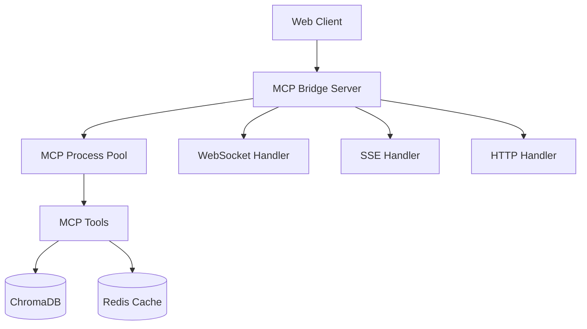

# TTRPG MCP Bridge Server - Complete API Reference

## Overview

The TTRPG MCP Bridge Server provides both MCP (Model Context Protocol) and web API access to a comprehensive tabletop role-playing game assistant. This document covers the complete API reference including HTTP endpoints, WebSocket protocol, Server-Sent Events (SSE), and MCP tools.

## Table of Contents

1. [Architecture](#architecture)
2. [Authentication](#authentication)
3. [HTTP API Endpoints](#http-api-endpoints)
4. [WebSocket Protocol](#websocket-protocol)
5. [Server-Sent Events (SSE)](#server-sent-events-sse)
6. [MCP Tools Reference](#mcp-tools-reference)
7. [Error Handling](#error-handling)
8. [Rate Limiting](#rate-limiting)
9. [Response Formats](#response-formats)
10. [Interactive Examples](#interactive-examples)

## Architecture

The system consists of three main components:

### 1. MCP Bridge Server
- **Purpose**: HTTP/WebSocket to MCP stdio bridge
- **Technology**: FastAPI with asyncio
- **Port**: 8000 (configurable)
- **Protocols**: HTTP, WebSocket, SSE

### 2. MCP Core Server
- **Purpose**: TTRPG domain logic and tools
- **Technology**: FastMCP
- **Protocol**: JSON-RPC 2.0 over stdio
- **Tools**: Search, Campaign Management, Character Generation, etc.

### 3. Frontend Application
- **Purpose**: Web interface
- **Technology**: SvelteKit + TypeScript
- **Features**: Real-time collaboration, responsive design



## Authentication

### API Key Authentication (Optional)

When `require_auth` is enabled, include API key in request headers:

```http
Authorization: Bearer your-api-key-here
```

### Configuration

```bash
# Enable authentication
export BRIDGE_REQUIRE_AUTH=true
export BRIDGE_API_KEYS="key1,key2,key3"
```

## HTTP API Endpoints

### Health & Status

#### GET /health
Basic health check endpoint.

**Response:**
```json
{
    "status": "healthy",
    "uptime": 3600.5
}
```

#### GET /stats
Comprehensive service statistics.

**Response:**
```json
{
    "active_sessions": 3,
    "active_processes": 5,
    "total_requests": 1247,
    "total_errors": 12,
    "average_response_time_ms": 45.2,
    "uptime_seconds": 7200.0,
    "process_stats": [
        {
            "process_id": 12345,
            "session_id": "sess-abc123",
            "cpu_percent": 2.1,
            "memory_mb": 128.5,
            "num_requests": 89,
            "num_errors": 1,
            "uptime_seconds": 1800.0,
            "last_request": "2024-01-15T10:30:45Z"
        }
    ]
}
```

### Session Management

#### POST /sessions
Create a new MCP session.

**Request Body:**
```json
{
    "client_id": "client-123",
    "metadata": {
        "user_agent": "MyApp/1.0",
        "capabilities": ["websocket", "sse"]
    }
}
```

**Response:**
```json
{
    "session_id": "sess-abc123",
    "client_id": "client-123",
    "state": "ready",
    "capabilities": {
        "tools": ["search", "add_source", "create_campaign"],
        "notifications": true,
        "streaming": true
    }
}
```

#### GET /sessions/{session_id}
Get session information.

**Response:**
```json
{
    "session_id": "sess-abc123",
    "client_id": "client-123",
    "state": "ready",
    "capabilities": {
        "tools": ["search", "add_source"]
    },
    "created_at": "2024-01-15T10:00:00Z",
    "last_activity": "2024-01-15T10:30:00Z"
}
```

#### DELETE /sessions/{session_id}
Delete a session.

**Response:**
```json
{
    "status": "deleted"
}
```

### Tool Discovery & Execution

#### POST /tools/discover
Discover available MCP tools.

**Request Body:**
```json
{
    "session_id": "sess-abc123"
}
```

**Response:**
```json
{
    "session_id": "sess-abc123",
    "tools": [
        {
            "name": "search",
            "description": "Search across TTRPG content",
            "inputSchema": {
                "type": "object",
                "properties": {
                    "query": {"type": "string"},
                    "rulebook": {"type": "string"},
                    "max_results": {"type": "integer", "default": 5}
                },
                "required": ["query"]
            }
        },
        {
            "name": "add_source",
            "description": "Add new PDF source",
            "inputSchema": {
                "type": "object",
                "properties": {
                    "pdf_path": {"type": "string"},
                    "rulebook_name": {"type": "string"},
                    "system": {"type": "string"},
                    "source_type": {"type": "string"}
                },
                "required": ["pdf_path", "rulebook_name", "system"]
            }
        }
    ]
}
```

#### POST /tools/call
Execute an MCP tool.

**Request Body:**
```json
{
    "session_id": "sess-abc123",
    "tool": "search",
    "params": {
        "query": "fireball spell",
        "rulebook": "Player's Handbook",
        "max_results": 3
    }
}
```

**Response:**
```json
{
    "session_id": "sess-abc123",
    "tool": "search",
    "result": {
        "success": true,
        "query": "fireball spell",
        "results": [
            {
                "content": "Fireball: 3rd-level evocation spell...",
                "source": "Player's Handbook",
                "page": 241,
                "relevance_score": 0.95
            }
        ],
        "total_results": 1
    }
}
```

## WebSocket Protocol

Connect to `/ws` for real-time bidirectional communication.

### Connection Flow

1. **Client connects** to `ws://localhost:8000/ws`
2. **Client sends** session creation/attachment message
3. **Server responds** with session info
4. **Bidirectional messaging** begins

### Message Types

#### 1. Session Creation
**Client → Server:**
```json
{
    "type": "create_session",
    "client_id": "client-123",
    "metadata": {
        "version": "1.0.0",
        "capabilities": ["tools", "streaming"]
    }
}
```

**Server → Client:**
```json
{
    "type": "session_created",
    "session_id": "sess-abc123",
    "capabilities": {
        "tools": ["search", "add_source"],
        "streaming": true,
        "notifications": true
    }
}
```

#### 2. Session Attachment
**Client → Server:**
```json
{
    "type": "attach_session",
    "session_id": "sess-abc123"
}
```

**Server → Client:**
```json
{
    "type": "session_attached",
    "session_id": "sess-abc123",
    "capabilities": {
        "tools": ["search", "add_source"]
    }
}
```

#### 3. Tool Request
**Client → Server:**
```json
{
    "jsonrpc": "2.0",
    "id": "req-123",
    "method": "tools/search",
    "params": {
        "query": "dragon breath weapon",
        "max_results": 5
    },
    "format": "json-rpc"
}
```

**Server → Client:**
```json
{
    "type": "response",
    "data": {
        "jsonrpc": "2.0",
        "id": "req-123",
        "result": {
            "success": true,
            "results": [...]
        }
    }
}
```

#### 4. Error Handling
**Server → Client:**
```json
{
    "type": "error",
    "data": {
        "jsonrpc": "2.0",
        "id": "req-123",
        "error": {
            "code": -32601,
            "message": "Method not found",
            "data": {
                "method": "unknown_method"
            }
        }
    }
}
```

### WebSocket Client Example

```javascript
const ws = new WebSocket('ws://localhost:8000/ws');

ws.onopen = () => {
    // Create session
    ws.send(JSON.stringify({
        type: 'create_session',
        client_id: 'my-client'
    }));
};

ws.onmessage = (event) => {
    const message = JSON.parse(event.data);
    
    if (message.type === 'session_created') {
        console.log('Session ID:', message.session_id);
        
        // Make a tool request
        ws.send(JSON.stringify({
            jsonrpc: '2.0',
            id: 'search-1',
            method: 'tools/search',
            params: {
                query: 'fireball spell',
                max_results: 3
            }
        }));
    } else if (message.type === 'response') {
        console.log('Tool result:', message.data.result);
    }
};
```

## Server-Sent Events (SSE)

Connect to `/events/{session_id}` for server-to-client streaming.

### Connection

```javascript
const eventSource = new EventSource('/events/sess-abc123');

eventSource.addEventListener('connected', (event) => {
    const data = JSON.parse(event.data);
    console.log('Connected to session:', data.session_id);
});

eventSource.addEventListener('heartbeat', (event) => {
    const data = JSON.parse(event.data);
    console.log('Heartbeat at:', data.timestamp);
});

eventSource.addEventListener('tool_result', (event) => {
    const data = JSON.parse(event.data);
    console.log('Tool completed:', data);
});
```

### Event Types

#### Connected Event
```
event: connected
data: {"session_id": "sess-abc123", "capabilities": {...}}
```

#### Heartbeat Event
```
event: heartbeat  
data: {"timestamp": "2024-01-15T10:30:45Z"}
```

#### Tool Progress Event
```
event: tool_progress
data: {"tool": "add_source", "progress": 0.65, "status": "processing"}
```

#### Tool Complete Event
```
event: tool_complete
data: {"tool": "search", "result": {...}}
```

## MCP Tools Reference

### Search Tools

#### search
Search across indexed TTRPG content.

**Parameters:**
- `query` (string, required): Search query
- `rulebook` (string, optional): Filter by specific rulebook
- `source_type` (string, optional): Filter by source type (rulebook, flavor_source)
- `content_type` (string, optional): Filter by content type (spell, monster, etc.)
- `max_results` (integer, optional): Maximum results to return (default: 5)
- `use_hybrid` (boolean, optional): Enable hybrid search (default: true)

**Response:**
```json
{
    "success": true,
    "query": "fireball spell",
    "results": [
        {
            "content": "Fireball: 3rd-level evocation spell...",
            "source": "Player's Handbook",
            "page": 241,
            "relevance_score": 0.95,
            "content_type": "spell"
        }
    ],
    "total_results": 1,
    "search_time_ms": 45
}
```

### Source Management

#### add_source
Add a new PDF source to the knowledge base.

**Parameters:**
- `pdf_path` (string, required): Path to PDF file
- `rulebook_name` (string, required): Name of the rulebook
- `system` (string, required): Game system (e.g., "D&D 5e")
- `source_type` (string, optional): Type of source (default: "rulebook")

**Response:**
```json
{
    "success": true,
    "message": "Source added successfully",
    "source_id": "src-abc123",
    "pages_processed": 320,
    "chunks_created": 1250
}
```

#### list_sources
List all indexed sources.

**Parameters:**
- `system` (string, optional): Filter by game system
- `source_type` (string, optional): Filter by source type

**Response:**
```json
{
    "success": true,
    "sources": [
        {
            "source_id": "src-abc123",
            "rulebook_name": "Player's Handbook",
            "system": "D&D 5e",
            "source_type": "rulebook",
            "pages": 320,
            "chunks": 1250,
            "indexed_at": "2024-01-15T09:00:00Z"
        }
    ],
    "total_sources": 1
}
```

### Campaign Management

#### create_campaign
Create a new campaign.

**Parameters:**
- `name` (string, required): Campaign name
- `system` (string, required): Game system
- `description` (string, optional): Campaign description

**Response:**
```json
{
    "success": true,
    "campaign_id": "camp-abc123",
    "name": "Lost Mine of Phandelver",
    "system": "D&D 5e"
}
```

#### get_campaign_data
Retrieve campaign data.

**Parameters:**
- `campaign_id` (string, required): Campaign ID
- `data_type` (string, optional): Specific data type to retrieve

**Response:**
```json
{
    "success": true,
    "campaign_id": "camp-abc123",
    "data": {
        "characters": [...],
        "npcs": [...],
        "locations": [...],
        "notes": [...]
    }
}
```

### Session Management

#### start_session
Start a new game session.

**Parameters:**
- `campaign_id` (string, required): Campaign ID
- `session_name` (string, optional): Session name

**Response:**
```json
{
    "success": true,
    "session_id": "sess-game123",
    "campaign_id": "camp-abc123",
    "started_at": "2024-01-15T19:00:00Z"
}
```

#### set_initiative
Set initiative order for combat.

**Parameters:**
- `session_id` (string, required): Session ID
- `initiative_order` (array, required): Array of initiative entries

**Response:**
```json
{
    "success": true,
    "session_id": "sess-game123",
    "initiative_set": true,
    "current_turn": 0
}
```

### Character Generation

#### generate_character
Generate a character.

**Parameters:**
- `system` (string, required): Game system
- `level` (integer, optional): Character level (default: 1)
- `class_type` (string, optional): Character class
- `race` (string, optional): Character race
- `backstory_hints` (string, optional): Hints for backstory generation

**Response:**
```json
{
    "success": true,
    "character": {
        "name": "Thorin Ironforge",
        "race": "Dwarf",
        "class": "Fighter",
        "level": 1,
        "stats": {
            "strength": 16,
            "dexterity": 12,
            "constitution": 15,
            "intelligence": 10,
            "wisdom": 13,
            "charisma": 8
        },
        "backstory": "A gruff but honorable warrior..."
    }
}
```

#### generate_npc
Generate an NPC.

**Parameters:**
- `system` (string, required): Game system
- `role` (string, optional): NPC role (e.g., "merchant", "guard")
- `name` (string, optional): Specific name to use

**Response:**
```json
{
    "success": true,
    "npc": {
        "name": "Marcus the Merchant",
        "role": "merchant",
        "personality": "Shrewd but fair",
        "appearance": "Middle-aged human with graying hair",
        "stats": {...}
    }
}
```

## Error Handling

### Standard HTTP Status Codes

- `200 OK` - Request successful
- `400 Bad Request` - Invalid request parameters
- `401 Unauthorized` - Authentication required
- `403 Forbidden` - Insufficient permissions
- `404 Not Found` - Resource not found
- `429 Too Many Requests` - Rate limit exceeded
- `500 Internal Server Error` - Server error
- `503 Service Unavailable` - Service temporarily unavailable

### MCP Error Codes

| Code | Name | Description |
|------|------|-------------|
| -32700 | Parse Error | Invalid JSON |
| -32600 | Invalid Request | Invalid JSON-RPC request |
| -32601 | Method Not Found | Method does not exist |
| -32602 | Invalid Params | Invalid method parameters |
| -32603 | Internal Error | Internal JSON-RPC error |
| -32001 | Process Error | MCP process error |
| -32002 | Session Error | Session management error |
| -32003 | Timeout Error | Request timeout |
| -32004 | Transport Error | Transport layer error |
| -32005 | Initialization Error | Initialization failed |
| -32006 | Capability Error | Capability not supported |

### Error Response Format

```json
{
    "jsonrpc": "2.0",
    "id": "req-123",
    "error": {
        "code": -32601,
        "message": "Method not found",
        "data": {
            "method": "unknown_tool",
            "available_methods": ["search", "add_source"]
        }
    }
}
```

## Rate Limiting

### Default Limits

- **HTTP API**: 60 requests per minute per client
- **WebSocket**: 100 messages per minute per connection
- **Tool Calls**: 30 per minute per session

### Headers

```http
X-RateLimit-Limit: 60
X-RateLimit-Remaining: 45  
X-RateLimit-Reset: 1641398400
```

### Configuration

```bash
# Enable rate limiting
export BRIDGE_ENABLE_RATE_LIMITING=true
export BRIDGE_RATE_LIMIT_REQUESTS=60
export BRIDGE_RATE_LIMIT_PERIOD=60
```

## Response Formats

### Success Response
All successful API responses follow this structure:

```json
{
    "success": true,
    "message": "Operation completed successfully", 
    "data": {
        // Tool-specific response data
    },
    "metadata": {
        "request_id": "req-abc123",
        "execution_time_ms": 45,
        "session_id": "sess-abc123"
    }
}
```

### Error Response
```json
{
    "success": false,
    "error": "Descriptive error message",
    "error_code": "INVALID_PARAMETERS",
    "details": {
        "field": "query",
        "message": "Query parameter is required"
    },
    "metadata": {
        "request_id": "req-abc123",
        "session_id": "sess-abc123"
    }
}
```

## Interactive Examples

### Complete Search Workflow

```bash
# 1. Create session
curl -X POST http://localhost:8000/sessions \
  -H "Content-Type: application/json" \
  -d '{"client_id": "my-client"}'

# Response: {"session_id": "sess-abc123", ...}

# 2. Discover tools  
curl -X POST http://localhost:8000/tools/discover \
  -H "Content-Type: application/json" \
  -d '{"session_id": "sess-abc123"}'

# 3. Search for content
curl -X POST http://localhost:8000/tools/call \
  -H "Content-Type: application/json" \
  -d '{
    "session_id": "sess-abc123",
    "tool": "search",
    "params": {
      "query": "how does stealth work in combat",
      "max_results": 3
    }
  }'
```

### WebSocket Complete Example

```html
<!DOCTYPE html>
<html>
<head>
    <title>TTRPG Assistant WebSocket Demo</title>
</head>
<body>
    <div id="output"></div>
    <input type="text" id="query" placeholder="Enter search query">
    <button onclick="search()">Search</button>

    <script>
        let ws;
        let sessionId;
        
        function connect() {
            ws = new WebSocket('ws://localhost:8000/ws');
            
            ws.onopen = () => {
                log('Connected to WebSocket');
                ws.send(JSON.stringify({
                    type: 'create_session',
                    client_id: 'demo-client'
                }));
            };
            
            ws.onmessage = (event) => {
                const message = JSON.parse(event.data);
                log('Received: ' + JSON.stringify(message, null, 2));
                
                if (message.type === 'session_created') {
                    sessionId = message.session_id;
                    log('Session created: ' + sessionId);
                } else if (message.type === 'response') {
                    displaySearchResults(message.data.result);
                }
            };
            
            ws.onerror = (error) => {
                log('WebSocket error: ' + error);
            };
            
            ws.onclose = () => {
                log('WebSocket closed');
            };
        }
        
        function search() {
            const query = document.getElementById('query').value;
            if (!query || !sessionId) return;
            
            ws.send(JSON.stringify({
                jsonrpc: '2.0',
                id: 'search-' + Date.now(),
                method: 'tools/search',
                params: {
                    query: query,
                    max_results: 5
                }
            }));
        }
        
        function displaySearchResults(result) {
            if (result.success && result.results) {
                let html = '<h3>Search Results:</h3>';
                result.results.forEach(item => {
                    html += `
                        <div style="border: 1px solid #ccc; margin: 10px; padding: 10px;">
                            <strong>${item.source}</strong> (Page ${item.page})
                            <br><em>Score: ${item.relevance_score}</em>
                            <p>${item.content.substring(0, 200)}...</p>
                        </div>
                    `;
                });
                document.getElementById('output').innerHTML = html;
            }
        }
        
        function log(message) {
            const output = document.getElementById('output');
            output.innerHTML += '<div>' + message + '</div>';
        }
        
        // Connect on load
        connect();
    </script>
</body>
</html>
```

### Python Client Example

```python
import asyncio
import json
import websockets
from typing import Optional

class TTRPGClient:
    def __init__(self, url: str = "ws://localhost:8000/ws"):
        self.url = url
        self.websocket: Optional[websockets.WebSocketServerProtocol] = None
        self.session_id: Optional[str] = None
        
    async def connect(self):
        """Connect to the WebSocket server."""
        self.websocket = await websockets.connect(self.url)
        
        # Create session
        await self.websocket.send(json.dumps({
            "type": "create_session",
            "client_id": "python-client"
        }))
        
        # Wait for session creation
        response = await self.websocket.recv()
        message = json.loads(response)
        
        if message["type"] == "session_created":
            self.session_id = message["session_id"]
            print(f"Session created: {self.session_id}")
        else:
            raise Exception("Failed to create session")
    
    async def search(self, query: str, max_results: int = 5):
        """Perform a search."""
        if not self.websocket or not self.session_id:
            raise Exception("Not connected")
            
        request = {
            "jsonrpc": "2.0",
            "id": f"search-{len(query)}",
            "method": "tools/search",
            "params": {
                "query": query,
                "max_results": max_results
            }
        }
        
        await self.websocket.send(json.dumps(request))
        
        # Wait for response
        response = await self.websocket.recv()
        message = json.loads(response)
        
        if message["type"] == "response":
            return message["data"]["result"]
        else:
            raise Exception(f"Unexpected response: {message}")
    
    async def close(self):
        """Close the connection."""
        if self.websocket:
            await self.websocket.close()

# Usage example
async def main():
    client = TTRPGClient()
    
    try:
        await client.connect()
        
        # Perform searches
        result = await client.search("fireball spell")
        print("Search results:")
        for item in result.get("results", []):
            print(f"- {item['source']}: {item['content'][:100]}...")
            
        result = await client.search("dragon breath weapon", max_results=3)
        print(f"\nFound {len(result.get('results', []))} dragon results")
        
    finally:
        await client.close()

if __name__ == "__main__":
    asyncio.run(main())
```

This completes the comprehensive API documentation for the TTRPG MCP Bridge Server, covering all aspects from basic HTTP endpoints to advanced WebSocket usage with interactive examples.