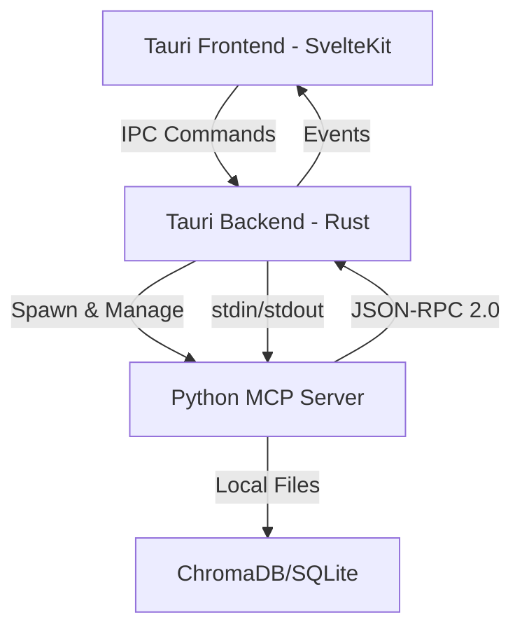

# MDMAI Desktop Application Architecture Recommendation

## Executive Summary

After thorough analysis of the MDMAI project requirements and current architecture, I recommend **Tauri** as the primary desktop framework, with the existing SvelteKit frontend and Python MCP server architecture. This approach provides the best balance of performance, security, distribution size, and development efficiency while maintaining cross-platform compatibility.

## Current Architecture Analysis

### Existing Components
- **Backend**: Python 3.11+ MCP server using FastMCP (stdin/stdout communication)
- **Bridge Service**: FastAPI server bridging WebSocket/SSE to MCP protocol
- **Frontend**: SvelteKit web application with TypeScript and TailwindCSS
- **Database**: ChromaDB for vector storage, SQLite for structured data
- **Real-time**: WebSockets and Server-Sent Events

### Requirements
1. Run the MCP server locally as a subprocess
2. Provide a native UI that communicates with the MCP server
3. Support Windows, macOS, and Linux
4. Allow offline operation
5. Package everything for easy distribution

## Framework Comparison

### 1. Tauri (Recommended) ⭐

**Architecture**: Rust backend + WebView frontend + Python subprocess

**Pros:**
- **Tiny bundle size**: 3-10MB base (vs 50-150MB for Electron)
- **Memory efficient**: 90% less RAM usage than Electron
- **Fast startup**: No Chromium initialization overhead
- **Security**: Rust memory safety, sandboxed WebView, fine-grained permissions
- **Native performance**: Direct OS integration, native file dialogs
- **Reuse SvelteKit**: Can directly use existing frontend with minimal changes
- **Built-in tooling**: Hot reload, cross-platform building, app icon generation
- **Python subprocess management**: Rust's excellent process handling

**Cons:**
- Learning curve for Rust (minimal for basic subprocess management)
- WebView inconsistencies across platforms (mostly resolved in v2)
- Smaller ecosystem than Electron

**Implementation Strategy:**
```rust
// Tauri backend manages Python MCP server
use tauri::Manager;
use std::process::Command;

fn spawn_mcp_server() -> Result<Child, Error> {
    Command::new("python")
        .arg("-m")
        .arg("src.main")
        .stdin(Stdio::piped())
        .stdout(Stdio::piped())
        .spawn()
}
```

### 2. Electron

**Architecture**: Chromium + Node.js + Python subprocess

**Pros:**
- Mature ecosystem with extensive documentation
- Familiar JavaScript/TypeScript throughout
- Direct Node.js integration for file system access
- Established distribution channels

**Cons:**
- **Large bundle size**: 50-150MB minimum
- **High memory usage**: Full Chromium instance per app
- **Slower startup**: 2-3x slower than Tauri
- **Security concerns**: Requires careful configuration
- **Battery drain**: Higher resource consumption

### 3. Flutter Desktop

**Architecture**: Dart + Skia rendering + Platform channels

**Pros:**
- True native performance
- Single codebase for mobile and desktop
- Excellent animation performance
- Strong type safety with Dart

**Cons:**
- **Complete frontend rewrite required**
- Limited desktop-specific widgets
- Larger learning curve (Dart + Flutter)
- Complex Python integration via platform channels
- 30-50MB bundle size

### 4. Python Native (PyQt/Kivy)

**Architecture**: Python throughout + Qt/Kivy UI

**Pros:**
- Single language (Python)
- Direct MCP server integration
- Rich widget libraries (PyQt)

**Cons:**
- **Requires complete UI rewrite**
- Distribution complexity with Python dependencies
- Larger bundle sizes (100MB+)
- Less modern UI capabilities
- Performance limitations for complex UIs

## Recommended Architecture

### Core Structure

```
mdmai-desktop/
├── src-tauri/          # Tauri Rust backend
│   ├── src/
│   │   ├── main.rs     # Main application entry
│   │   ├── mcp.rs      # MCP server management
│   │   └── ipc.rs      # IPC handlers
│   └── Cargo.toml
├── src/                # SvelteKit frontend (existing)
├── python/             # Python MCP server
│   ├── src/            # Existing Python code
│   └── requirements.txt
└── package.json
```

### Communication Architecture



### Key Components

#### 1. Tauri Backend (Rust)
- Spawns and manages Python MCP server subprocess
- Handles IPC communication with frontend
- Manages stdin/stdout pipes to Python process
- Provides native file dialogs and system integration
- Handles auto-updates and crash reporting

#### 2. Frontend (SvelteKit)
- Reuse existing SvelteKit application
- Replace WebSocket connections with Tauri IPC
- Use Tauri's event system for real-time updates
- Leverage native file dialogs via Tauri APIs

#### 3. Python MCP Server
- Runs as subprocess managed by Tauri
- Communicates via stdin/stdout (existing architecture)
- Packaged with PyOxidizer for single executable
- Includes all dependencies (ChromaDB, sentence-transformers, etc.)

## Packaging Strategy

### Python Backend Packaging

**Recommended: PyOxidizer**
- Creates single executable with embedded Python
- Fast startup (700ms)
- Memory-based module loading
- Includes all dependencies
- 50-80MB for complete Python environment

**Alternative: Nuitka**
- Compiles to native code
- Better performance
- Larger binaries (150MB+)
- Longer build times

### Distribution Strategy

#### Windows
```toml
[package]
productName = "MDMAI Assistant"
version = "1.0.0"

[tauri.bundle.windows]
wix = { enabled = true }  # MSI installer
nsis = { enabled = true } # NSIS installer
```

#### macOS
```toml
[tauri.bundle.macOS]
frameworks = []
minimumSystemVersion = "10.15"
dmg = { enabled = true }
app = { enabled = true }
```

#### Linux
```toml
[tauri.bundle.linux]
deb = { enabled = true }
appimage = { enabled = true }
rpm = { enabled = true }
```

### Build Pipeline

```yaml
# GitHub Actions workflow
name: Build Desktop App

on:
  release:
    types: [created]

jobs:
  build:
    strategy:
      matrix:
        os: [ubuntu-latest, windows-latest, macos-latest]
    
    steps:
      - name: Build Python executable
        run: |
          pyoxidizer build --release
      
      - name: Build Tauri app
        run: |
          npm run tauri build
```

## Implementation Roadmap

### Phase 1: Proof of Concept (Week 1)
1. Set up basic Tauri project
2. Integrate Python subprocess spawning
3. Implement basic IPC communication
4. Test stdin/stdout message passing

### Phase 2: Frontend Integration (Week 2)
1. Port SvelteKit app to Tauri webview
2. Replace WebSocket with Tauri IPC
3. Implement event system for real-time updates
4. Add native file dialog integration

### Phase 3: Python Packaging (Week 3)
1. Configure PyOxidizer for Python backend
2. Bundle all Python dependencies
3. Test on all platforms
4. Optimize bundle size

### Phase 4: Distribution (Week 4)
1. Set up code signing certificates
2. Configure auto-updater
3. Create installers for each platform
4. Set up CI/CD pipeline

## Security Considerations

### Tauri Security Features
- Content Security Policy (CSP) enforcement
- Sandboxed WebView with limited permissions
- Allowlist-based IPC commands
- Secure subprocess communication
- Code signing and notarization support

### Implementation
```rust
// Secure IPC configuration
tauri::Builder::default()
    .invoke_handler(tauri::generate_handler![
        start_mcp_server,
        stop_mcp_server,
        send_mcp_command
    ])
    .setup(|app| {
        // Validate and sanitize all IPC inputs
        Ok(())
    })
```

## Performance Optimization

### Startup Optimization
1. Lazy load Python modules
2. Use PyOxidizer's memory loading
3. Implement splash screen during initialization
4. Cache embeddings and models locally

### Runtime Optimization
1. Use Tauri's event system for efficient updates
2. Implement virtual scrolling for large datasets
3. Batch MCP requests when possible
4. Use worker threads for heavy computations

## Alternative Approaches

### Hybrid Approach (Fallback Option)
If Tauri proves challenging:
1. Use Electron for rapid prototyping
2. Keep Python as separate service
3. Use existing bridge architecture
4. Optimize later if needed

### Progressive Web App (PWA)
For simpler distribution:
1. Keep web-based architecture
2. Add PWA capabilities
3. Use File System API for local storage
4. Limited offline capabilities

## Conclusion

**Tauri** offers the best combination of:
- Small bundle size (10MB + 50MB Python = 60MB total)
- Native performance and feel
- Security and sandboxing
- Reuse of existing SvelteKit frontend
- Cross-platform consistency
- Modern development experience

This architecture provides a production-ready desktop application that maintains the flexibility of the MCP protocol while delivering a native user experience across all major platforms.

## Next Steps

1. **Approve architecture decision**
2. **Set up Tauri development environment**
3. **Create minimal proof of concept**
4. **Test Python subprocess communication**
5. **Begin incremental migration**

## Resources

- [Tauri Documentation](https://tauri.app/v1/guides/)
- [PyOxidizer Documentation](https://pyoxidizer.readthedocs.io/)
- [MCP Protocol Specification](https://modelcontextprotocol.io/)
- [SvelteKit + Tauri Integration](https://github.com/tauri-apps/tauri/tree/dev/examples/sveltekit)