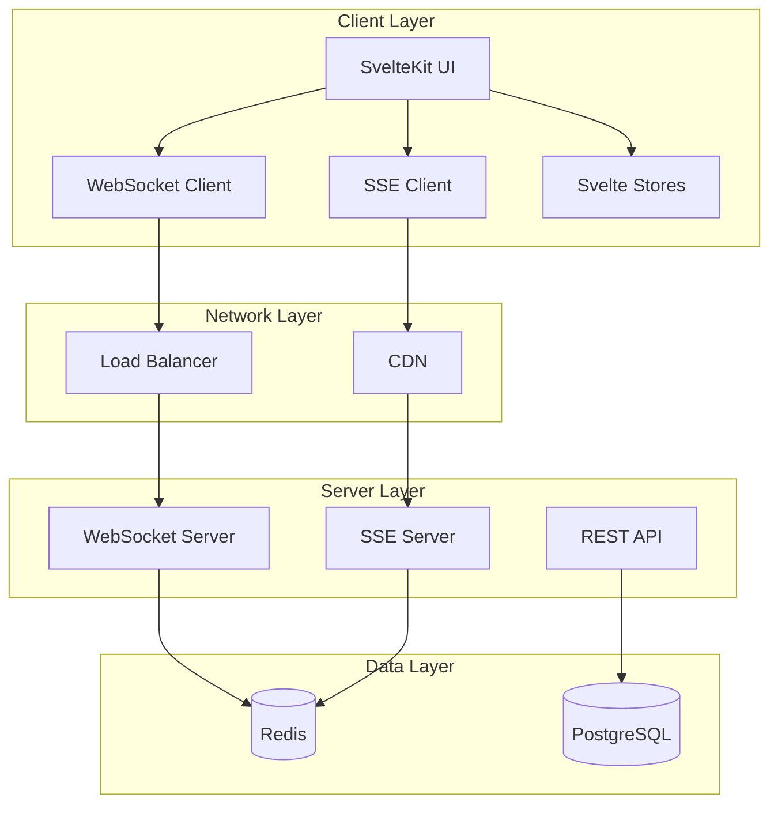
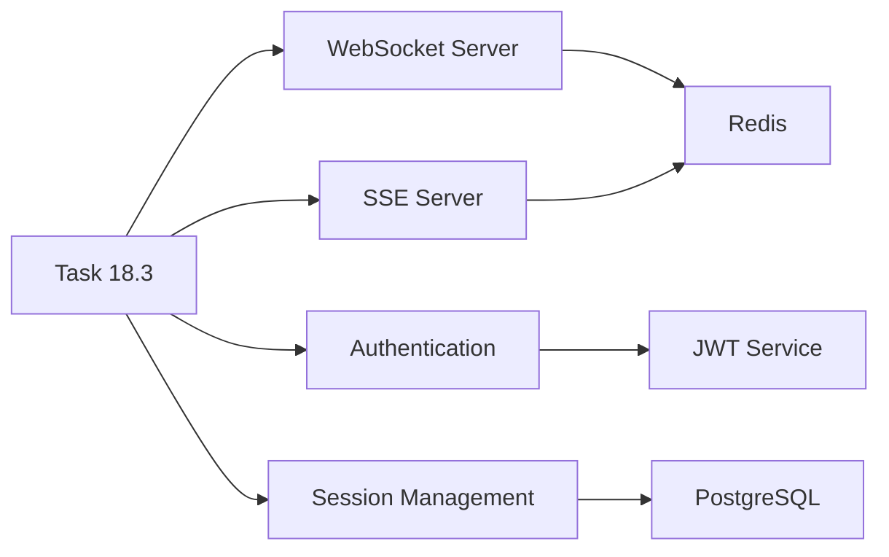

# Task 18.3: Real-time Features - Technical Design

## Architecture Overview



## Component Design

### WebSocket Client
```typescript
interface WebSocketClient {
  // Connection management
  connect(): Promise<void>
  disconnect(): void
  
  // Messaging
  send(message: Message): void
  request(method: string, params: any): Promise<any>
  
  // Events
  on(event: EventType, handler: Handler): void
  off(event: EventType, handler: Handler): void
  
  // State
  readonly state: ConnectionState
  readonly latency: number
}
```

### Message Protocol
```typescript
interface Message {
  id: string          // Unique message ID
  type: MessageType   // Type of message
  payload: any        // Message data
  timestamp: number   // Unix timestamp
  userId?: string     // Sender ID
  sessionId?: string  // Session context
}

enum MessageType {
  // Connection
  CONNECT = 'connect',
  DISCONNECT = 'disconnect',
  HEARTBEAT = 'heartbeat',
  
  // Collaboration
  CURSOR_MOVE = 'cursor_move',
  DRAW = 'draw',
  PRESENCE_UPDATE = 'presence_update',
  
  // Activity
  ACTIVITY = 'activity',
  NOTIFICATION = 'notification'
}
```

### State Management
```typescript
// Store structure
interface RealtimeState {
  connection: {
    status: ConnectionStatus
    latency: number
    reconnectAttempts: number
  }
  
  presence: Map<string, UserPresence>
  
  canvas: {
    operations: DrawOperation[]
    history: CanvasHistory
  }
  
  activity: {
    events: ActivityEvent[]
    unread: number
  }
}
```

## Data Flow

### 1. WebSocket Message Flow
```
Client Action → Validate → Send → Server → Broadcast → Clients → Update UI
      ↓                                          ↓
   Optimistic                               Store in Redis
    Update                                       ↓
                                           Persist to DB
```

### 2. SSE Event Flow
```
Server Event → Redis Pub/Sub → SSE Server → Push to Clients → Update Feed
                    ↓
              Store in PostgreSQL
```

### 3. Reconnection Flow
```
Connection Lost → Attempt Reconnect → Exponential Backoff
       ↓              ↓                      ↓
   Queue Messages   Success?            Max Attempts?
                       ↓                      ↓
                  Flush Queue            Fallback to SSE
```

## API Specifications

### WebSocket Endpoints
```
wss://api.example.com/ws
├── /session/{sessionId}  - Session-specific connection
├── /user/{userId}        - User-specific connection
└── /broadcast            - Public broadcast channel
```

### SSE Endpoints
```
https://api.example.com/sse
├── /activity/{sessionId} - Activity feed
├── /notifications        - User notifications
└── /system              - System announcements
```

### REST Fallback
```
POST /api/realtime/cursor
POST /api/realtime/draw
GET  /api/realtime/presence
GET  /api/realtime/activity
```

## Security Design

### Authentication Flow
```
1. Client requests connection with JWT
2. Server validates token
3. Server creates session
4. Client receives session ID
5. Subsequent messages include session ID
```

### Authorization Matrix
| Action | Player | GM | Spectator |
|--------|--------|----|-----------|
| View canvas | ✓ | ✓ | ✓ |
| Draw on canvas | ✓ | ✓ | ✗ |
| Move tokens | ✓ | ✓ | ✗ |
| Clear canvas | ✗ | ✓ | ✗ |
| Manage fog | ✗ | ✓ | ✗ |

## Performance Considerations

### Optimization Strategies
1. **Message Batching**: Combine multiple updates in 16ms window
2. **Throttling**: Limit cursor updates to 60 Hz
3. **Debouncing**: Delay draw operations by 100ms
4. **Compression**: Use gzip for messages > 1KB
5. **Caching**: Store recent operations in memory

### Scalability Plan
```
Phase 1: Single server (< 100 concurrent)
Phase 2: Multiple servers + Redis (< 1000 concurrent)
Phase 3: Geographic distribution (< 10000 concurrent)
Phase 4: WebRTC for P2P (unlimited)
```

## Error Handling

### Client-Side Errors
```typescript
enum ErrorCode {
  CONNECTION_FAILED = 'E001',
  AUTH_FAILED = 'E002',
  MESSAGE_TOO_LARGE = 'E003',
  RATE_LIMITED = 'E004',
  INVALID_SESSION = 'E005'
}

interface ErrorHandler {
  handle(error: ErrorCode): void
  retry(action: () => Promise<void>): void
  fallback(): void
}
```

### Server-Side Errors
- Connection timeout: 30s
- Message timeout: 5s
- Heartbeat timeout: 60s
- Max reconnect attempts: 5
- Circuit breaker threshold: 50% error rate

## Testing Strategy

### Unit Tests
- WebSocket client methods
- SSE client methods
- Message validation
- Store updates
- Error handling

### Integration Tests
- Connection establishment
- Message round-trip
- Reconnection logic
- State synchronization
- Fallback mechanisms

### Performance Tests
- 100 concurrent users
- 1000 messages/second
- 50KB canvas state
- 5MB/s bandwidth
- < 100ms latency

## Migration Path

### Phase 1: Basic Implementation
- WebSocket connection
- Simple cursor tracking
- Basic activity feed

### Phase 2: Enhanced Features
- Canvas collaboration
- Presence indicators
- SSE fallback

### Phase 3: Advanced Features
- Conflict resolution
- Offline support
- P2P options

## Monitoring Requirements

### Metrics to Track
- Connection count
- Message rate
- Error rate
- Latency (p50, p95, p99)
- Bandwidth usage
- Reconnection rate

### Alerts
- Error rate > 1%
- Latency p95 > 200ms
- Connection failures > 10/min
- Memory usage > 80%
- CPU usage > 70%

## Dependencies Diagram



## Open Questions

1. **Architecture**: Monolithic vs microservices for real-time services?
2. **Protocol**: Should we consider WebRTC for direct P2P?
3. **Storage**: Redis vs PostgreSQL for session state?
4. **Scaling**: Kubernetes vs traditional deployment?
5. **Monitoring**: Prometheus vs commercial solution?

## Risk Assessment

| Component | Risk | Mitigation |
|-----------|------|------------|
| WebSocket | Browser compatibility | Feature detection + polyfills |
| SSE | Proxy buffering | Configure no-cache headers |
| Canvas | Performance with many objects | Virtual viewport, culling |
| Presence | Stale data | Heartbeat + timeout |
| Activity | Message loss | Acknowledgments + retry |