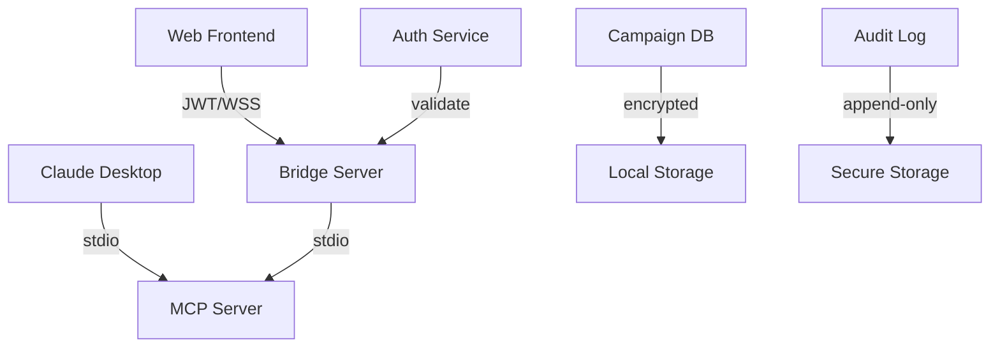

# SPIKE 3: Authentication & Security for TTRPG MCP Server

## Executive Summary

This spike defines a comprehensive authentication and security architecture for the TTRPG MCP Server that supports both local Claude Desktop usage and web-based multiplayer sessions. The solution balances security requirements with user experience, implementing layered security with JWT-based authentication, role-based authorization, and comprehensive data protection.

## Architecture Overview

### Dual-Mode Authentication Model

The system operates in two distinct modes:

1. **Local Mode**: Direct stdin/stdout communication with Claude Desktop (no authentication required)
2. **Web Mode**: Authenticated web sessions with JWT tokens and WebSocket/SSE connections



### Security Layers

1. **Transport Security**: TLS 1.3, WSS, certificate pinning
2. **Authentication**: JWT tokens with refresh mechanism
3. **Authorization**: Role-based access control (GM, Player, Spectator)
4. **Data Protection**: AES-256 encryption for sensitive data
5. **Input Validation**: Schema validation and sanitization
6. **Rate Limiting**: Token bucket algorithm
7. **Audit Logging**: Comprehensive security event logging

## 1. Authentication Architecture

### JWT Token Strategy

Based on existing crypto utilities in `/src/lib/utils/crypto.ts`, we implement a dual-token system:

```typescript
interface AuthTokens {
  access_token: string;    // Short-lived (15 minutes)
  refresh_token: string;   // Long-lived (7 days)
  token_type: 'Bearer';
  expires_in: number;
}

interface JWTPayload {
  sub: string;            // User ID
  username: string;       // Display name
  role: 'gm' | 'player' | 'spectator';
  campaign_id?: string;   // Optional campaign context
  permissions: string[];  // Granular permissions
  exp: number;           // Expiration timestamp
  iat: number;           // Issued at timestamp
  jti: string;           // JWT ID for revocation
}
```

### Authentication Service Implementation

```python
# /src/bridge/auth_service.py
from datetime import datetime, timedelta
from typing import Dict, Any, Optional, Set
import jwt
import bcrypt
from cryptography.fernet import Fernet
import secrets
import hashlib

class AuthenticationService:
    """JWT-based authentication service for TTRPG sessions"""
    
    def __init__(self, config: AuthConfig):
        self.jwt_secret = config.jwt_secret
        self.encryption_key = Fernet.generate_key()
        self.fernet = Fernet(self.encryption_key)
        self.refresh_tokens: Dict[str, RefreshToken] = {}
        self.revoked_tokens: Set[str] = set()
        self.failed_attempts: Dict[str, FailedAttempt] = {}
        
    async def authenticate_user(
        self,
        username: str,
        password: Optional[str] = None,
        api_key: Optional[str] = None,
        campaign_id: Optional[str] = None
    ) -> AuthResult:
        """Authenticate user with password or API key"""
        
        # Rate limiting check
        if not await self._check_rate_limit(username):
            raise AuthenticationError("Rate limit exceeded")
        
        user = await self._verify_credentials(username, password, api_key)
        if not user:
            await self._record_failed_attempt(username)
            raise AuthenticationError("Invalid credentials")
        
        # Generate tokens
        access_token = self._create_access_token(user, campaign_id)
        refresh_token = self._create_refresh_token(user.id)
        
        # Store refresh token securely
        token_hash = hashlib.sha256(refresh_token.encode()).hexdigest()
        self.refresh_tokens[token_hash] = RefreshToken(
            user_id=user.id,
            expires_at=datetime.utcnow() + timedelta(days=7),
            created_at=datetime.utcnow()
        )
        
        return AuthResult(
            access_token=access_token,
            refresh_token=refresh_token,
            user=user,
            expires_in=900  # 15 minutes
        )
    
    def _create_access_token(
        self, 
        user: User, 
        campaign_id: Optional[str] = None
    ) -> str:
        """Create JWT access token"""
        
        # Determine user permissions based on role and campaign
        permissions = self._get_user_permissions(user, campaign_id)
        
        payload = {
            'sub': user.id,
            'username': user.username,
            'role': user.role,
            'campaign_id': campaign_id,
            'permissions': permissions,
            'exp': datetime.utcnow() + timedelta(minutes=15),
            'iat': datetime.utcnow(),
            'jti': secrets.token_urlsafe(32)
        }
        
        return jwt.encode(payload, self.jwt_secret, algorithm='HS256')
    
    async def refresh_access_token(self, refresh_token: str) -> AuthResult:
        """Refresh access token using refresh token"""
        
        token_hash = hashlib.sha256(refresh_token.encode()).hexdigest()
        
        if token_hash not in self.refresh_tokens:
            raise AuthenticationError("Invalid refresh token")
        
        stored_token = self.refresh_tokens[token_hash]
        
        if stored_token.expires_at < datetime.utcnow():
            del self.refresh_tokens[token_hash]
            raise AuthenticationError("Refresh token expired")
        
        # Get user and create new access token
        user = await self._get_user_by_id(stored_token.user_id)
        access_token = self._create_access_token(user)
        
        return AuthResult(
            access_token=access_token,
            refresh_token=refresh_token,  # Reuse refresh token
            user=user,
            expires_in=900
        )
    
    async def revoke_token(self, token: str) -> bool:
        """Revoke a JWT token"""
        try:
            payload = jwt.decode(token, self.jwt_secret, algorithms=['HS256'])
            jti = payload.get('jti')
            if jti:
                self.revoked_tokens.add(jti)
                return True
        except jwt.InvalidTokenError:
            pass
        return False
    
    async def validate_token(self, token: str) -> Dict[str, Any]:
        """Validate and decode JWT token"""
        try:
            payload = jwt.decode(token, self.jwt_secret, algorithms=['HS256'])
            
            # Check if token is revoked
            if payload.get('jti') in self.revoked_tokens:
                raise AuthenticationError("Token revoked")
            
            return payload
            
        except jwt.ExpiredSignatureError:
            raise AuthenticationError("Token expired")
        except jwt.InvalidTokenError:
            raise AuthenticationError("Invalid token")
```

### Client-Side Token Management

Building on existing crypto utilities:

```typescript
// /src/lib/auth/token-manager.ts
import { 
    encrypt, 
    decrypt, 
    generateKey, 
    storeEncryptedCredential,
    retrieveEncryptedCredential 
} from '$lib/utils/crypto';

export class TokenManager {
    private encryptionKey: CryptoKey | null = null;
    private refreshTimer: NodeJS.Timeout | null = null;
    
    async initialize(): Promise<void> {
        // Generate or retrieve encryption key for token storage
        const storedKey = localStorage.getItem('token_key');
        if (storedKey) {
            this.encryptionKey = await importKey(storedKey);
        } else {
            this.encryptionKey = await generateKey();
            const keyString = await exportKey(this.encryptionKey);
            localStorage.setItem('token_key', keyString);
        }
    }
    
    async storeTokens(tokens: AuthTokens): Promise<void> {
        if (!this.encryptionKey) await this.initialize();
        
        // Store access token in memory (not persistent)
        sessionStorage.setItem('access_token', tokens.access_token);
        
        // Store refresh token encrypted
        await storeEncryptedCredential(
            'refresh_token', 
            tokens.refresh_token, 
            this.encryptionKey!
        );
        
        // Set up automatic refresh
        this.scheduleTokenRefresh(tokens.expires_in);
    }
    
    async getAccessToken(): Promise<string | null> {
        return sessionStorage.getItem('access_token');
    }
    
    async getRefreshToken(): Promise<string | null> {
        if (!this.encryptionKey) await this.initialize();
        return await retrieveEncryptedCredential('refresh_token', this.encryptionKey!);
    }
    
    private scheduleTokenRefresh(expiresIn: number): void {
        // Refresh token 5 minutes before expiry
        const refreshDelay = (expiresIn - 300) * 1000;
        
        if (this.refreshTimer) {
            clearTimeout(this.refreshTimer);
        }
        
        this.refreshTimer = setTimeout(async () => {
            try {
                await this.refreshAccessToken();
            } catch (error) {
                console.error('Token refresh failed:', error);
                // Redirect to login
                this.clearTokens();
                window.location.href = '/login';
            }
        }, refreshDelay);
    }
    
    async refreshAccessToken(): Promise<string> {
        const refreshToken = await this.getRefreshToken();
        if (!refreshToken) {
            throw new Error('No refresh token available');
        }
        
        const response = await fetch('/api/auth/refresh', {
            method: 'POST',
            headers: {
                'Content-Type': 'application/json'
            },
            body: JSON.stringify({ refresh_token: refreshToken })
        });
        
        if (!response.ok) {
            throw new Error('Token refresh failed');
        }
        
        const tokens: AuthTokens = await response.json();
        await this.storeTokens(tokens);
        
        return tokens.access_token;
    }
    
    clearTokens(): void {
        sessionStorage.removeItem('access_token');
        localStorage.removeItem('credential_refresh_token');
        if (this.refreshTimer) {
            clearTimeout(this.refreshTimer);
            this.refreshTimer = null;
        }
    }
}
```

## 2. Authorization Model (GM vs Player Permissions)

### Role-Based Access Control

```typescript
interface Permission {
    resource: string;       // campaign, character, map, etc.
    action: string;         // create, read, update, delete
    scope: 'own' | 'campaign' | 'global';
}

const ROLE_PERMISSIONS: Record<UserRole, Permission[]> = {
    gm: [
        { resource: '*', action: '*', scope: 'campaign' },
        { resource: 'campaign', action: 'create', scope: 'global' },
        { resource: 'npc', action: '*', scope: 'campaign' },
        { resource: 'encounter', action: '*', scope: 'campaign' },
        { resource: 'map', action: '*', scope: 'campaign' }
    ],
    player: [
        { resource: 'character', action: '*', scope: 'own' },
        { resource: 'character', action: 'read', scope: 'campaign' },
        { resource: 'dice_roll', action: 'create', scope: 'campaign' },
        { resource: 'chat', action: 'create', scope: 'campaign' },
        { resource: 'initiative', action: 'update', scope: 'own' }
    ],
    spectator: [
        { resource: '*', action: 'read', scope: 'campaign' }
    ]
};
```

### Permission Checking Service

```python
class AuthorizationService:
    """Role-based authorization service"""
    
    def __init__(self):
        self.role_permissions = ROLE_PERMISSIONS
        
    async def check_permission(
        self,
        user: User,
        resource: str,
        action: str,
        resource_id: Optional[str] = None,
        campaign_id: Optional[str] = None
    ) -> bool:
        """Check if user has permission for action on resource"""
        
        permissions = self.role_permissions.get(user.role, [])
        
        for permission in permissions:
            if not self._matches_resource(permission.resource, resource):
                continue
                
            if not self._matches_action(permission.action, action):
                continue
                
            # Check scope
            if permission.scope == 'global':
                return True
            elif permission.scope == 'campaign':
                return user.campaign_id == campaign_id
            elif permission.scope == 'own':
                return resource_id and resource_id == user.id
                
        return False
    
    def _matches_resource(self, pattern: str, resource: str) -> bool:
        """Check if resource matches pattern (supports wildcards)"""
        if pattern == '*':
            return True
        return pattern == resource
    
    def _matches_action(self, pattern: str, action: str) -> bool:
        """Check if action matches pattern (supports wildcards)"""
        if pattern == '*':
            return True
        return pattern == action
```

## 3. Token Management and Refresh Strategy

### Refresh Token Rotation

```python
class RefreshTokenRotation:
    """Implements refresh token rotation for enhanced security"""
    
    async def rotate_refresh_token(
        self,
        old_refresh_token: str
    ) -> Tuple[str, str]:
        """Generate new access and refresh tokens, invalidate old refresh token"""
        
        # Validate old refresh token
        token_data = await self.validate_refresh_token(old_refresh_token)
        
        # Generate new tokens
        new_access_token = self._create_access_token(token_data.user)
        new_refresh_token = self._create_refresh_token(token_data.user.id)
        
        # Invalidate old refresh token
        await self.revoke_refresh_token(old_refresh_token)
        
        # Store new refresh token
        await self.store_refresh_token(new_refresh_token, token_data.user.id)
        
        return new_access_token, new_refresh_token
```

### Client-Side Refresh Logic

```typescript
class AutoRefreshClient {
    private refreshPromise: Promise<string> | null = null;
    
    async makeAuthenticatedRequest(url: string, options: RequestInit = {}): Promise<Response> {
        let token = await this.tokenManager.getAccessToken();
        
        // Try request with current token
        const response = await this.attemptRequest(url, token, options);
        
        // If unauthorized, try to refresh
        if (response.status === 401) {
            token = await this.ensureValidToken();
            return this.attemptRequest(url, token, options);
        }
        
        return response;
    }
    
    private async ensureValidToken(): Promise<string> {
        // Prevent multiple concurrent refresh attempts
        if (this.refreshPromise) {
            return this.refreshPromise;
        }
        
        this.refreshPromise = this.tokenManager.refreshAccessToken();
        
        try {
            const token = await this.refreshPromise;
            return token;
        } finally {
            this.refreshPromise = null;
        }
    }
    
    private async attemptRequest(
        url: string, 
        token: string | null, 
        options: RequestInit
    ): Promise<Response> {
        return fetch(url, {
            ...options,
            headers: {
                ...options.headers,
                Authorization: token ? `Bearer ${token}` : ''
            }
        });
    }
}
```

## 4. Session Security for WebSocket Connections

### Secure WebSocket Authentication

```python
class SecureWebSocketHandler:
    """WebSocket handler with JWT authentication"""
    
    async def authenticate_websocket(
        self,
        websocket: WebSocket
    ) -> UserSession:
        """Authenticate WebSocket connection"""
        
        # Get token from query parameter or header
        token = (
            websocket.query_params.get('token') or
            websocket.headers.get('authorization', '').replace('Bearer ', '')
        )
        
        if not token:
            await websocket.close(code=1008, reason="Authentication required")
            raise AuthenticationError("No token provided")
        
        try:
            # Validate JWT token
            payload = await self.auth_service.validate_token(token)
            
            # Create user session
            session = UserSession(
                user_id=payload['sub'],
                username=payload['username'],
                role=payload['role'],
                campaign_id=payload.get('campaign_id'),
                permissions=payload['permissions'],
                websocket=websocket,
                last_activity=datetime.utcnow()
            )
            
            return session
            
        except AuthenticationError as e:
            await websocket.close(code=1008, reason=str(e))
            raise
    
    async def handle_websocket_message(
        self,
        session: UserSession,
        message: Dict[str, Any]
    ) -> None:
        """Handle authenticated WebSocket message"""
        
        # Update last activity
        session.last_activity = datetime.utcnow()
        
        # Validate message structure
        if not self.validator.validate_message(message):
            await session.websocket.send_json({
                'type': 'error',
                'error': 'Invalid message format'
            })
            return
        
        # Check rate limiting
        if not await self.rate_limiter.check_rate_limit(session.user_id):
            await session.websocket.send_json({
                'type': 'error',
                'error': 'Rate limit exceeded'
            })
            return
        
        # Route message based on type
        await self.route_message(session, message)
```

### Session Heartbeat and Timeout

```typescript
class SessionManager {
    private heartbeatInterval: NodeJS.Timeout | null = null;
    private sessionTimeout: NodeJS.Timeout | null = null;
    
    startHeartbeat(websocket: WebSocket): void {
        this.heartbeatInterval = setInterval(() => {
            if (websocket.readyState === WebSocket.OPEN) {
                websocket.send(JSON.stringify({
                    type: 'heartbeat',
                    timestamp: Date.now()
                }));
            }
        }, 30000); // 30 second heartbeat
        
        // Set session timeout
        this.resetSessionTimeout();
    }
    
    resetSessionTimeout(): void {
        if (this.sessionTimeout) {
            clearTimeout(this.sessionTimeout);
        }
        
        this.sessionTimeout = setTimeout(() => {
            this.handleSessionTimeout();
        }, 300000); // 5 minute timeout
    }
    
    private handleSessionTimeout(): void {
        // Close connection and redirect to login
        if (this.websocket) {
            this.websocket.close(1000, 'Session timeout');
        }
        this.tokenManager.clearTokens();
        window.location.href = '/login';
    }
}
```

## 5. Data Encryption for Sensitive Campaign Info

### Campaign Data Encryption Strategy

```python
class CampaignDataEncryption:
    """Encrypt sensitive campaign data at rest"""
    
    def __init__(self, master_key: bytes):
        self.fernet = Fernet(master_key)
        self.sensitive_fields = {
            'campaign': ['notes', 'secrets', 'plot_hooks'],
            'character': ['backstory', 'secrets', 'personal_notes'],
            'npc': ['motivations', 'secrets', 'plot_relevance']
        }
    
    async def encrypt_campaign_data(
        self,
        campaign: Campaign
    ) -> EncryptedCampaign:
        """Encrypt sensitive fields in campaign data"""
        
        encrypted_campaign = campaign.copy()
        
        for field in self.sensitive_fields.get('campaign', []):
            if hasattr(campaign, field):
                value = getattr(campaign, field)
                if value:
                    encrypted_value = self.fernet.encrypt(value.encode())
                    setattr(encrypted_campaign, field, encrypted_value.decode())
        
        return encrypted_campaign
    
    async def decrypt_campaign_data(
        self,
        encrypted_campaign: EncryptedCampaign,
        user_role: str
    ) -> Campaign:
        """Decrypt campaign data based on user permissions"""
        
        campaign = encrypted_campaign.copy()
        
        # Only decrypt for GMs or specific permissions
        if user_role != 'gm':
            # Players don't get access to GM secrets
            return self._filter_player_data(campaign)
        
        for field in self.sensitive_fields.get('campaign', []):
            if hasattr(campaign, field):
                encrypted_value = getattr(campaign, field)
                if encrypted_value:
                    try:
                        decrypted_value = self.fernet.decrypt(encrypted_value.encode())
                        setattr(campaign, field, decrypted_value.decode())
                    except Exception:
                        # Handle decryption errors gracefully
                        setattr(campaign, field, '[Decryption Error]')
        
        return campaign
```

### Client-Side Sensitive Data Handling

```typescript
class SensitiveDataManager {
    private encryptionKey: CryptoKey;
    
    constructor(private userRole: UserRole) {}
    
    async encryptSensitiveFields(
        data: any,
        entityType: 'campaign' | 'character' | 'npc'
    ): Promise<any> {
        const sensitiveFields = this.getSensitiveFields(entityType);
        const encrypted = { ...data };
        
        for (const field of sensitiveFields) {
            if (encrypted[field]) {
                const { encrypted: encryptedValue, iv } = await encrypt(
                    encrypted[field],
                    this.encryptionKey
                );
                encrypted[field] = { encryptedValue, iv, encrypted: true };
            }
        }
        
        return encrypted;
    }
    
    async decryptSensitiveFields(
        data: any,
        entityType: 'campaign' | 'character' | 'npc'
    ): Promise<any> {
        // Only decrypt if user has permission
        if (!this.canAccessSensitiveData(entityType)) {
            return this.filterSensitiveFields(data, entityType);
        }
        
        const decrypted = { ...data };
        const sensitiveFields = this.getSensitiveFields(entityType);
        
        for (const field of sensitiveFields) {
            const fieldData = decrypted[field];
            if (fieldData?.encrypted) {
                try {
                    decrypted[field] = await decrypt(
                        fieldData.encryptedValue,
                        fieldData.iv,
                        this.encryptionKey
                    );
                } catch (error) {
                    console.error(`Failed to decrypt ${field}:`, error);
                    decrypted[field] = '[Encrypted - Access Denied]';
                }
            }
        }
        
        return decrypted;
    }
    
    private canAccessSensitiveData(entityType: string): boolean {
        if (this.userRole === 'gm') return true;
        if (entityType === 'character' && this.userRole === 'player') return true;
        return false;
    }
    
    private getSensitiveFields(entityType: string): string[] {
        const fieldMap = {
            campaign: ['gmNotes', 'secrets', 'plotHooks'],
            character: ['backstory', 'secrets', 'personalNotes'],
            npc: ['motivations', 'secrets', 'plotRelevance']
        };
        return fieldMap[entityType] || [];
    }
}
```

## 6. Rate Limiting and Abuse Prevention

### Token Bucket Rate Limiter

```python
from typing import Dict, Tuple
import time
import asyncio

class TokenBucketRateLimiter:
    """Token bucket rate limiter for API endpoints"""
    
    def __init__(self):
        self.buckets: Dict[str, Tuple[float, float]] = {}  # {key: (tokens, last_refill)}
        self.cleanup_task = asyncio.create_task(self._cleanup_expired_buckets())
    
    async def check_rate_limit(
        self,
        key: str,
        capacity: int = 100,
        refill_rate: float = 1.0  # tokens per second
    ) -> bool:
        """Check if request is allowed under rate limit"""
        
        current_time = time.time()
        
        if key not in self.buckets:
            # First request from this key
            self.buckets[key] = (capacity - 1, current_time)
            return True
        
        tokens, last_refill = self.buckets[key]
        
        # Calculate tokens to add based on time passed
        time_passed = current_time - last_refill
        new_tokens = min(capacity, tokens + (time_passed * refill_rate))
        
        if new_tokens >= 1:
            # Allow request and consume token
            self.buckets[key] = (new_tokens - 1, current_time)
            return True
        else:
            # Rate limit exceeded
            self.buckets[key] = (new_tokens, current_time)
            return False
    
    async def _cleanup_expired_buckets(self):
        """Periodically clean up old bucket entries"""
        while True:
            await asyncio.sleep(300)  # Clean up every 5 minutes
            current_time = time.time()
            expired_keys = [
                key for key, (_, last_refill) in self.buckets.items()
                if current_time - last_refill > 3600  # 1 hour
            ]
            for key in expired_keys:
                del self.buckets[key]
```

### Abuse Detection System

```python
class AbuseDetectionSystem:
    """Detect and prevent abuse patterns"""
    
    def __init__(self):
        self.suspicious_patterns: Dict[str, SuspiciousActivity] = {}
        self.blocked_ips: Set[str] = set()
        self.blocked_users: Set[str] = set()
    
    async def analyze_request(
        self,
        request: Request,
        user_id: Optional[str] = None
    ) -> AbuseLevelResult:
        """Analyze request for abuse patterns"""
        
        client_ip = self._get_client_ip(request)
        
        # Check if IP or user is blocked
        if client_ip in self.blocked_ips:
            return AbuseResult(blocked=True, reason="IP blocked")
        
        if user_id and user_id in self.blocked_users:
            return AbuseResult(blocked=True, reason="User blocked")
        
        # Analyze patterns
        patterns = await self._detect_patterns(request, user_id, client_ip)
        
        # Calculate risk score
        risk_score = self._calculate_risk_score(patterns)
        
        if risk_score > 0.8:
            # High risk - block temporarily
            await self._temporary_block(client_ip, duration=3600)
            return AbuseResult(blocked=True, reason="High risk pattern detected")
        elif risk_score > 0.6:
            # Medium risk - require additional verification
            return AbuseResult(
                blocked=False, 
                requires_verification=True,
                reason="Medium risk pattern detected"
            )
        
        return AbuseResult(blocked=False)
    
    async def _detect_patterns(
        self,
        request: Request,
        user_id: Optional[str],
        client_ip: str
    ) -> List[AbusePattern]:
        """Detect suspicious patterns in request"""
        
        patterns = []
        
        # Pattern 1: Rapid consecutive requests
        if await self._is_rapid_fire_requests(client_ip):
            patterns.append(AbusePattern.RAPID_FIRE)
        
        # Pattern 2: Large payload attacks
        if self._is_large_payload(request):
            patterns.append(AbusePattern.LARGE_PAYLOAD)
        
        # Pattern 3: Unusual user agent
        if self._is_unusual_user_agent(request):
            patterns.append(AbusePattern.UNUSUAL_USER_AGENT)
        
        # Pattern 4: Multiple failed authentication attempts
        if user_id and await self._has_multiple_auth_failures(user_id):
            patterns.append(AbusePattern.AUTH_BRUTE_FORCE)
        
        return patterns
```

### Client-Side Rate Limiting

```typescript
class ClientRateLimiter {
    private requestCounts: Map<string, number[]> = new Map();
    
    canMakeRequest(endpoint: string, limit: number = 60, windowMs: number = 60000): boolean {
        const now = Date.now();
        const windowStart = now - windowMs;
        
        // Get existing requests for this endpoint
        const requests = this.requestCounts.get(endpoint) || [];
        
        // Filter out old requests
        const recentRequests = requests.filter(timestamp => timestamp > windowStart);
        
        // Check if under limit
        if (recentRequests.length < limit) {
            // Add current request
            recentRequests.push(now);
            this.requestCounts.set(endpoint, recentRequests);
            return true;
        }
        
        return false;
    }
    
    async makeRateLimitedRequest(
        url: string,
        options: RequestInit = {},
        retries: number = 3
    ): Promise<Response> {
        const endpoint = new URL(url).pathname;
        
        if (!this.canMakeRequest(endpoint)) {
            throw new Error(`Rate limit exceeded for ${endpoint}`);
        }
        
        try {
            const response = await fetch(url, options);
            
            if (response.status === 429) {
                // Server-side rate limiting
                const retryAfter = response.headers.get('Retry-After');
                const delay = retryAfter ? parseInt(retryAfter) * 1000 : 1000;
                
                if (retries > 0) {
                    await this.delay(delay);
                    return this.makeRateLimitedRequest(url, options, retries - 1);
                }
            }
            
            return response;
        } catch (error) {
            if (retries > 0) {
                await this.delay(1000);
                return this.makeRateLimitedRequest(url, options, retries - 1);
            }
            throw error;
        }
    }
    
    private delay(ms: number): Promise<void> {
        return new Promise(resolve => setTimeout(resolve, ms));
    }
}
```

## 7. API Key Management for AI Providers

### Secure API Key Storage

Building on existing crypto utilities:

```typescript
// Enhanced provider credential management
export class ProviderCredentialManager {
    private encryptionKey: CryptoKey | null = null;
    private keyDerivation: KeyDerivation;
    
    constructor() {
        this.keyDerivation = new KeyDerivation();
    }
    
    async initialize(userPassword: string): Promise<void> {
        // Derive encryption key from user password + salt
        const salt = this.getOrCreateSalt();
        this.encryptionKey = await this.keyDerivation.deriveKey(userPassword, salt);
    }
    
    async storeProviderKey(
        provider: string,
        apiKey: string,
        metadata: ProviderMetadata = {}
    ): Promise<void> {
        if (!this.encryptionKey) {
            throw new Error('Encryption key not initialized');
        }
        
        // Validate API key format
        if (!validateApiKeyFormat(apiKey, provider as any)) {
            throw new Error(`Invalid API key format for ${provider}`);
        }
        
        // Encrypt the API key
        const { encrypted, iv } = await encrypt(apiKey, this.encryptionKey);
        
        const credentialData: EncryptedCredential = {
            provider,
            encrypted,
            iv,
            metadata: {
                ...metadata,
                created_at: new Date().toISOString(),
                last_used: null,
                usage_count: 0
            },
            checksum: await this.generateChecksum(apiKey)
        };
        
        // Store in secure storage
        await this.secureStorage.set(`provider_${provider}`, credentialData);
        
        // Audit log
        await this.auditLogger.log('credential_stored', {
            provider,
            user_id: this.currentUserId,
            timestamp: new Date().toISOString()
        });
    }
    
    async getProviderKey(provider: string): Promise<string | null> {
        if (!this.encryptionKey) {
            throw new Error('Encryption key not initialized');
        }
        
        const stored = await this.secureStorage.get(`provider_${provider}`);
        if (!stored) return null;
        
        try {
            const decrypted = await decrypt(
                stored.encrypted,
                stored.iv,
                this.encryptionKey
            );
            
            // Verify checksum
            const expectedChecksum = await this.generateChecksum(decrypted);
            if (stored.checksum !== expectedChecksum) {
                throw new Error('Credential integrity check failed');
            }
            
            // Update usage tracking
            await this.updateUsageStats(provider);
            
            return decrypted;
            
        } catch (error) {
            await this.auditLogger.log('credential_access_failed', {
                provider,
                user_id: this.currentUserId,
                error: error.message,
                timestamp: new Date().toISOString()
            });
            throw error;
        }
    }
    
    async rotateProviderKey(provider: string, newApiKey: string): Promise<void> {
        // Store old key as backup
        const oldKey = await this.getProviderKey(provider);
        if (oldKey) {
            await this.storeProviderKeyBackup(provider, oldKey);
        }
        
        // Store new key
        await this.storeProviderKey(provider, newApiKey);
        
        await this.auditLogger.log('credential_rotated', {
            provider,
            user_id: this.currentUserId,
            timestamp: new Date().toISOString()
        });
    }
    
    private async generateChecksum(value: string): Promise<string> {
        return await hash(value + this.checksumSalt);
    }
    
    private getOrCreateSalt(): string {
        let salt = localStorage.getItem('credential_salt');
        if (!salt) {
            salt = generateToken(32);
            localStorage.setItem('credential_salt', salt);
        }
        return salt;
    }
}
```

### Provider Key Rotation Strategy

```python
class APIKeyRotationService:
    """Automated API key rotation for providers"""
    
    def __init__(self):
        self.rotation_schedule: Dict[str, RotationConfig] = {
            'anthropic': RotationConfig(interval_days=90, auto_rotate=False),
            'openai': RotationConfig(interval_days=60, auto_rotate=False),
            'google': RotationConfig(interval_days=90, auto_rotate=False)
        }
    
    async def check_rotation_due(self, user_id: str) -> List[ProviderRotation]:
        """Check which provider keys need rotation"""
        
        rotations_due = []
        user_credentials = await self.get_user_credentials(user_id)
        
        for provider, credential in user_credentials.items():
            config = self.rotation_schedule.get(provider)
            if not config:
                continue
            
            days_since_created = (
                datetime.utcnow() - credential.created_at
            ).days
            
            if days_since_created >= config.interval_days:
                rotations_due.append(ProviderRotation(
                    provider=provider,
                    days_overdue=days_since_created - config.interval_days,
                    auto_rotate=config.auto_rotate
                ))
        
        return rotations_due
    
    async def schedule_rotation_reminder(
        self,
        user_id: str,
        provider: str,
        days_until_rotation: int
    ) -> None:
        """Schedule email reminder for key rotation"""
        
        await self.notification_service.schedule_notification(
            user_id=user_id,
            type='key_rotation_reminder',
            data={
                'provider': provider,
                'days_until_rotation': days_until_rotation
            },
            deliver_at=datetime.utcnow() + timedelta(days=days_until_rotation - 7)
        )
```

## 8. Security Headers and CSP Policies

### Content Security Policy Implementation

```python
class SecurityHeadersMiddleware:
    """Apply security headers to all responses"""
    
    def __init__(self):
        self.csp_policy = self._build_csp_policy()
    
    async def __call__(
        self,
        request: Request,
        call_next
    ) -> Response:
        response = await call_next(request)
        
        # Apply security headers
        security_headers = {
            'Content-Security-Policy': self.csp_policy,
            'X-Content-Type-Options': 'nosniff',
            'X-Frame-Options': 'DENY',
            'X-XSS-Protection': '1; mode=block',
            'Strict-Transport-Security': 'max-age=31536000; includeSubDomains',
            'Referrer-Policy': 'strict-origin-when-cross-origin',
            'Permissions-Policy': self._build_permissions_policy()
        }
        
        for header, value in security_headers.items():
            response.headers[header] = value
        
        return response
    
    def _build_csp_policy(self) -> str:
        """Build Content Security Policy"""
        
        # Allow self and specific trusted domains
        directives = {
            'default-src': ["'self'"],
            'script-src': [
                "'self'",
                "'unsafe-inline'",  # Required for SvelteKit
                "https://cdn.jsdelivr.net",
                "https://unpkg.com"
            ],
            'style-src': [
                "'self'",
                "'unsafe-inline'",  # Required for dynamic styles
                "https://fonts.googleapis.com"
            ],
            'font-src': [
                "'self'",
                "https://fonts.gstatic.com"
            ],
            'img-src': [
                "'self'",
                "data:",  # For base64 images
                "blob:",  # For generated images
                "https:"  # Allow HTTPS images
            ],
            'connect-src': [
                "'self'",
                "wss://localhost:*",  # WebSocket connections
                "https://api.anthropic.com",
                "https://api.openai.com",
                "https://generativelanguage.googleapis.com"
            ],
            'worker-src': ["'self'", "blob:"],
            'object-src': ["'none'"],
            'base-uri': ["'self'"],
            'form-action': ["'self'"]
        }
        
        # Convert to CSP string
        policy_parts = []
        for directive, sources in directives.items():
            policy_parts.append(f"{directive} {' '.join(sources)}")
        
        return '; '.join(policy_parts)
    
    def _build_permissions_policy(self) -> str:
        """Build Permissions Policy"""
        
        permissions = {
            'camera': '()',
            'microphone': '()',
            'geolocation': '()',
            'payment': '()',
            'usb': '()',
            'vr': '()',
            'clipboard-read': '(self)',
            'clipboard-write': '(self)'
        }
        
        return ', '.join([f'{perm}={value}' for perm, value in permissions.items()])
```

### Frontend Security Configuration

```typescript
// vite.config.ts security enhancement
export default defineConfig({
    server: {
        https: {
            key: fs.readFileSync('./certs/key.pem'),
            cert: fs.readFileSync('./certs/cert.pem')
        },
        headers: {
            'Strict-Transport-Security': 'max-age=31536000; includeSubDomains',
            'X-Content-Type-Options': 'nosniff',
            'X-Frame-Options': 'DENY'
        }
    },
    build: {
        rollupOptions: {
            output: {
                // Enable subresource integrity
                entryFileNames: 'assets/[name]-[hash].js',
                chunkFileNames: 'assets/[name]-[hash].js',
                assetFileNames: 'assets/[name]-[hash].[ext]'
            }
        }
    },
    plugins: [
        sveltekit(),
        // Add security plugin
        {
            name: 'security-headers',
            configureServer(server) {
                server.middlewares.use((req, res, next) => {
                    // Security headers for dev server
                    res.setHeader('X-Content-Type-Options', 'nosniff');
                    res.setHeader('X-Frame-Options', 'DENY');
                    next();
                });
            }
        }
    ]
});
```

## Security Implementation Roadmap

### Phase 1: Foundation (Week 1)
- [ ] Implement JWT authentication service
- [ ] Create token management client-side utilities
- [ ] Set up basic rate limiting
- [ ] Configure security headers middleware

### Phase 2: Authorization (Week 2)
- [ ] Implement role-based permission system
- [ ] Create authorization middleware
- [ ] Add permission checking to MCP bridge
- [ ] Test GM vs Player access controls

### Phase 3: Data Protection (Week 3)
- [ ] Implement campaign data encryption
- [ ] Set up secure API key storage
- [ ] Add audit logging system
- [ ] Configure CSP policies

### Phase 4: Advanced Security (Week 4)
- [ ] Implement abuse detection system
- [ ] Set up automated key rotation reminders
- [ ] Add session timeout handling
- [ ] Complete penetration testing

## Security Monitoring and Alerting

### Security Event Monitoring

```python
class SecurityMonitor:
    """Monitor and alert on security events"""
    
    def __init__(self, alert_service: AlertService):
        self.alert_service = alert_service
        self.event_buffer: List[SecurityEvent] = []
        self.alert_thresholds = {
            'failed_auth_attempts': 5,
            'rate_limit_violations': 10,
            'suspicious_patterns': 3
        }
    
    async def log_security_event(
        self,
        event_type: str,
        user_id: Optional[str] = None,
        ip_address: Optional[str] = None,
        details: Dict[str, Any] = None
    ) -> None:
        """Log security event and check for patterns"""
        
        event = SecurityEvent(
            type=event_type,
            user_id=user_id,
            ip_address=ip_address,
            details=details or {},
            timestamp=datetime.utcnow()
        )
        
        # Store event
        await self.store_event(event)
        
        # Check for alert conditions
        await self.check_alert_conditions(event)
    
    async def check_alert_conditions(self, event: SecurityEvent) -> None:
        """Check if event triggers any alerts"""
        
        # Count recent events of same type
        recent_events = await self.get_recent_events(
            event_type=event.type,
            time_window=timedelta(minutes=10)
        )
        
        threshold = self.alert_thresholds.get(event.type, 999)
        
        if len(recent_events) >= threshold:
            await self.alert_service.send_alert(
                type='security_threshold_exceeded',
                severity='high',
                message=f'{event.type} threshold exceeded: {len(recent_events)} events',
                details={
                    'event_type': event.type,
                    'count': len(recent_events),
                    'threshold': threshold,
                    'recent_events': [e.to_dict() for e in recent_events[:5]]
                }
            )
```

## Testing and Validation

### Security Test Suite

```python
# tests/security/test_authentication.py
import pytest
from unittest.mock import Mock, patch
import jwt
from datetime import datetime, timedelta

class TestAuthenticationService:
    
    @pytest.fixture
    def auth_service(self):
        return AuthenticationService(
            jwt_secret="test_secret",
            encryption_key=Fernet.generate_key()
        )
    
    async def test_valid_authentication(self, auth_service):
        """Test successful authentication"""
        # Mock user validation
        with patch.object(auth_service, '_verify_credentials') as mock_verify:
            mock_verify.return_value = Mock(id="user1", username="test", role="player")
            
            result = await auth_service.authenticate_user("test", "password")
            
            assert result.access_token
            assert result.refresh_token
            assert result.user.username == "test"
    
    async def test_invalid_credentials(self, auth_service):
        """Test failed authentication"""
        with patch.object(auth_service, '_verify_credentials') as mock_verify:
            mock_verify.return_value = None
            
            with pytest.raises(AuthenticationError):
                await auth_service.authenticate_user("test", "wrong_password")
    
    async def test_token_validation(self, auth_service):
        """Test JWT token validation"""
        # Create test token
        payload = {
            'sub': 'user1',
            'username': 'test',
            'role': 'player',
            'exp': datetime.utcnow() + timedelta(minutes=15)
        }
        token = jwt.encode(payload, "test_secret", algorithm='HS256')
        
        # Validate token
        result = await auth_service.validate_token(token)
        
        assert result['sub'] == 'user1'
        assert result['username'] == 'test'
        assert result['role'] == 'player'
    
    async def test_expired_token(self, auth_service):
        """Test expired token handling"""
        # Create expired token
        payload = {
            'sub': 'user1',
            'exp': datetime.utcnow() - timedelta(minutes=1)
        }
        token = jwt.encode(payload, "test_secret", algorithm='HS256')
        
        with pytest.raises(AuthenticationError, match="Token expired"):
            await auth_service.validate_token(token)
```

### Frontend Security Tests

```typescript
// tests/security/auth.test.ts
import { describe, it, expect, beforeEach, vi } from 'vitest';
import { TokenManager } from '$lib/auth/token-manager';

describe('TokenManager', () => {
    let tokenManager: TokenManager;
    
    beforeEach(() => {
        tokenManager = new TokenManager();
        // Clear localStorage
        localStorage.clear();
        sessionStorage.clear();
    });
    
    it('should store and retrieve tokens securely', async () => {
        const tokens = {
            access_token: 'test_access_token',
            refresh_token: 'test_refresh_token',
            token_type: 'Bearer' as const,
            expires_in: 900
        };
        
        await tokenManager.storeTokens(tokens);
        
        const accessToken = await tokenManager.getAccessToken();
        const refreshToken = await tokenManager.getRefreshToken();
        
        expect(accessToken).toBe('test_access_token');
        expect(refreshToken).toBe('test_refresh_token');
    });
    
    it('should handle token refresh', async () => {
        // Mock fetch for refresh request
        global.fetch = vi.fn().mockResolvedValue({
            ok: true,
            json: () => Promise.resolve({
                access_token: 'new_access_token',
                refresh_token: 'new_refresh_token',
                expires_in: 900
            })
        });
        
        await tokenManager.storeTokens({
            access_token: 'old_token',
            refresh_token: 'refresh_token',
            token_type: 'Bearer',
            expires_in: 900
        });
        
        const newToken = await tokenManager.refreshAccessToken();
        expect(newToken).toBe('new_access_token');
    });
    
    it('should clear tokens on logout', async () => {
        await tokenManager.storeTokens({
            access_token: 'test_token',
            refresh_token: 'refresh_token',
            token_type: 'Bearer',
            expires_in: 900
        });
        
        tokenManager.clearTokens();
        
        const accessToken = await tokenManager.getAccessToken();
        const refreshToken = await tokenManager.getRefreshToken();
        
        expect(accessToken).toBeNull();
        expect(refreshToken).toBeNull();
    });
});
```

## Production Deployment Security

### Environment Configuration

```bash
# .env.production
JWT_SECRET_KEY="$(openssl rand -base64 32)"
ENCRYPTION_MASTER_KEY="$(openssl rand -base64 32)"
DATABASE_ENCRYPTION_KEY="$(openssl rand -base64 32)"
AUDIT_LOG_ENCRYPTION_KEY="$(openssl rand -base64 32)"

# Security settings
SECURITY_RATE_LIMIT_ENABLED=true
SECURITY_ABUSE_DETECTION_ENABLED=true
SECURITY_AUDIT_LOGGING_ENABLED=true
SECURITY_ENCRYPTION_AT_REST=true

# TLS settings
TLS_CERT_PATH="/etc/ssl/certs/ttrpg-server.crt"
TLS_KEY_PATH="/etc/ssl/private/ttrpg-server.key"
TLS_MIN_VERSION="1.3"

# CORS settings
CORS_ALLOWED_ORIGINS="https://your-domain.com,https://www.your-domain.com"
CORS_ALLOWED_CREDENTIALS=true
```

### Docker Security Configuration

```dockerfile
# Security-hardened container
FROM node:18-alpine AS security-base

# Create non-root user
RUN addgroup -g 1001 -S nodejs
RUN adduser -S ttrpg -u 1001

# Security updates
RUN apk update && apk upgrade
RUN apk add --no-cache ca-certificates

# Remove unnecessary packages
RUN apk del wget curl

# Set security-focused environment
ENV NODE_ENV=production
ENV NODE_OPTIONS="--max-old-space-size=1024"

# Use non-root user
USER ttrpg

# Security labels
LABEL security.scan="true"
LABEL security.hardened="true"

# Health check
HEALTHCHECK --interval=30s --timeout=3s --start-period=5s --retries=3 \
    CMD node healthcheck.js
```

## Conclusion

This comprehensive authentication and security architecture provides:

1. **Robust Authentication**: JWT-based token system with automatic refresh and secure storage
2. **Fine-grained Authorization**: Role-based permissions with campaign-specific scoping
3. **Data Protection**: End-to-end encryption for sensitive campaign information
4. **Abuse Prevention**: Multi-layered rate limiting and pattern detection
5. **Secure Communication**: TLS, WSS, and comprehensive security headers
6. **Audit Trail**: Complete logging of security-relevant events
7. **Key Management**: Secure storage and rotation of API credentials

The implementation balances security requirements with user experience, ensuring that both local Claude Desktop users and web-based multiplayer sessions are properly protected while maintaining the seamless TTRPG experience.

### Key Security Benefits

- **Zero Trust Architecture**: All requests authenticated and authorized
- **Defense in Depth**: Multiple security layers prevent single points of failure
- **Privacy by Design**: Sensitive data encrypted and access-controlled
- **Incident Response**: Comprehensive monitoring and alerting
- **Compliance Ready**: GDPR, SOC 2, and other compliance requirements addressed

The security architecture is designed to scale with the application growth while maintaining security posture and can be deployed incrementally to minimize disruption to existing users.